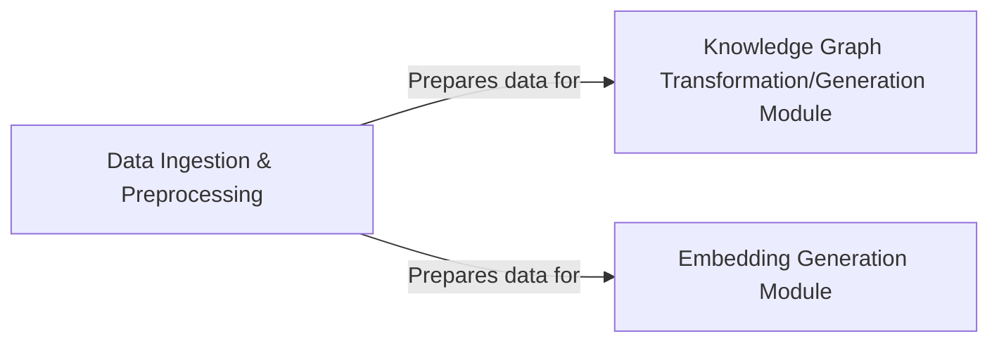

## Details

One paragraph explaining the functionality which is represented by this graph. What the main flow is and what is its purpose.

### Data Ingestion & Preprocessing [[Expand]](./Data_Ingestion_Preprocessing.md)
This component is responsible for the initial stages of the data pipeline. It handles the extraction of unstructured data from various sources such as web pages, local files, cloud storage, Wikipedia, and YouTube. It performs essential tasks like initial cleaning, chunking, and transformation (e.g., using Diffbot) to prepare the raw data for subsequent processing, specifically for knowledge graph construction and embedding generation. This component is fundamental as it forms the entry point for all external data into the system.

**Related Classes/Methods**:

- `backend.src.document_sources.web_pages`
- `backend.src.diffbot_transformer`

### Knowledge Graph Transformation/Generation Module
This component is responsible for processing the preprocessed data to construct and generate a knowledge graph. It takes the cleaned and transformed data from the `Data Ingestion & Preprocessing` component and converts it into a structured, interconnected knowledge representation.

**Related Classes/Methods**: _None_

### Embedding Generation Module
This component is responsible for generating numerical embeddings from the preprocessed data. It takes the output from the `Data Ingestion & Preprocessing` component and transforms it into vector representations suitable for machine learning models, enabling semantic search and similarity comparisons.

**Related Classes/Methods**: _None_

### [FAQ](https://github.com/CodeBoarding/GeneratedOnBoardings/tree/main?tab=readme-ov-file#faq)