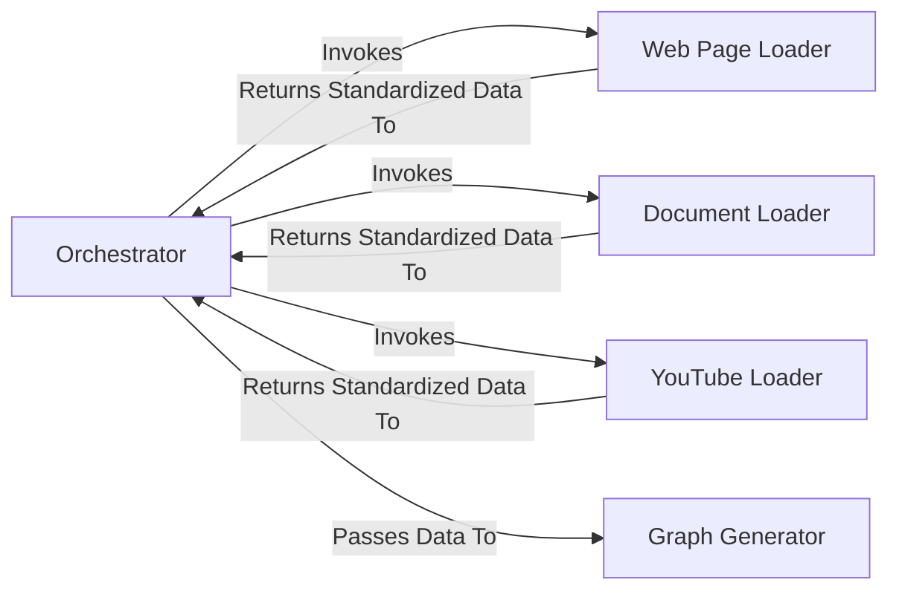

## Details

One paragraph explaining the functionality which is represented by this graph. What the main flow is and what is its purpose.

### Orchestrator
The central entry point of the backend (`main.py`) that manages the initial data extraction process. It receives API requests specifying a data source, selects the appropriate loader module, and directs the flow of data to the next stage of the pipeline.

**Related Classes/Methods**:

- `backend/src/main.py`

### Web Page Loader
A specialized module responsible for connecting to a given web URL, fetching the HTML content, and extracting the core text. It standardizes the extracted text into `Document` objects for uniform processing.

**Related Classes/Methods**:

- `backend/src/document_sources/web_pages.py`

### Document Loader
A versatile module designed to handle various file-based data sources, such as PDF, DOCX, or TXT files. It reads content from different storage systems (e.g., local disk, Google Cloud Storage) and standardizes it into `Document` objects.

**Related Classes/Methods**:

- `backend/src/document_sources/local_file.py`
- `backend/src/document_sources/gcs_bucket.py`

### YouTube Loader
A specific connector for video content. It connects to YouTube, retrieves the transcript for a given video, and transforms the text into the standardized `Document` object format.

**Related Classes/Methods**:

- `backend/src/document_sources/youtube.py`

### Graph Generator
Receives standardized `Document` objects from the Orchestrator and processes them to generate a graph by creating entities and relationships.

**Related Classes/Methods**:

- `backend/src/make_relationships.py`

### [FAQ](https://github.com/CodeBoarding/GeneratedOnBoardings/tree/main?tab=readme-ov-file#faq)