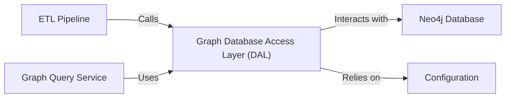

## Details

One paragraph explaining the functionality which is represented by this graph. What the main flow is and what is its purpose.

### Graph Database Access Layer (DAL) [[Expand]](./Graph_Database_Access_Layer_DAL_.md)
Manages all read/write operations with the Neo4j database. It provides a high-level API for creating nodes and relationships and for executing Cypher queries, abstracting connection management and query execution details.

**Related Classes/Methods**:

- `backend/src/graphDB_dataAccess.py`

### ETL Pipeline
The "Extract, Transform, Load" engine. It extracts data from various unstructured sources, transforms it into a graph structure (entities and relationships), and uses the DAL to load this data into the Neo4j graph.

**Related Classes/Methods**:

- `backend/src/document_sources/`
- `backend/src/create_chunks.py`
- `backend/src/diffbot_transformer.py`
- `backend/src/make_relationships.py`

### Graph Query Service
The retrieval engine for the RAG system. It constructs complex Cypher queries based on user input or application logic and uses the DAL's read capabilities to fetch data from the graph.

**Related Classes/Methods**:

- `backend/src/graph_query.py`

### Neo4j Database
The underlying graph database that stores the knowledge graph. As an external infrastructure component, it does not have a direct source code reference within this project. All interactions are managed exclusively through the 'Graph Database Access Layer (DAL)'.

**Related Classes/Methods**: _None_

### Configuration
Provides the necessary credentials (URI, username, password) and settings for the DAL to connect to the Neo4j database instance. This is typically managed through environment variables.

**Related Classes/Methods**:

- `backend/example.env`

### [FAQ](https://github.com/CodeBoarding/GeneratedOnBoardings/tree/main?tab=readme-ov-file#faq)