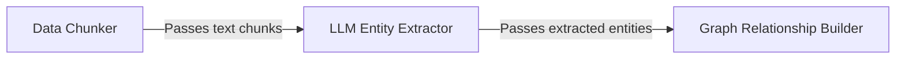

## Details

One paragraph explaining the functionality which is represented by this graph. What the main flow is and what is its purpose.

### Data Chunker
This component is the entry point into the generation pipeline. It takes large, unstructured documents or text data provided by the data source connectors and breaks it down into smaller, semantically coherent chunks. This is a critical preprocessing step, as LLMs have context window limitations and perform better on focused, smaller pieces of text.

**Related Classes/Methods**:

- `src.create_chunks.get_chunks`

### LLM Entity Extractor
This component receives text chunks from the `Data Chunker`. It utilizes a Large Language Model (LLM) to perform Natural Language Processing (NLP) tasks, specifically identifying and extracting key entities (e.g., people, places, concepts) and their corresponding types or schemas from the text. The output is a structured list of potential graph nodes.

**Related Classes/Methods**:

- `src.llm.extract_entities`

### Graph Relationship Builder
Following entity extraction, this component takes the structured list of entities and uses an LLM to infer the relationships between them. It analyzes the context from the original text chunks to determine how entities are connected, forming the edges of the knowledge graph. The final output is a set of node-relationship-node triples ready to be loaded into the Neo4j database.

**Related Classes/Methods**:

- `src.make_relationships.get_relationships`

### [FAQ](https://github.com/CodeBoarding/GeneratedOnBoardings/tree/main?tab=readme-ov-file#faq)