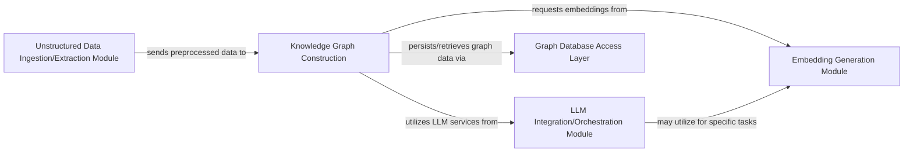

## Details

This analysis details the key components of the project, their functionalities, and their interdependencies, including specific source code references for each component.

### Unstructured Data Ingestion/Extraction Module
This module is the initial entry point for all raw, unstructured data into the system. It is responsible for ingesting data from diverse sources (e.g., documents, web pages, multimedia transcripts) and performing the necessary extraction and preprocessing steps. This includes parsing various file formats, cleaning data, and segmenting it into manageable chunks, preparing it for subsequent knowledge graph construction.

**Related Classes/Methods**:

- <a href="https://github.com/neo4j-labs/llm-graph-builder/blob/main/backend/src/document_sources/local_file.py#L8-L13" target="_blank" rel="noopener noreferrer">`backend.src.document_sources.local_file.ListLoader` (8:13)</a>
- <a href="https://github.com/neo4j-labs/llm-graph-builder/blob/main/backend/src/document_sources/local_file.py#L22-L42" target="_blank" rel="noopener noreferrer">`backend.src.document_sources.local_file.load_document_content` (22:42)</a>
- <a href="https://github.com/neo4j-labs/llm-graph-builder/blob/main/backend/src/document_sources/local_file.py#L44-L60" target="_blank" rel="noopener noreferrer">`backend.src.document_sources.local_file.get_documents_from_file_by_path` (44:60)</a>

### Knowledge Graph Construction [[Expand]](./Knowledge_Graph_Construction.md)
This is the core transformation engine of the platform. It takes preprocessed data and orchestrates interactions with LLMs to perform advanced information extraction, specifically identifying entities and the semantic relationships between them. The extracted information is then used to construct, refine, and update the knowledge graph structure within the Neo4j database, ensuring data integrity and consistency. This component embodies the "Knowledge Graph Transformation/Generation Module".

**Related Classes/Methods**:

- `backend.src.make_relationships`
- `backend.src.chunkid_entities`

### LLM Integration/Orchestration Module
This module provides a unified interface for interacting with various Large Language Models (LLMs) from different providers (e.g., OpenAI, Gemini, Anthropic). It manages model selection, handles API calls, implements prompt engineering strategies, and parses LLM responses. Its primary role is to abstract the complexities of LLM interactions, allowing other components, particularly the Knowledge Graph Construction module, to leverage AI capabilities seamlessly.

**Related Classes/Methods**:

- <a href="https://github.com/neo4j-labs/llm-graph-builder/blob/main/backend/src/llm.py#L20-L128" target="_blank" rel="noopener noreferrer">`backend.src.llm.get_llm` (20:128)</a>
- <a href="https://github.com/neo4j-labs/llm-graph-builder/blob/main/backend/src/llm.py#L176-L209" target="_blank" rel="noopener noreferrer">`backend.src.llm.get_graph_document_list` (176:209)</a>
- <a href="https://github.com/neo4j-labs/llm-graph-builder/blob/main/backend/src/llm.py#L211-L250" target="_blank" rel="noopener noreferrer">`backend.src.llm.get_graph_from_llm` (211:250)</a>
- `langchain_experimental.graph_transformers.LLMGraphTransformer` (1:1)

### Embedding Generation Module
This module is responsible for generating high-dimensional vector embeddings for entities, relationships, or text chunks within the knowledge graph. These embeddings capture semantic meaning and are crucial for enabling advanced functionalities such as semantic search, similarity comparisons, and potentially Retrieval Augmented Generation (RAG) within future query answering systems.

**Related Classes/Methods**:

- <a href="https://github.com/neo4j-labs/llm-graph-builder/blob/main/backend/src/shared/common_fn.py#L71-L92" target="_blank" rel="noopener noreferrer">`backend.src.shared.common_fn.load_embedding_model` (71:92)</a>
- <a href="https://github.com/neo4j-labs/llm-graph-builder/blob/main/backend/src/graphDB_dataAccess.py#L145-L162" target="_blank" rel="noopener noreferrer">`backend.src.graphDB_dataAccess.graphDBdataAccess.update_KNN_graph` (145:162)</a>

### Graph Database Access Layer
This module provides a robust abstraction layer for all interactions with the Neo4j graph database. It handles data persistence, retrieval, and updates for the knowledge graph, ensuring data integrity, consistency, and efficient querying. It decouples the application's business logic from the underlying database technology.

**Related Classes/Methods**:

- <a href="https://github.com/neo4j-labs/llm-graph-builder/blob/main/backend/src/graphDB_dataAccess.py#L15-L585" target="_blank" rel="noopener noreferrer">`backend.src.graphDB_dataAccess.graphDBdataAccess` (15:585)</a>

### [FAQ](https://github.com/CodeBoarding/GeneratedOnBoardings/tree/main?tab=readme-ov-file#faq)