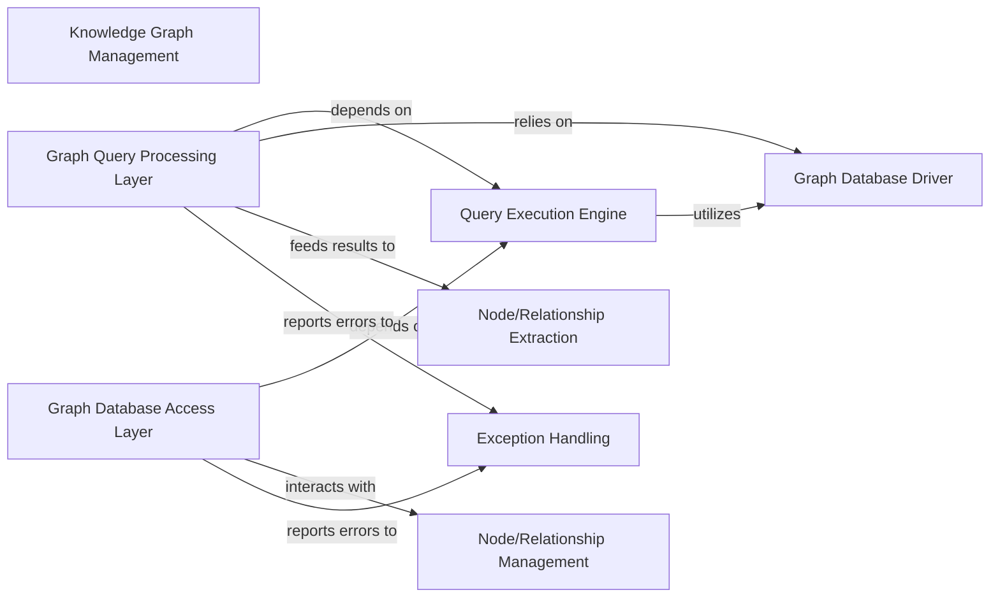

## Details

Abstract Components Overview

### Knowledge Graph Management [[Expand]](./Knowledge_Graph_Management.md)
The overarching subsystem responsible for all interactions with the Neo4j graph database. It provides a comprehensive abstraction layer for persistence, retrieval, updates, and complex querying of the knowledge graph, ensuring data integrity and efficient access.

**Related Classes/Methods**: _None_

### Graph Database Access Layer
This foundational layer handles direct, low-level CRUD operations (Create, Read, Update, Delete) on nodes and relationships within the Neo4j graph database. It also manages database-level maintenance tasks like merging duplicate nodes and handles exceptions during operations.

**Related Classes/Methods**: _None_

### Graph Query Processing Layer
Provides a higher-level abstraction for executing complex analytical and retrieval queries against the Neo4j knowledge graph. It processes raw database results, transforming them into structured node and relationship elements for application use, supporting schema visualization and chunked text extraction.

**Related Classes/Methods**: _None_

### Query Execution Engine
A centralized utility responsible for executing all database commands. It acts as an intermediary, ensuring consistent and controlled execution of queries and operations against the Neo4j database, including retry mechanisms for transient errors.

**Related Classes/Methods**: _None_

### Graph Database Driver
Manages the establishment and maintenance of connections to the Neo4j database. It handles connection pooling, session management, and ensures reliable communication with the database.

**Related Classes/Methods**: _None_

### Node/Relationship Extraction
Responsible for parsing and structuring the raw output from database queries into distinct node and relationship elements. This component ensures that data retrieved from the graph is correctly interpreted and formatted for application logic.

**Related Classes/Methods**: _None_

### Node/Relationship Management
Handles specific lifecycle operations related to nodes and relationships, including their creation, modification, deletion, and merging. It ensures that graph elements are managed consistently.

**Related Classes/Methods**: _None_

### Exception Handling
Provides a centralized mechanism for catching, logging, and gracefully managing errors that occur during database operations. It ensures the robustness and stability of the knowledge graph management subsystem.

**Related Classes/Methods**: _None_

### [FAQ](https://github.com/CodeBoarding/GeneratedOnBoardings/tree/main?tab=readme-ov-file#faq)