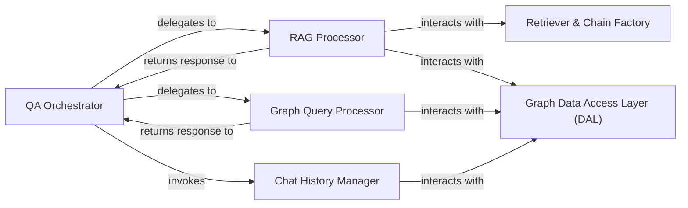

## Details

One paragraph explaining the functionality which is represented by this graph. What the main flow is and what is its purpose.

### QA Orchestrator
The central controller that receives user queries. It determines the appropriate strategy (RAG or direct graph query) and orchestrates the workflow between the other components to generate a final answer.

**Related Classes/Methods**:

- `QA_integration.route_question`

### Retriever & Chain Factory
Responsible for constructing and configuring the necessary LangChain objects. It builds the vector retriever for fetching document chunks and assembles the processing chains used by the RAG and Graph processors.

**Related Classes/Methods**:

- <a href="https://github.com/neo4j-labs/llm-graph-builder/blob/main/backend/src/QA_integration.py#L412-L431" target="_blank" rel="noopener noreferrer">`QA_integration.setup_chat` (412:431)</a>
- <a href="https://github.com/neo4j-labs/llm-graph-builder/blob/main/backend/src/QA_integration.py#L397-L409" target="_blank" rel="noopener noreferrer">`QA_integration.get_neo4j_retriever` (397:409)</a>

### RAG Processor
Executes the Retrieval-Augmented Generation pipeline. It utilizes the factory to configure a retriever, finds relevant context, and passes it to an LLM to synthesize a natural language response.

**Related Classes/Methods**:

- <a href="https://github.com/neo4j-labs/llm-graph-builder/blob/main/backend/src/QA_integration.py#L433-L490" target="_blank" rel="noopener noreferrer">`QA_integration.process_chat_response` (433:490)</a>

### Graph Query Processor
Executes direct queries against the knowledge graph. It is responsible for generating or forwarding a Cypher query, executing it via the DAL, and processing the structured graph data.

**Related Classes/Methods**:

- <a href="https://github.com/neo4j-labs/llm-graph-builder/blob/main/backend/src/QA_integration.py#L574-L619" target="_blank" rel="noopener noreferrer">`QA_integration.process_graph_response` (574:619)</a>

### Chat History Manager
Manages the conversation history for user sessions. It provides the necessary context for follow-up questions by storing and retrieving chat messages from the graph database.

**Related Classes/Methods**:

- <a href="https://github.com/neo4j-labs/llm-graph-builder/blob/main/backend/src/QA_integration.py#L621-L639" target="_blank" rel="noopener noreferrer">`QA_integration.create_neo4j_chat_message_history` (621:639)</a>

### Graph Data Access Layer (DAL)
Provides the low-level API for all interactions with the Neo4j database. It abstracts the complexities of query execution, connection management, and data parsing from the other components.

**Related Classes/Methods**:

- <a href="https://github.com/neo4j-labs/llm-graph-builder/blob/main/backend/src/graphDB_dataAccess.py#L15-L585" target="_blank" rel="noopener noreferrer">`graphDB_dataAccess.graphDBdataAccess` (15:585)</a>

### [FAQ](https://github.com/CodeBoarding/GeneratedOnBoardings/tree/main?tab=readme-ov-file#faq)