```mermaid
graph LR
    API_Gateway["API Gateway"]
    Data_Ingestion_Preprocessing["Data Ingestion & Preprocessing"]
    Knowledge_Graph_Construction["Knowledge Graph Construction"]
    Knowledge_Graph_Management["Knowledge Graph Management"]
    Conversational_AI_RAG["Conversational AI & RAG"]
    API_Gateway -- "triggers" --> Data_Ingestion_Preprocessing
    API_Gateway -- "routes user queries to" --> Conversational_AI_RAG
    Data_Ingestion_Preprocessing -- "feeds processed data to" --> Knowledge_Graph_Construction
    Knowledge_Graph_Construction -- "receives processed data from" --> Data_Ingestion_Preprocessing
    Knowledge_Graph_Construction -- "persists constructed graph data via" --> Knowledge_Graph_Management
    Knowledge_Graph_Management -- "receives graph data from" --> Knowledge_Graph_Construction
    Knowledge_Graph_Management -- "provides queried information to" --> Conversational_AI_RAG
    Conversational_AI_RAG -- "receives user queries from" --> API_Gateway
    Conversational_AI_RAG -- "queries and retrieves information from" --> Knowledge_Graph_Management
    click API_Gateway href "https://github.com/CodeBoarding/GeneratedOnBoardings/blob/main/llm-graph-builder/API_Gateway.md" "Details"
    click Data_Ingestion_Preprocessing href "https://github.com/CodeBoarding/GeneratedOnBoardings/blob/main/llm-graph-builder/Data_Ingestion_Preprocessing.md" "Details"
    click Knowledge_Graph_Construction href "https://github.com/CodeBoarding/GeneratedOnBoardings/blob/main/llm-graph-builder/Knowledge_Graph_Construction.md" "Details"
    click Knowledge_Graph_Management href "https://github.com/CodeBoarding/GeneratedOnBoardings/blob/main/llm-graph-builder/Knowledge_Graph_Management.md" "Details"
    click Conversational_AI_RAG href "https://github.com/CodeBoarding/GeneratedOnBoardings/blob/main/llm-graph-builder/Conversational_AI_RAG.md" "Details"
```

## Details

Abstract Components Overview

### API Gateway [[Expand]](./API_Gateway.md)
Serves as the primary entry point for all external interactions, exposing RESTful API endpoints for data ingestion, knowledge graph querying, and conversational AI. It acts as the interface for the frontend and other external systems.

**Related Classes/Methods**:

- `backend.src.main`

### Data Ingestion & Preprocessing [[Expand]](./Data_Ingestion_Preprocessing.md)
Handles the extraction of unstructured data from diverse sources (web pages, local files, cloud storage, Wikipedia, YouTube). It performs initial cleaning, chunking, and transformation (e.g., using Diffbot) to prepare the data for subsequent knowledge graph construction.

**Related Classes/Methods**:

- `backend.src.document_sources.web_pages`
- `backend.src.diffbot_transformer`

### Knowledge Graph Construction [[Expand]](./Knowledge_Graph_Construction.md)
Processes preprocessed data, leveraging integrated LLM capabilities for tasks like entity extraction and relationship identification. It then constructs and refines the knowledge graph structure based on these extractions.

**Related Classes/Methods**:

- `backend.src.make_relationships`
- `backend.src.chunkid_entities`

### Knowledge Graph Management [[Expand]](./Knowledge_Graph_Management.md)
Provides an abstraction layer for interacting with the Neo4j graph database. It handles the persistence, retrieval, updates, and complex querying of the knowledge graph, ensuring data integrity and efficient access.

**Related Classes/Methods**:

- `backend.src.graphDB_dataAccess`
- `backend.src.graph_query`

### Conversational AI & RAG [[Expand]](./Conversational_AI_RAG.md)
Manages the conversational flow, retrieves relevant information from the knowledge graph based on user queries (leveraging Retrieval Augmented Generation - RAG principles), and generates natural language responses using integrated LLM capabilities. It also maintains chat history and context.

**Related Classes/Methods**:

- `backend.src.QA_integration`
- `backend.src.llm`

### [FAQ](https://github.com/CodeBoarding/GeneratedOnBoardings/tree/main?tab=readme-ov-file#faq)