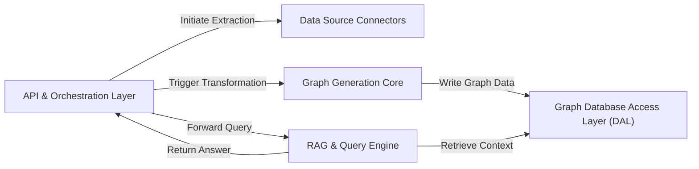

## Details

This project, `llm-graph-builder`, is an AI-driven data pipeline that transforms unstructured data from various sources into a structured Neo4j knowledge graph. It leverages Large Language Models (LLMs) for the core transformation logic, including entity and relationship extraction. The system is orchestrated via a FastAPI backend, which manages both the data ingestion pipeline (ETL) and a Retrieval-Augmented Generation (RAG) engine, allowing users to interact with and query the generated knowledge graph through a chat-based interface.

### API & Orchestration Layer [[Expand]](./API_Orchestration_Layer.md)
The central entry point of the backend, built with FastAPI. It handles all incoming HTTP requests, validates them, and orchestrates the two primary workflows: data ingestion and user queries. It directs traffic to the appropriate downstream components.

**Related Classes/Methods**:

- `backend/src/main.py`

### Data Source Connectors [[Expand]](./Data_Source_Connectors.md)
The "Extract" phase of the ETL pipeline. This component contains a collection of modules, each designed to connect to a specific data source (e.g., web pages, documents), fetch raw, unstructured data, and standardize it for processing.

**Related Classes/Methods**:

- `backend/document_sources/`

### Graph Generation Core [[Expand]](./Graph_Generation_Core.md)
The "Transform" heart of the pipeline. It takes raw data from the connectors and uses LLMs to perform complex processing, including splitting data into chunks, extracting entities and schemas, and structuring the output into a graph format of nodes and relationships.

**Related Classes/Methods**:

- `create_chunks.py`
- `llm.py`
- `make_relationships.py`

### Graph Database Access Layer (DAL) [[Expand]](./Graph_Database_Access_Layer_DAL_.md)
The "Load" phase of the ETL pipeline and the retrieval engine for the RAG system. This component abstracts all interactions with the Neo4j database, providing a clean, centralized interface for writing graph data and executing complex read queries.

**Related Classes/Methods**:

- `graphDB_dataAccess.py`

### RAG & Query Engine [[Expand]](./RAG_Query_Engine.md)
Powers the user-facing question-answering functionality. It translates natural language user queries into formal graph database queries (Cypher), retrieves relevant sub-graphs via the DAL, and uses an LLM to synthesize the retrieved context into a coherent, human-readable answer.

**Related Classes/Methods**:

- `QA_integration.py`
- `graph_query.py`

### [FAQ](https://github.com/CodeBoarding/GeneratedOnBoardings/tree/main?tab=readme-ov-file#faq)