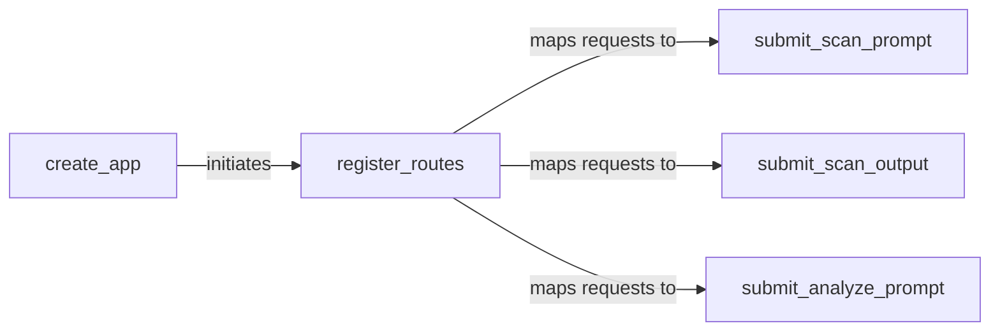

## Details

The API Gateway subsystem serves as the primary external interface for the LLM Guard system, handling all incoming scan and analysis requests.

### create_app
Initializes the FastAPI application, orchestrates the setup of scanners, and registers all API routes. It serves as the main entry point for the API.

**Related Classes/Methods**:

- <a href="https://github.com/protectai/llm-guard/blob/main/llm_guard_api/app/app.py#L162-L495" target="_blank" rel="noopener noreferrer">`llm_guard_api.app.app.register_routes`:162-495</a>
- <a href="https://github.com/protectai/llm-guard/blob/main/llm_guard_api/app/scanner.py" target="_blank" rel="noopener noreferrer">`llm_guard_api.app.scanner._get_input_scanners_function`</a>
- <a href="https://github.com/protectai/llm-guard/blob/main/llm_guard_api/app/scanner.py" target="_blank" rel="noopener noreferrer">`llm_guard_api.app.scanner._get_output_scanners_function`</a>

### register_routes
Defines and registers the various API endpoints (e.g., /scan/prompt, /scan/output, /analyze/prompt) with their respective handler functions. It also integrates authentication mechanisms.

**Related Classes/Methods**:

- <a href="https://github.com/protectai/llm-guard/blob/main/llm_guard_api/app/app.py#L398-L460" target="_blank" rel="noopener noreferrer">`llm_guard_api.app.app.submit_scan_prompt`:398-460</a>
- <a href="https://github.com/protectai/llm-guard/blob/main/llm_guard_api/app/app.py#L265-L333" target="_blank" rel="noopener noreferrer">`llm_guard_api.app.app.submit_scan_output`:265-333</a>
- <a href="https://github.com/protectai/llm-guard/blob/main/llm_guard_api/app/app.py#L335-L396" target="_blank" rel="noopener noreferrer">`llm_guard_api.app.app.submit_analyze_prompt`:335-396</a>
- <a href="https://github.com/protectai/llm-guard/blob/main/llm_guard_api/app/app.py#L91-L123" target="_blank" rel="noopener noreferrer">`llm_guard_api.app.app._check_auth_function`:91-123</a>

### submit_scan_prompt
Serves as the API endpoint handler for receiving and processing requests to scan user prompts. It delegates the actual scanning to the core scanner engine.

**Related Classes/Methods**:

- <a href="https://github.com/protectai/llm-guard/blob/main/llm_guard_api/app/scanner.py#L303-L304" target="_blank" rel="noopener noreferrer">`llm_guard_api.app.scanner.ascan_prompt`:303-304</a>
- <a href="https://github.com/protectai/llm-guard/blob/main/llm_guard_api/app/schemas.py#L11-L13" target="_blank" rel="noopener noreferrer">`llm_guard_api.app.schemas.ScanPromptResponse`:11-13</a>

### submit_scan_output
Serves as the API endpoint handler for receiving and processing requests to scan LLM-generated outputs. It delegates the actual scanning to the core scanner engine.

**Related Classes/Methods**:

- <a href="https://github.com/protectai/llm-guard/blob/main/llm_guard_api/app/scanner.py#L328-L329" target="_blank" rel="noopener noreferrer">`llm_guard_api.app.scanner.ascan_output`:328-329</a>
- <a href="https://github.com/protectai/llm-guard/blob/main/llm_guard_api/app/schemas.py#L30-L32" target="_blank" rel="noopener noreferrer">`llm_guard_api.app.schemas.ScanOutputResponse`:30-32</a>

### submit_analyze_prompt
Serves as the API endpoint handler for requests related to prompt analysis.

**Related Classes/Methods**:

- <a href="https://github.com/protectai/llm-guard/blob/main/llm_guard_api/app/schemas.py#L20-L21" target="_blank" rel="noopener noreferrer">`llm_guard_api.app.schemas.AnalyzePromptResponse`:20-21</a>

### [FAQ](https://github.com/CodeBoarding/GeneratedOnBoardings/tree/main?tab=readme-ov-file#faq)