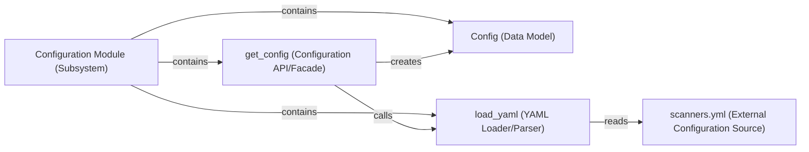

## Details

The Configuration Module serves as the central hub for managing and providing the application's operational settings.

### Configuration Module (Subsystem)
The overarching logical component responsible for managing and providing the application's operational configuration. It acts as the central point for accessing system settings, including active scanners, their order, and specific thresholds. This subsystem is primarily implemented within the llm_guard_api.app.config package.

**Related Classes/Methods**: _None_

### Config (Data Model)
Represents the structured, in-memory configuration data. This component encapsulates all loaded settings, such as the list of active scanners, their processing order, and any specific parameters or thresholds for each scanner. It acts as an internal, strongly-typed data model for the configuration.

**Related Classes/Methods**:

- <a href="https://github.com/protectai/llm-guard/blob/main/llm_guard_api/app/config.py#L52-L59" target="_blank" rel="noopener noreferrer">`llm_guard_api.app.config.Config`:52-59</a>

### get_config (Configuration API/Facade)
Serves as the primary public interface for retrieving the entire system configuration. It orchestrates the loading process, ensuring the configuration is loaded, parsed, and presented in a usable Config object format. This component hides the underlying loading complexity from consumers.

**Related Classes/Methods**:

- <a href="https://github.com/protectai/llm-guard/blob/main/llm_guard_api/app/config.py#L81-L88" target="_blank" rel="noopener noreferrer">`llm_guard_api.app.config.get_config`:81-88</a>

### load_yaml (YAML Loader/Parser)
A utility component specifically responsible for parsing the scanners.yml configuration file. It reads the YAML content and converts it into a Python-readable data structure, which is then used by get_config to construct the Config object. This component isolates the YAML parsing logic.

**Related Classes/Methods**:

- <a href="https://github.com/protectai/llm-guard/blob/main/llm_guard_api/app/config.py#L70-L78" target="_blank" rel="noopener noreferrer">`llm_guard_api.app.config.load_yaml`:70-78</a>

### scanners.yml (External Configuration Source)
The external, static YAML configuration file that declaratively defines the various input and output scanners. It specifies their types, parameters, and activation status, serving as the primary source of truth for scanner definitions. As an external file, it does not have a direct source code reference in the traditional sense.

**Related Classes/Methods**: _None_

### [FAQ](https://github.com/CodeBoarding/GeneratedOnBoardings/tree/main?tab=readme-ov-file#faq)