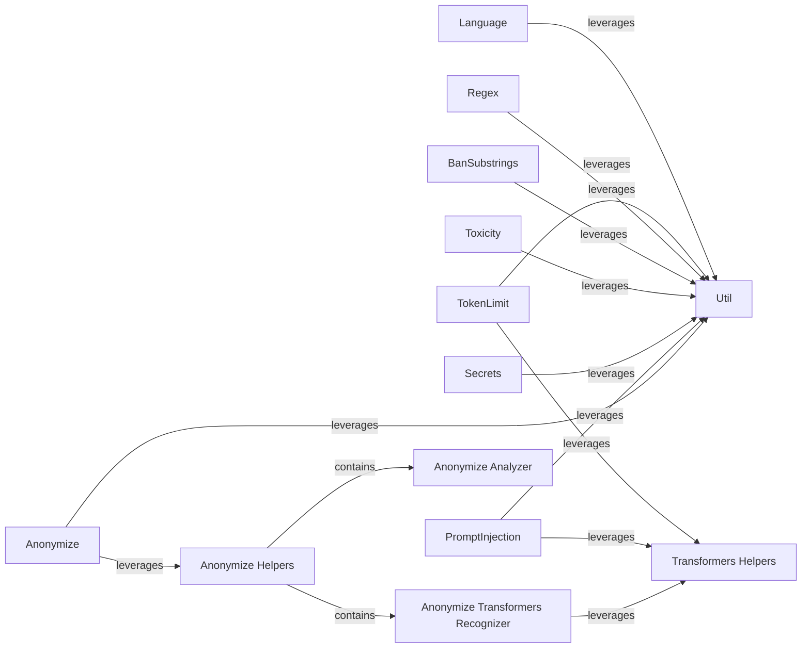

## Details

The `llm_guard` project's input scanning subsystem is designed to preprocess user prompts before they are fed into a Large Language Model (LLM). This subsystem comprises several independent scanner components, each responsible for detecting and mitigating specific types of undesirable content or behaviors. These scanners operate in a pipeline, ensuring that prompts adhere to predefined safety and policy guidelines. Core functionalities like PII detection, prompt injection prevention, and sensitive data identification are handled by specialized scanners. The system leverages shared helper modules for common tasks such as interacting with NLP models (Transformers Helpers) and general utility functions (Util). The Anonymize scanner, in particular, relies on a dedicated set of helper components for in-depth PII analysis and transformer-based recognition.

### Anonymize
Detects and handles Personally Identifiable Information (PII) within input prompts to prevent data leakage.

**Related Classes/Methods**:

- <a href="https://github.com/protectai/llm-guard/blob/main/llm_guard/input_scanners/anonymize.py" target="_blank" rel="noopener noreferrer">`llm_guard.input_scanners.anonymize`</a>

### PromptInjection
Identifies and mitigates attempts to manipulate the LLM's behavior through malicious prompt injection techniques.

**Related Classes/Methods**:

- <a href="https://github.com/protectai/llm-guard/blob/main/llm_guard/input_scanners/prompt_injection.py" target="_blank" rel="noopener noreferrer">`llm_guard.input_scanners.prompt_injection`</a>

### Secrets
Scans input prompts for the presence of sensitive credentials, API keys, or other secret information.

**Related Classes/Methods**:

- <a href="https://github.com/protectai/llm-guard/blob/main/llm_guard/input_scanners/secrets.py" target="_blank" rel="noopener noreferrer">`llm_guard.input_scanners.secrets`</a>

### Toxicity
Detects and flags toxic, offensive, or harmful content in user inputs.

**Related Classes/Methods**:

- <a href="https://github.com/protectai/llm-guard/blob/main/llm_guard/input_scanners/toxicity.py" target="_blank" rel="noopener noreferrer">`llm_guard.input_scanners.toxicity`</a>

### BanSubstrings
Enforces a configurable list of banned substrings, preventing specific words or phrases from being used in prompts.

**Related Classes/Methods**:

- <a href="https://github.com/protectai/llm-guard/blob/main/llm_guard/input_scanners/ban_substrings.py" target="_blank" rel="noopener noreferrer">`llm_guard.input_scanners.ban_substrings`</a>

### Regex
Allows for flexible pattern matching using regular expressions to identify and block undesirable input formats or content.

**Related Classes/Methods**:

- <a href="https://github.com/protectai/llm-guard/blob/main/llm_guard/input_scanners/regex.py" target="_blank" rel="noopener noreferrer">`llm_guard.input_scanners.regex`</a>

### TokenLimit
Checks if the input prompt exceeds a predefined token limit, preventing excessively long or resource-intensive requests.

**Related Classes/Methods**:

- <a href="https://github.com/protectai/llm-guard/blob/main/llm_guard/input_scanners/token_limit.py" target="_blank" rel="noopener noreferrer">`llm_guard.input_scanners.token_limit`</a>

### Language
Identifies the language of the input prompt, enabling language-specific processing or filtering.

**Related Classes/Methods**:

- <a href="https://github.com/protectai/llm-guard/blob/main/llm_guard/input_scanners/language.py" target="_blank" rel="noopener noreferrer">`llm_guard.input_scanners.language`</a>

### Transformers Helpers
Provides shared functionalities for interacting with NLP models, particularly for token classification and entity recognition.

**Related Classes/Methods**:

- <a href="https://github.com/protectai/llm-guard/blob/main/llm_guard/input_scanners/anonymize_helpers/transformers_recognizer.py#L22-L317" target="_blank" rel="noopener noreferrer">`llm_guard.input_scanners.anonymize_helpers.transformers_recognizer.TransformersRecognizer`:22-317</a>

### Util
Provides general-purpose utility functions such as logging configuration, device detection, dependency loading, text chunking, and markdown removal.

**Related Classes/Methods**:

- <a href="https://github.com/protectai/llm-guard/blob/main/llm_guard/util.py" target="_blank" rel="noopener noreferrer">`llm_guard.util`</a>

### Anonymize Helpers
A package containing specialized PII analysis functionalities used by the `Anonymize` scanner.

**Related Classes/Methods**:

- <a href="https://github.com/protectai/llm-guard/blob/main/llm_guard/input_scanners/anonymize_helpers/__init__.py" target="_blank" rel="noopener noreferrer">`llm_guard.input_scanners.anonymize_helpers`</a>

### Anonymize Analyzer
A component within `Anonymize Helpers` responsible for orchestrating PII analysis using various recognizers.

**Related Classes/Methods**:

- <a href="https://github.com/protectai/llm-guard/blob/main/llm_guard/input_scanners/anonymize_helpers/analyzer.py" target="_blank" rel="noopener noreferrer">`llm_guard.input_scanners.anonymize_helpers.analyzer.Analyzer`</a>

### Anonymize Transformers Recognizer
A component within `Anonymize Helpers` specifically designed for transformer-based PII recognition, leveraging external NLP models.

**Related Classes/Methods**:

- <a href="https://github.com/protectai/llm-guard/blob/main/llm_guard/input_scanners/anonymize_helpers/transformers_recognizer.py#L22-L317" target="_blank" rel="noopener noreferrer">`llm_guard.input_scanners.anonymize_helpers.transformers_recognizer.TransformersRecognizer`:22-317</a>

### [FAQ](https://github.com/CodeBoarding/GeneratedOnBoardings/tree/main?tab=readme-ov-file#faq)