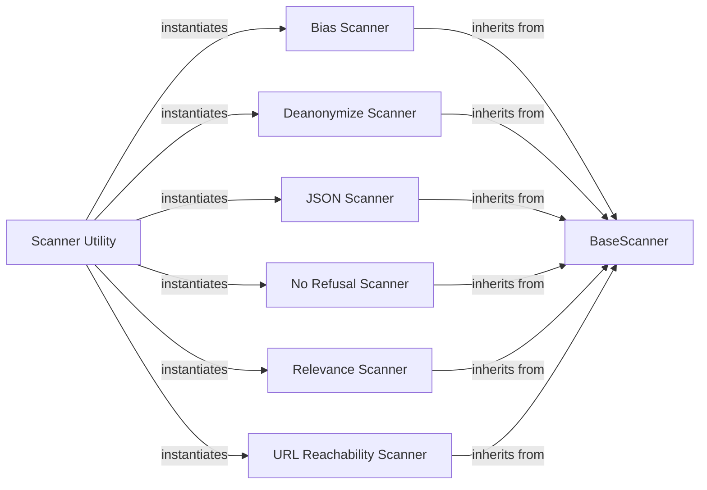

## Details

The output_scanners subsystem provides a modular and extensible framework for validating and enhancing LLM outputs. At its core, the BaseScanner defines a standardized contract for all scanning operations. Various specialized scanners, such as Bias Scanner, JSON Scanner, and URL Reachability Scanner, extend this base, each focusing on a specific aspect of output quality or safety. The Scanner Utility serves as an access point, allowing the main Core Orchestrator/Engine to dynamically select and utilize these scanners. This architecture promotes clear separation of concerns, enabling easy addition of new scanning capabilities without altering the core orchestration logic, and facilitates a robust and adaptable output validation pipeline.

### BaseScanner
Defines the common interface and abstract methods (e.g., scan) that all concrete output scanners must implement. It provides a consistent contract for the Core Orchestrator/Engine to interact with any scanner.

**Related Classes/Methods**:

- <a href="https://github.com/protectai/llm-guard/blob/main/llm_guard/output_scanners/base.py" target="_blank" rel="noopener noreferrer">`llm_guard.output_scanners.base.BaseScanner:scan`</a>

### Scanner Utility
Acts as a registry or factory for output scanner instances. It provides a mechanism for the Core Orchestrator/Engine to retrieve specific scanner implementations by name.

**Related Classes/Methods**:

- <a href="https://github.com/protectai/llm-guard/blob/main/llm_guard/output_scanners/util.py" target="_blank" rel="noopener noreferrer">`llm_guard.output_scanners.util.ScannerUtility`</a>

### Bias Scanner
Detects and flags biased content within the LLM's generated response.

**Related Classes/Methods**:

- <a href="https://github.com/protectai/llm-guard/blob/main/llm_guard/output_scanners/bias.py" target="_blank" rel="noopener noreferrer">`llm_guard.output_scanners.bias.BiasScanner`</a>

### Deanonymize Scanner
Identifies attempts to deanonymize previously anonymized information or sensitive data within the output.

**Related Classes/Methods**:

- <a href="https://github.com/protectai/llm-guard/blob/main/llm_guard/output_scanners/deanonymize.py" target="_blank" rel="noopener noreferrer">`llm_guard.output_scanners.deanonymize.DeanonymizeScanner`</a>

### JSON Scanner
Validates if the LLM's output is a well-formed JSON structure and attempts to repair it if it's malformed.

**Related Classes/Methods**:

- <a href="https://github.com/protectai/llm-guard/blob/main/llm_guard/output_scanners/json.py" target="_blank" rel="noopener noreferrer">`llm_guard.output_scanners.json.JsonScanner`</a>

### No Refusal Scanner
Checks for patterns or phrases in the LLM's response that indicate a refusal to answer or perform a requested task.

**Related Classes/Methods**:

- <a href="https://github.com/protectai/llm-guard/blob/main/llm_guard/output_scanners/no_refusal.py" target="_blank" rel="noopener noreferrer">`llm_guard.output_scanners.no_refusal.NoRefusalScanner`</a>

### Relevance Scanner
Assesses the semantic relevance of the LLM's output to the initial input prompt, ensuring the response stays on topic.

**Related Classes/Methods**:

- <a href="https://github.com/protectai/llm-guard/blob/main/llm_guard/output_scanners/relevance.py" target="_blank" rel="noopener noreferrer">`llm_guard.output_scanners.relevance.RelevanceScanner`</a>

### URL Reachability Scanner
Identifies URLs within the LLM's output and verifies their accessibility or safety.

**Related Classes/Methods**:

- <a href="https://github.com/protectai/llm-guard/blob/main/llm_guard/output_scanners/url_reachabitlity.py" target="_blank" rel="noopener noreferrer">`llm_guard.output_scanners.url_reachabitlity.UrlReachabitlityScanner`</a>

### [FAQ](https://github.com/CodeBoarding/GeneratedOnBoardings/tree/main?tab=readme-ov-file#faq)