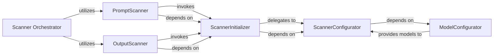

## Details

The `llm_guard_api.app.scanner` subsystem forms the core of the LLM content moderation pipeline, orchestrating the validation of both prompts and generated responses. At its highest level, the **Scanner Orchestrator** directs the overall flow, delegating prompt-specific checks to the **PromptScanner** and output-specific validations to the **OutputScanner**. Both `PromptScanner` and `OutputScanner` rely on the **ScannerInitializer** to dynamically load and prepare scanner instances. The `ScannerInitializer`, in turn, delegates the intricate task of individual scanner setup to the **ScannerConfigurator**. A critical dependency exists between `ScannerConfigurator` and the **ModelConfigurator**, where the `ModelConfigurator` is responsible for efficiently loading and providing the necessary machine learning models that power various scanners, ensuring their proper configuration and reusability across the system. This modular design allows for flexible extension and management of diverse scanning capabilities.

### Scanner Orchestrator [[Expand]](./Scanner_Orchestrator.md)
The overarching control unit that coordinates the entire scanning pipeline. It acts as the central engine, directing the flow of prompts and responses through various scanner stages.

**Related Classes/Methods**:

- <a href="https://github.com/protectai/llm-guard/blob/main/llm_guard_api/app/scanner.py#L282-L300" target="_blank" rel="noopener noreferrer">`llm_guard_api.app.scanner.scan_prompt`:282-300</a>
- <a href="https://github.com/protectai/llm-guard/blob/main/llm_guard_api/app/scanner.py#L303-L304" target="_blank" rel="noopener noreferrer">`llm_guard_api.app.scanner.ascan_prompt`:303-304</a>
- <a href="https://github.com/protectai/llm-guard/blob/main/llm_guard_api/app/scanner.py#L307-L325" target="_blank" rel="noopener noreferrer">`llm_guard_api.app.scanner.scan_output`:307-325</a>
- <a href="https://github.com/protectai/llm-guard/blob/main/llm_guard_api/app/scanner.py#L328-L329" target="_blank" rel="noopener noreferrer">`llm_guard_api.app.scanner.ascan_output`:328-329</a>

### PromptScanner
Manages the collection and application of various input scanners. It ensures that the prompt undergoes a sequence of checks as defined by the loaded input scanner configurations.

**Related Classes/Methods**:

- <a href="https://github.com/protectai/llm-guard/blob/main/llm_guard/input_scanners/base.py#L5-L24" target="_blank" rel="noopener noreferrer">`llm_guard.input_scanners.base.Scanner`:5-24</a>

### OutputScanner
Manages the collection and application of various output scanners. It ensures that the LLM's generated response undergoes a sequence of checks as defined by the loaded output scanner configurations.

**Related Classes/Methods**:

- <a href="https://github.com/protectai/llm-guard/blob/main/llm_guard/output_scanners/base.py#L5-L25" target="_blank" rel="noopener noreferrer">`llm_guard.output_scanners.base.Scanner`:5-25</a>

### ScannerInitializer
Acts as a factory and registry for scanner instances. It provides ready-to-use scanner objects (both input and output) to the orchestrators. This component supports the Plugin/Extension pattern by centralizing scanner instantiation.

**Related Classes/Methods**:

- <a href="https://github.com/protectai/llm-guard/blob/main/llm_guard_api/app/scanner.py#L43-L59" target="_blank" rel="noopener noreferrer">`llm_guard_api.app.scanner.get_input_scanners`:43-59</a>
- <a href="https://github.com/protectai/llm-guard/blob/main/llm_guard_api/app/scanner.py#L62-L77" target="_blank" rel="noopener noreferrer">`llm_guard_api.app.scanner.get_output_scanners`:62-77</a>

### ScannerConfigurator
Configures and instantiates individual scanner objects based on their specific types and settings. It handles the detailed setup required for each scanner.

**Related Classes/Methods**:

- <a href="https://github.com/protectai/llm-guard/blob/main/llm_guard_api/app/scanner.py#L107-L176" target="_blank" rel="noopener noreferrer">`llm_guard_api.app.scanner._get_input_scanner`:107-176</a>
- <a href="https://github.com/protectai/llm-guard/blob/main/llm_guard_api/app/scanner.py#L179-L269" target="_blank" rel="noopener noreferrer">`llm_guard_api.app.scanner._get_output_scanner`:179-269</a>

### ModelConfigurator
Centralizes the logic for loading and configuring machine learning models that are utilized by various scanners. This ensures efficient model management and reusability across different scanner types.

**Related Classes/Methods**:

- <a href="https://github.com/protectai/llm-guard/blob/main/llm_guard_api/app/scanner.py#L80-L104" target="_blank" rel="noopener noreferrer">`llm_guard_api.app.scanner._configure_model`:80-104</a>

### [FAQ](https://github.com/CodeBoarding/GeneratedOnBoardings/tree/main?tab=readme-ov-file#faq)