```mermaid
graph LR
    User_Client["User/Client"]
    API_Gateway["API Gateway"]
    Scanner_Orchestrator["Scanner Orchestrator"]
    Input_Scanners["Input Scanners"]
    Output_Scanners["Output Scanners"]
    Configuration_Module["Configuration Module"]
    User_Client -- "Sends Prompt/Output for Scan" --> API_Gateway
    API_Gateway -- "Forwards Scan Request" --> Scanner_Orchestrator
    Scanner_Orchestrator -- "Executes Input Scan" --> Input_Scanners
    Input_Scanners -- "Returns Input Scan Result" --> Scanner_Orchestrator
    Scanner_Orchestrator -- "Executes Output Scan" --> Output_Scanners
    Output_Scanners -- "Returns Output Scan Result" --> Scanner_Orchestrator
    Scanner_Orchestrator -- "Returns Aggregated Scan Result" --> API_Gateway
    API_Gateway -- "Receives Scan Result" --> User_Client
    Configuration_Module -- "Provides API Configuration" --> API_Gateway
    Configuration_Module -- "Provides Scanner Configuration" --> Scanner_Orchestrator
    click API_Gateway href "https://github.com/CodeBoarding/GeneratedOnBoardings/blob/main/llm-guard/API_Gateway.md" "Details"
    click Scanner_Orchestrator href "https://github.com/CodeBoarding/GeneratedOnBoardings/blob/main/llm-guard/Scanner_Orchestrator.md" "Details"
    click Input_Scanners href "https://github.com/CodeBoarding/GeneratedOnBoardings/blob/main/llm-guard/Input_Scanners.md" "Details"
    click Output_Scanners href "https://github.com/CodeBoarding/GeneratedOnBoardings/blob/main/llm-guard/Output_Scanners.md" "Details"
    click Configuration_Module href "https://github.com/CodeBoarding/GeneratedOnBoardings/blob/main/llm-guard/Configuration_Module.md" "Details"
```

## Details

The LLM Guard system is designed with a clear separation of concerns, facilitating robust and scalable content scanning for Large Language Models. At its core, an API Gateway serves as the primary entry point, handling all incoming scan requests from external Users/Clients. This gateway routes requests to the Scanner Orchestrator, the central intelligence that manages the entire scanning pipeline. The Orchestrator dynamically leverages specialized Input Scanners to analyze prompts before they reach an LLM and Output Scanners to scrutinize LLM-generated responses. All operational parameters, including active scanners and their configurations, are managed by a dedicated Configuration Module, ensuring the system adheres to defined security policies. This modular design allows for easy extension and maintenance, providing a comprehensive data flow for content moderation.

### User/Client
Represents the external entity (user, application, or system) that interacts with the LLM Guard API to submit content for scanning and receive results. As an external entity, it does not have source code within the `llm-guard` project.

**Related Classes/Methods**: _None_

### API Gateway [[Expand]](./API_Gateway.md)
The primary external interface of the LLM Guard system. It receives incoming scan requests (for prompts or outputs), handles API-level concerns, and routes requests to the appropriate internal components.

**Related Classes/Methods**:

- <a href="https://github.com/protectai/llm-guard/blob/main/llm_guard_api/app/app.py" target="_blank" rel="noopener noreferrer">`llm_guard_api.app.app`</a>

### Scanner Orchestrator [[Expand]](./Scanner_Orchestrator.md)
The central control unit responsible for managing the entire scanning pipeline. It determines which scanners to run, in what order, and aggregates their results. It acts as the core engine of the LLM Guard.

**Related Classes/Methods**:

- `llm_guard_api.app.scanner`

### Input Scanners [[Expand]](./Input_Scanners.md)
A collection of specialized, modular components designed to analyze and detect specific threats or undesirable content within user prompts *before* they are sent to the LLM. Each scanner focuses on a particular vulnerability (e.g., prompt injection, secrets).

**Related Classes/Methods**:

- <a href="https://github.com/protectai/llm-guard/blob/main/llm_guard/input_scanners" target="_blank" rel="noopener noreferrer">`llm_guard.input_scanners`</a>

### Output Scanners [[Expand]](./Output_Scanners.md)
A collection of specialized, modular components designed to analyze and detect specific threats or undesirable content within LLM-generated responses *after* they are produced.

**Related Classes/Methods**:

- <a href="https://github.com/protectai/llm-guard/blob/main/llm_guard/output_scanners" target="_blank" rel="noopener noreferrer">`llm_guard.output_scanners`</a>

### Configuration Module [[Expand]](./Configuration_Module.md)
Manages the system's operational parameters, including which scanners are active, their order, and specific thresholds or settings for each scanner. It ensures the system operates according to defined policies.

**Related Classes/Methods**:

- <a href="https://github.com/protectai/llm-guard/blob/main/llm_guard_api/app/config.py" target="_blank" rel="noopener noreferrer">`llm_guard_api.app.config`</a>
- <a href="https://github.com/protectai/llm-guard/blob/main/llm_guard_api/config/scanners.yml" target="_blank" rel="noopener noreferrer">`llm_guard_api.config.scanners`</a>

### [FAQ](https://github.com/CodeBoarding/GeneratedOnBoardings/tree/main?tab=readme-ov-file#faq)