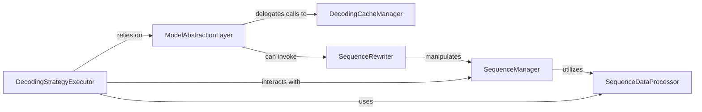

## Details

The LMQL runtime's decoding process is orchestrated by the `DecodingStrategyExecutor`, which selects and executes various decoding algorithms like argmax, sampling, or beam search. These algorithms interact with the `ModelAbstractionLayer` to perform core LLM operations such as token generation and scoring. The `ModelAbstractionLayer` can delegate calls to the `DecodingCacheManager` for performance optimization by retrieving cached model outputs. Throughout the decoding process, the `SequenceManager` is responsible for maintaining and evolving the state of individual decoding sequences, utilizing the `SequenceDataProcessor` for efficient array-like operations on sequence collections. Finally, the `SequenceRewriter` can modify sequences post-generation to enforce constraints or apply specific formatting, often invoked by the `ModelAbstractionLayer` during the decoding loop.

### ModelAbstractionLayer
Serves as the unified interface for interacting with various LLMs. It abstracts away model-specific details, handling tokenization, detokenization, computing logits masks based on constraints, and performing core model operations (e.g., argmax, score, topk_continuations). This component is crucial for the "LLM Integration Layer" aspect of the DSL runtime.

**Related Classes/Methods**:

- <a href="https://github.com/eth-sri/lmql/blob/main/src/lmql/runtime/dclib/dclib_model.py#L37-L118" target="_blank" rel="noopener noreferrer">`lmql.runtime.dclib.dclib_model.DcModel`:37-118</a>

### SequenceManager
Manages the lifecycle, state, and underlying graph representation of individual decoding sequences (DecoderSequence, DeterministicDecoderSequence, DecoderGraph, DecoderGraphSnapshot). It handles sequence extension, user data management, and sequence-level tokenization/detokenization. This is fundamental for managing the state within a DSL runtime's decoding process.

**Related Classes/Methods**:

- <a href="https://github.com/eth-sri/lmql/blob/main/src/lmql/runtime/dclib/dclib_seq.py#L84-L446" target="_blank" rel="noopener noreferrer">`lmql.runtime.dclib.dclib_seq.DecoderSequence`:84-446</a>
- <a href="https://github.com/eth-sri/lmql/blob/main/src/lmql/runtime/dclib/dclib_seq.py#L497-L671" target="_blank" rel="noopener noreferrer">`lmql.runtime.dclib.dclib_seq.DeterministicDecoderSequence`:497-671</a>
- <a href="https://github.com/eth-sri/lmql/blob/main/src/lmql/runtime/dclib/dclib_seq.py#L20-L82" target="_blank" rel="noopener noreferrer">`lmql.runtime.dclib.dclib_seq.DecoderGraph`:20-82</a>
- <a href="https://github.com/eth-sri/lmql/blob/main/src/lmql/runtime/dclib/dclib_seq.py#L15-L18" target="_blank" rel="noopener noreferrer">`lmql.runtime.dclib.dclib_seq.DecoderGraphSnapshot`:15-18</a>

### DecodingStrategyExecutor
Implements and orchestrates various decoding algorithms such as `argmax`, `sample`, `beam_sample`, and `beam_search`. It manages the overall decoding loop, applies scoring mechanisms (like `BestKScorer`), and prunes hypotheses to guide token generation. This component embodies the "Interpreter Pattern" and "Strategy Pattern" for executing decoding logic, interacting with the `ModelAbstractionLayer` for token generation and `SequenceManager` for sequence manipulation.

**Related Classes/Methods**:

- <a href="https://github.com/eth-sri/lmql/blob/main/src/lmql/runtime/dclib/decoders.py#L10-L29" target="_blank" rel="noopener noreferrer">`lmql.runtime.dclib.decoders.argmax`:10-29</a>
- <a href="https://github.com/eth-sri/lmql/blob/main/src/lmql/runtime/dclib/decoders.py#L31-L46" target="_blank" rel="noopener noreferrer">`lmql.runtime.dclib.decoders.sample`:31-46</a>
- <a href="https://github.com/eth-sri/lmql/blob/main/src/lmql/runtime/dclib/decoders.py#L49-L106" target="_blank" rel="noopener noreferrer">`lmql.runtime.dclib.decoders.best_k`:49-106</a>
- <a href="https://github.com/eth-sri/lmql/blob/main/src/lmql/runtime/dclib/decoders.py#L108-L143" target="_blank" rel="noopener noreferrer">`lmql.runtime.dclib.decoders.beam_sample`:108-143</a>
- <a href="https://github.com/eth-sri/lmql/blob/main/src/lmql/runtime/dclib/decoders.py#L145-L177" target="_blank" rel="noopener noreferrer">`lmql.runtime.dclib.decoders.beam_search`:145-177</a>

### DecodingCacheManager
Optimizes decoding performance by caching model outputs and intermediate results. It intercepts model calls, checks for cached responses, and stores new results to avoid redundant computations. This aligns with "Runtime Optimizations" for an efficient DSL runtime.

**Related Classes/Methods**:

- <a href="https://github.com/eth-sri/lmql/blob/main/src/lmql/runtime/dclib/dclib_cache.py#L60-L648" target="_blank" rel="noopener noreferrer">`lmql.runtime.dclib.dclib_cache.CachedDcModel`:60-648</a>

### SequenceDataProcessor
Provides array-like operations and utilities for efficient processing of collections of decoding sequences and continuations. This includes scoring, filtering, reshaping, and applying component-wise operations on sequence data. It supports the efficient manipulation of decoding states.

**Related Classes/Methods**:

- <a href="https://github.com/eth-sri/lmql/blob/main/src/lmql/runtime/dclib/dclib_array.py#L262-L546" target="_blank" rel="noopener noreferrer">`lmql.runtime.dclib.dclib_array.DataArray`:262-546</a>

### SequenceRewriter
Handles post-processing and rewriting of decoded sequences, primarily for constraint satisfaction or specific output formatting. It can modify sequence content based on defined rules or conditions, essential for enforcing DSL-defined constraints.

**Related Classes/Methods**:

- <a href="https://github.com/eth-sri/lmql/blob/main/src/lmql/runtime/dclib/dclib_rewrite.py#L34-L195" target="_blank" rel="noopener noreferrer">`lmql.runtime.dclib.dclib_rewrite.DcModelRewriteMixin`:34-195</a>

### [FAQ](https://github.com/CodeBoarding/GeneratedOnBoardings/tree/main?tab=readme-ov-file#faq)