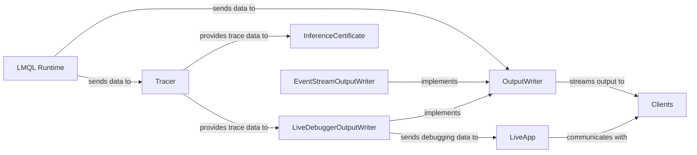

## Details

The feedback highlights missing components and relationships, specifically the 'LMQL Runtime' as a source and 'Web Clients'/'Clients' as destinations. The original analysis correctly identified several key components but lacked the overarching execution context and external consumers.

### LMQL Runtime [[Expand]](./LMQL_Runtime.md)
The core execution environment responsible for processing LMQL queries, generating intermediate states, and producing results. It acts as the central orchestrator, feeding data to output mechanisms and tracing components.

**Related Classes/Methods**: _None_

### OutputWriter
src.lmql.runtime.output_writer.BaseOutputWriter serves as the foundational interface for all output mechanisms within LMQL. It standardizes how runtime data (interpreter states, variable values, prompts, trace information) is handled and formatted, acting as the central dispatch point for the LMQL runtime.

**Related Classes/Methods**:

- <a href="https://github.com/eth-sri/lmql/blob/main/src/lmql/runtime/output_writer.py#L3-L47" target="_blank" rel="noopener noreferrer">`src.lmql.runtime.output_writer.BaseOutputWriter`:3-47</a>

### Tracer
src.lmql.runtime.tracing.tracer.Tracer is responsible for collecting and organizing execution events and metrics during LMQL query processing. It provides hierarchical tracing capabilities, capturing detailed runtime information.

**Related Classes/Methods**:

- <a href="https://github.com/eth-sri/lmql/blob/main/src/lmql/runtime/tracing/tracer.py" target="_blank" rel="noopener noreferrer">`src.lmql.runtime.tracing.tracer.Tracer`</a>

### InferenceCertificate
src.lmql.runtime.tracing.certificate.InferenceCertificate processes and structures the raw trace data from the Tracer into a formal, verifiable record of query execution. This component is vital for post-execution analysis and debugging.

**Related Classes/Methods**:

- <a href="https://github.com/eth-sri/lmql/blob/main/src/lmql/runtime/tracing/certificate.py#L6-L51" target="_blank" rel="noopener noreferrer">`src.lmql.runtime.tracing.certificate.InferenceCertificate`:6-51</a>

### LiveApp
src.lmql.ui.live.livelib.LiveApp provides the foundational framework for building interactive "live" user interface components and applications within the LMQL ecosystem. It manages client-server communication for real-time UI updates, enabling features like the live debugger.

**Related Classes/Methods**:

- <a href="https://github.com/eth-sri/lmql/blob/main/src/lmql/ui/live/livelib.py#L10-L93" target="_blank" rel="noopener noreferrer">`src.lmql.ui.live.livelib.LiveApp`:10-93</a>

### LiveDebuggerOutputWriter
src.lmql.ui.live.live.LiveDebuggerOutputWriter is a specialized OutputWriter implementation designed to provide rich, structured debugging information (e.g., decoder states, model statistics, execution graphs) specifically for the live debugger UI.

**Related Classes/Methods**:

- <a href="https://github.com/eth-sri/lmql/blob/main/src/lmql/ui/live/live.py#L12-L62" target="_blank" rel="noopener noreferrer">`src.lmql.ui.live.live.LiveDebuggerOutputWriter`:12-62</a>

### EventStreamOutputWriter
src.lmql.output.sse.EventStreamOutputWriter implements the OutputWriter interface to stream LMQL query output to external clients using Server-Sent Events (SSE), enabling one-way real-time updates for web-based interfaces.

**Related Classes/Methods**:

- <a href="https://github.com/eth-sri/lmql/blob/main/src/lmql/output/sse.py#L14-L21" target="_blank" rel="noopener noreferrer">`src.lmql.output.sse.EventStreamOutputWriter`:14-21</a>

### Clients
Represents external entities, such as web browsers or other applications, that consume the output streamed from the LMQL system and interact with its live UI components.

**Related Classes/Methods**: _None_

### [FAQ](https://github.com/CodeBoarding/GeneratedOnBoardings/tree/main?tab=readme-ov-file#faq)