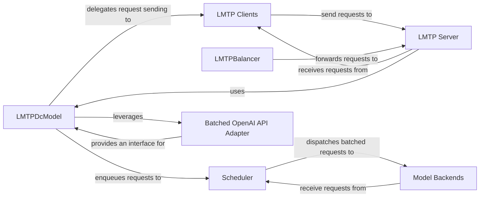

## Details

The LMTP subsystem in LMQL facilitates interaction with various LLM backends. `LMTP Clients` initiate requests, which are then sent to the `LMTP Server`. If a load balancer is in place, the `LMTPBalancer` forwards these incoming requests to available `LMTP Server` instances. The `LMTP Server` receives these requests and utilizes the `LMTPDcModel` to abstract the LLM interaction. The `LMTPDcModel` enqueues requests to the `Scheduler`, which optimizes and dispatches batched requests to specific `Model Backends` (e.g., HuggingFace, Llama.cpp) or leverages the `Batched OpenAI API Adapter` for OpenAI interactions. `Model Backends` process these requests and return results, which are then handled by the `Scheduler` and ultimately relayed back through the `LMTP Server` to the `LMTP Clients`.

### LMTPDcModel
Serves as the core abstraction for LMQL's interaction with various LLM backends. It provides a unified, high-level interface for model loading, tokenization, and core `generate` and `score` operations, abstracting away underlying communication and inference details. This component acts as the primary entry point from the LMQL runtime into the LLM integration layer.

**Related Classes/Methods**:

- <a href="https://github.com/eth-sri/lmql/blob/main/src/lmql/models/lmtp/lmtp_dcmodel.py" target="_blank" rel="noopener noreferrer">`lmql.models.lmtp.lmtp_dcmodel`</a>

### Scheduler
Orchestrates and optimizes LLM inference requests by batching them (`GenerateBatch`) and dispatching them to available `Model Backends`. It manages the lifecycle of loaded models and handles streaming results back to callers, embodying a key part of the runtime optimization.

**Related Classes/Methods**:

- <a href="https://github.com/eth-sri/lmql/blob/main/src/lmql/models/lmtp/lmtp_scheduler.py" target="_blank" rel="noopener noreferrer">`lmql.models.lmtp.lmtp_scheduler`</a>

### LMTP Clients
Provide various communication protocols and mechanisms for LMQL to interact with the `LMTP Server` or directly with remote/local model instances. They handle the low-level message passing and connection management, forming the client-side of the Client-Server Architecture.

**Related Classes/Methods**:

- <a href="https://github.com/eth-sri/lmql/blob/main/src/lmql/models/lmtp/lmtp_client.py" target="_blank" rel="noopener noreferrer">`lmql.models.lmtp.lmtp_client`</a>
- <a href="https://github.com/eth-sri/lmql/blob/main/src/lmql/models/lmtp/lmtp_multiprocessing.py" target="_blank" rel="noopener noreferrer">`lmql.models.lmtp.lmtp_multiprocessing`</a>
- <a href="https://github.com/eth-sri/lmql/blob/main/src/lmql/models/lmtp/lmtp_async.py" target="_blank" rel="noopener noreferrer">`lmql.models.lmtp.lmtp_async`</a>
- <a href="https://github.com/eth-sri/lmql/blob/main/src/lmql/models/lmtp/lmtp_replicate_client.py" target="_blank" rel="noopener noreferrer">`lmql.models.lmtp.lmtp_replicate_client`</a>

### LMTP Server
Acts as the central entry point for external `LMTP Clients`, providing a network interface (e.g., WebSocket) to expose LLM capabilities. It receives client requests and routes them for processing, forming the server-side of the Client-Server Architecture.

**Related Classes/Methods**:

- <a href="https://github.com/eth-sri/lmql/blob/main/src/lmql/models/lmtp/lmtp_serve.py" target="_blank" rel="noopener noreferrer">`lmql.models.lmtp.lmtp_serve`</a>

### LMTPBalancer
Distributes incoming LMTP requests across multiple `LMTP Server` instances (workers) to ensure efficient resource utilization, load balancing, and high availability within the distributed setup.

**Related Classes/Methods**:

- <a href="https://github.com/eth-sri/lmql/blob/main/src/lmql/models/lmtp/lmtp_balance.py" target="_blank" rel="noopener noreferrer">`lmql.models.lmtp.lmtp_balance`</a>

### Batched OpenAI API Adapter
Provides a robust, batched, and fault-tolerant interface for interacting specifically with the OpenAI API. It handles request queuing, retries, and response parsing, acting as a specialized Adapter for a key external LLM service.

**Related Classes/Methods**:

- <a href="https://github.com/eth-sri/lmql/blob/main/src/lmql/runtime/bopenai/batched_openai.py" target="_blank" rel="noopener noreferrer">`lmql.runtime.bopenai.batched_openai`</a>

### Model Backends
Encapsulate the specific implementation details for interacting with different underlying LLM libraries (e.g., HuggingFace Transformers, Llama.cpp). They provide a standardized `generate` and `score` interface for the `Scheduler`, embodying the Adapter and Strategy patterns for diverse LLM integrations.

**Related Classes/Methods**:

- <a href="https://github.com/eth-sri/lmql/blob/main/src/lmql/models/lmtp/backends/transformers_model.py" target="_blank" rel="noopener noreferrer">`lmql.models.lmtp.backends.transformers_model`</a>
- <a href="https://github.com/eth-sri/lmql/blob/main/src/lmql/models/lmtp/backends/llama_cpp_model.py" target="_blank" rel="noopener noreferrer">`lmql.models.lmtp.backends.llama_cpp_model`</a>
- <a href="https://github.com/eth-sri/lmql/blob/main/src/lmql/models/lmtp/backends/random_model.py" target="_blank" rel="noopener noreferrer">`lmql.models.lmtp.backends.random_model`</a>

### [FAQ](https://github.com/CodeBoarding/GeneratedOnBoardings/tree/main?tab=readme-ov-file#faq)