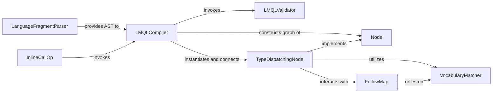

## Details

The LMQL Language Core subsystem is responsible for the foundational processes of parsing, validating, and compiling LMQL code into an internal Control Flow Graph (CFG) representation, thereby defining the language's structure and operations.

### LanguageFragmentParser
Performs lexical analysis and parsing of raw LMQL code fragments, validating syntax and constructing the Abstract Syntax Tree (AST). It's the initial step in interpreting LMQL queries, aligning with the "Interpreter Pattern."

**Related Classes/Methods**:

- <a href="https://github.com/eth-sri/lmql/blob/main/src/lmql/language/fragment_parser.py" target="_blank" rel="noopener noreferrer">`lmql.language.fragment_parser`</a>

### LMQLValidator
Conducts semantic analysis on the AST, ensuring the LMQL query adheres to language rules, checking for valid usage of variables, distributions, and other constructs to guarantee semantic correctness before compilation.

**Related Classes/Methods**:

- <a href="https://github.com/eth-sri/lmql/blob/main/src/lmql/language/validator.py" target="_blank" rel="noopener noreferrer">`lmql.language.validator`</a>

### LMQLCompiler
The core compilation engine that transforms the validated AST into an executable operational graph of Node objects. It applies transformations and optimizations, embodying the "Interpreter Pattern" by translating high-level LMQL into an executable form.

**Related Classes/Methods**:

- <a href="https://github.com/eth-sri/lmql/blob/main/src/lmql/language/compiler.py" target="_blank" rel="noopener noreferrer">`lmql.language.compiler`</a>

### Node
Serves as the abstract base class for all operational nodes within the LMQL execution graph. It defines the common interface for execution, data flow, and tracing, forming the fundamental building blocks of the compiled LMQL query's runtime representation.

**Related Classes/Methods**:

- <a href="https://github.com/eth-sri/lmql/blob/main/src/lmql/ops/node.py" target="_blank" rel="noopener noreferrer">`lmql.ops.node`</a>

### TypeDispatchingNode
Concrete implementations of the Node abstract class, representing specific LMQL operations (e.g., WHERE, SAMPLE, DISTRIBUTION). They encapsulate the logic for executing these operations, propagating constraints, and interacting with other runtime components. This aligns with the "Strategy Pattern."

**Related Classes/Methods**:

- <a href="https://github.com/eth-sri/lmql/blob/main/src/lmql/ops/ops.py" target="_blank" rel="noopener noreferrer">`lmql.ops.ops`</a>

### FollowMap
Manages and combines "follow maps," which are data structures representing allowed next tokens during LLM generation. It ensures generated tokens adhere to LMQL query constraints, contributing to runtime optimization and constraint satisfaction.

**Related Classes/Methods**:

- <a href="https://github.com/eth-sri/lmql/blob/main/src/lmql/ops/follow_map.py" target="_blank" rel="noopener noreferrer">`lmql.ops.follow_map`</a>

### VocabularyMatcher
Provides an interface to the underlying tokenizer and vocabulary, responsible for creating and managing token masks based on various criteria (e.g., regular expressions, specific token sets). It translates high-level LMQL constraints into low-level token ID masks.

**Related Classes/Methods**:

- <a href="https://github.com/eth-sri/lmql/blob/main/src/lmql/ops/token_set.py" target="_blank" rel="noopener noreferrer">`lmql.ops.token_set`</a>

### InlineCallOp
Handles the execution of nested or recursive LMQL queries within a larger query. It acts as a sub-interpreter, enabling modularity and reusability of LMQL code by allowing one LMQL fragment to invoke and execute another.

**Related Classes/Methods**:

- <a href="https://github.com/eth-sri/lmql/blob/main/src/lmql/ops/inline_call.py" target="_blank" rel="noopener noreferrer">`lmql.ops.inline_call`</a>

### [FAQ](https://github.com/CodeBoarding/GeneratedOnBoardings/tree/main?tab=readme-ov-file#faq)