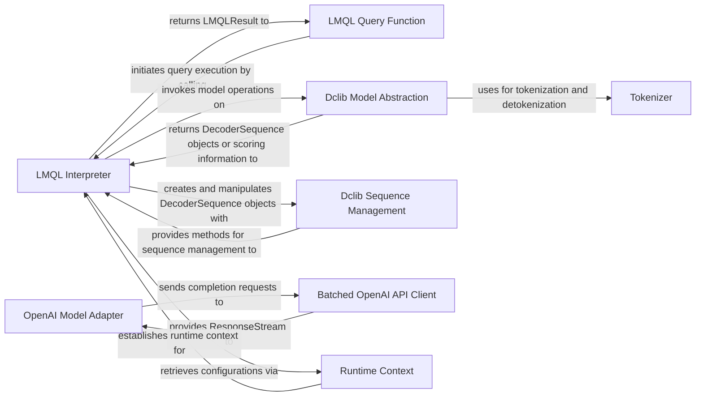

## Details

The `LMQL Runtime` subsystem is responsible for executing compiled LMQL queries, managing program state, and orchestrating the overall query execution flow by interacting with core components.

### LMQL Interpreter
The core execution engine of the LMQL runtime. It processes LMQL prompt statements, manages the program's state, applies `WHERE` clause constraints, and orchestrates token generation by interacting with underlying language models. It also handles advanced features like multi-head interpretation and prompt rewriting.

**Related Classes/Methods**:

- <a href="https://github.com/eth-sri/lmql/blob/main/src/lmql/runtime/interpreter.py#L1-L1000" target="_blank" rel="noopener noreferrer">`LMQL Interpreter`:1-1000</a>

### LMQL Query Function
Serves as the high-level, callable representation of a compiled LMQL query. It acts as the primary interface for users to execute LMQL code, resolving input variables and delegating the actual execution to the `PromptInterpreter`.

**Related Classes/Methods**:

- <a href="https://github.com/eth-sri/lmql/blob/main/src/lmql/runtime/lmql_runtime.py#L1-L1000" target="_blank" rel="noopener noreferrer">`LMQL Query Function`:1-1000</a>

### Dclib Model Abstraction
Defines a generic, abstract interface for all language models integrated with LMQL. It specifies core operations such as `argmax`, `sample`, `score_tokens`, and `topk_continuations`, allowing the `Interpreter` to interact with various models uniformly without knowing their specific implementations. This aligns with the "Adapter Pattern".

**Related Classes/Methods**:

- <a href="https://github.com/eth-sri/lmql/blob/main/src/lmql/runtime/dclib/dclib_model.py#L1-L1000" target="_blank" rel="noopener noreferrer">`Dclib Model Abstraction`:1-1000</a>

### Dclib Sequence Management
Represents and manages sequences of tokens generated by the model. It tracks associated metadata like log-probabilities, deterministic flags, and user-defined data, and supports operations like extending sequences and checking for stop phrases.

**Related Classes/Methods**:

- <a href="https://github.com/eth-sri/lmql/blob/main/src/lmql/runtime/dclib/dclib_seq.py#L1-L1000" target="_blank" rel="noopener noreferrer">`Dclib Sequence Management`:1-1000</a>

### Tokenizer [[Expand]](./Tokenizer.md)
Manages the conversion of text into token IDs (tokenization) and token IDs back into human-readable text (detokenization). It provides a unified interface for different tokenizer backends (e.g., HuggingFace, Tiktoken).

**Related Classes/Methods**:

- <a href="https://github.com/eth-sri/lmql/blob/main/src/lmql/runtime/context.py#L21-L30" target="_blank" rel="noopener noreferrer">`Tokenizer`:21-30</a>

### OpenAI Model Adapter
A concrete implementation of the `DcModel` interface specifically designed for OpenAI's API. It translates LMQL's abstract model operations into corresponding OpenAI API requests and processes the responses. This is a specific instance of the "Adapter Pattern".

**Related Classes/Methods**:

- <a href="https://github.com/eth-sri/lmql/blob/main/src/lmql/runtime/openai_integration.py#L1-L1000" target="_blank" rel="noopener noreferrer">`OpenAI Model Adapter`:1-1000</a>

### Batched OpenAI API Client
Manages efficient, asynchronous, and batched communication with the OpenAI API. It handles request queuing, retries, and error recovery to ensure high throughput and reliability of external API calls. This component supports the "Client-Server Architecture" aspect of the project.

**Related Classes/Methods**:

- <a href="https://github.com/eth-sri/lmql/blob/main/src/lmql/runtime/bopenai/batched_openai.py#L1-L1000" target="_blank" rel="noopener noreferrer">`Batched OpenAI API Client`:1-1000</a>

### Runtime Context
Provides a mechanism for managing and accessing runtime-specific configurations and objects, such as the currently active `LMQLTokenizer` and `PromptInterpreter` instance.

**Related Classes/Methods**:

- <a href="https://github.com/eth-sri/lmql/blob/main/src/lmql/runtime/context.py#L1-L1000" target="_blank" rel="noopener noreferrer">`Runtime Context`:1-1000</a>

### [FAQ](https://github.com/CodeBoarding/GeneratedOnBoardings/tree/main?tab=readme-ov-file#faq)