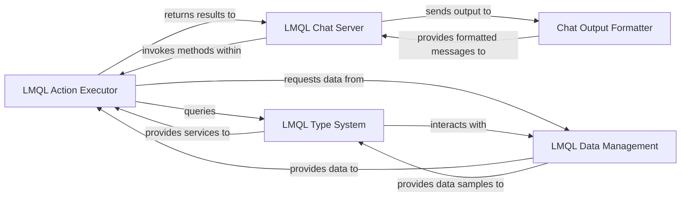

## Details

The LMQL Standard Library subsystem, encapsulated within the `lmql.lib` package, provides built-in functions, utilities, and core operational components to extend the LMQL language's capabilities, serving as a comprehensive and extensible part of the LMQL DSL runtime and development platform.

### LMQL Action Executor
This component is responsible for interpreting and executing various LMQL-defined actions. These actions include integrations with external tools (e.g., `wiki`, `lookup`), mathematical computations (`calc`), and general expression evaluation. It forms the operational backbone for executing dynamic behaviors within LMQL programs.

**Related Classes/Methods**:

- <a href="https://github.com/eth-sri/lmql/blob/main/src/lmql/lib/actions.py" target="_blank" rel="noopener noreferrer">`src/lmql/lib/actions.py`</a>

### LMQL Type System
Manages the LMQL language's type system, encompassing schema definition, rigorous type validation, and conversion of type instances. Its primary role is to ensure data consistency and correctness throughout LMQL programs, facilitating structured input and output, especially crucial when interacting with LLMs.

**Related Classes/Methods**:

- <a href="https://github.com/eth-sri/lmql/blob/main/src/lmql/lib/types.py" target="_blank" rel="noopener noreferrer">`src/lmql/lib/types.py`</a>

### LMQL Data Management
This component handles the loading, parsing, and caching of diverse datasets, such as GSM8K and Wikidata. It provides structured data samples that are essential for LMQL programs, supporting experimentation, benchmarking, and the generation of data-driven queries.

**Related Classes/Methods**:

- <a href="https://github.com/eth-sri/lmql/blob/main/src/lmql/lib/data.py" target="_blank" rel="noopener noreferrer">`src/lmql/lib/data.py`</a>

### LMQL Chat Server
Implements the interactive chat environment, managing WebSocket communication for real-time interaction. It executes LMQL queries within a chat context and streams results back to connected clients, serving as the core backend for the LMQL Playground IDE.

**Related Classes/Methods**:

- <a href="https://github.com/eth-sri/lmql/blob/main/src/lmql/lib/chat/chatserver.py" target="_blank" rel="noopener noreferrer">`src/lmql/lib/chat/chatserver.py`</a>

### Chat Output Formatter
Responsible for formatting and decorating messages specifically for display within the chat interface. This ensures that the output from LMQL program executions is consistently readable, structured, and user-friendly.

**Related Classes/Methods**:

- <a href="https://github.com/eth-sri/lmql/blob/main/src/lmql/lib/chat/output.py" target="_blank" rel="noopener noreferrer">`src/lmql/lib/chat/output.py`</a>

### [FAQ](https://github.com/CodeBoarding/GeneratedOnBoardings/tree/main?tab=readme-ov-file#faq)