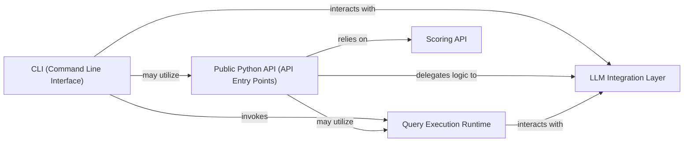

## Details

The LMQL system is designed around a clear separation of concerns, with user interactions primarily managed by the `CLI (Command Line Interface)` and the `Public Python API (API Entry Points)`. Both interfaces serve as entry points, abstracting the underlying complexities. The `CLI` directly invokes the `Query Execution Runtime` for command-line operations and interacts with the `LLM Integration Layer` for model serving. The `Public Python API` delegates core logic to the `LLM Integration Layer` for model interactions and relies on the `Scoring API` for output evaluation. At the heart of the system, the `Query Execution Runtime` orchestrates the execution of LMQL queries, interacting directly with the `LLM Integration Layer` to communicate with various language models. This layered architecture ensures modularity, allowing for independent development and maintenance of each component while providing a cohesive and powerful platform for language model interaction.

### CLI (Command Line Interface)
This component provides the command-line interface for direct user interaction with LMQL. It acts as a direct execution and tooling interface, enabling users to perform operations such as running LMQL queries, launching the interactive playground, and serving models. It abstracts the underlying complexities of the LMQL runtime and LLM integrations, offering a simplified entry point for various tasks.

**Related Classes/Methods**:

- <a href="https://github.com/eth-sri/lmql/blob/main/src/lmql/cli.py#L1-L1000" target="_blank" rel="noopener noreferrer">`lmql.cli`:1-1000</a>
- <a href="https://github.com/eth-sri/lmql/blob/main/src/lmql/cli.py#L29-L98" target="_blank" rel="noopener noreferrer">`lmql.cli.cmd_run`:29-98</a>
- <a href="https://github.com/eth-sri/lmql/blob/main/src/lmql/cli.py#L113-L171" target="_blank" rel="noopener noreferrer">`lmql.cli.cmd_playground`:113-171</a>
- <a href="https://github.com/eth-sri/lmql/blob/main/src/lmql/cli.py#L14-L18" target="_blank" rel="noopener noreferrer">`lmql.cli.cmd_serve_model`:14-18</a>

### Public Python API (API Entry Points)
This component offers a high-level Python API for programmatic interaction with LMQL. It serves as a facade, providing user-friendly functions like `generate` and `score` for common LMQL operations. This is the primary interface for developers who wish to integrate LMQL functionalities into their Python applications, abstracting the complexities of the underlying LLM integration, query execution, and scoring mechanisms.

**Related Classes/Methods**:

- <a href="https://github.com/eth-sri/lmql/blob/main/src/lmql/api/__init__.py#L1-L1000" target="_blank" rel="noopener noreferrer">`lmql.api`:1-1000</a>
- <a href="https://github.com/eth-sri/lmql/blob/main/src/lmql/api/__init__.py" target="_blank" rel="noopener noreferrer">`lmql.api.generate`</a>
- <a href="https://github.com/eth-sri/lmql/blob/main/src/lmql/api/__init__.py" target="_blank" rel="noopener noreferrer">`lmql.api.score`</a>

### Query Execution Runtime
This component is responsible for the core execution of LMQL queries. It handles the parsing, compilation, and execution of LMQL language constructs, managing the flow of data and interactions with the underlying language models. It includes functionalities for post-processing, tokenization, and tracing, ensuring efficient and accurate query execution.

**Related Classes/Methods**:

- <a href="https://github.com/eth-sri/lmql/blob/main/src/lmql/runtime/__init__.py" target="_blank" rel="noopener noreferrer">`lmql.runtime`</a>
- <a href="https://github.com/eth-sri/lmql/blob/main/src/lmql/runtime/bopenai/__init__.py" target="_blank" rel="noopener noreferrer">`lmql.runtime.bopenai`</a>
- <a href="https://github.com/eth-sri/lmql/blob/main/src/lmql/runtime/dclib/__init__.py" target="_blank" rel="noopener noreferrer">`lmql.runtime.dclib`</a>
- <a href="https://github.com/eth-sri/lmql/blob/main/src/lmql/runtime/postprocessing/__init__.py" target="_blank" rel="noopener noreferrer">`lmql.runtime.postprocessing`</a>
- <a href="https://github.com/eth-sri/lmql/blob/main/src/lmql/runtime/tokenizers/__init__.py" target="_blank" rel="noopener noreferrer">`lmql.runtime.tokenizers`</a>
- <a href="https://github.com/eth-sri/lmql/blob/main/src/lmql/runtime/tracing/__init__.py" target="_blank" rel="noopener noreferrer">`lmql.runtime.tracing`</a>

### LLM Integration Layer
This component provides a standardized interface for interacting with various Large Language Models (LLMs). It abstracts the complexities of different LLM APIs and backends, allowing the Query Execution Runtime to communicate with models seamlessly. It includes mechanisms for model loading, management, and handling different model types (e.g., Transformers, Llama.cpp).

**Related Classes/Methods**:

- <a href="https://github.com/eth-sri/lmql/blob/main/src/lmql/models/__init__.py" target="_blank" rel="noopener noreferrer">`lmql.models`</a>
- <a href="https://github.com/eth-sri/lmql/blob/main/src/lmql/models/lmtp/__init__.py" target="_blank" rel="noopener noreferrer">`lmql.models.lmtp`</a>
- <a href="https://github.com/eth-sri/lmql/blob/main/src/lmql/models/lmtp/backends/__init__.py" target="_blank" rel="noopener noreferrer">`lmql.models.lmtp.backends`</a>
- <a href="https://github.com/eth-sri/lmql/blob/main/src/lmql/models/model_info.py" target="_blank" rel="noopener noreferrer">`lmql.models.model_info`</a>

### Scoring API
This component provides functionalities for scoring and evaluating the outputs generated by LMQL queries. It is utilized by the Public Python API to offer a direct method for assessing the quality or relevance of generated text based on defined criteria.

**Related Classes/Methods**:

- <a href="https://github.com/eth-sri/lmql/blob/main/src/lmql/api/scoring.py" target="_blank" rel="noopener noreferrer">`lmql.api.scoring`</a>

### [FAQ](https://github.com/CodeBoarding/GeneratedOnBoardings/tree/main?tab=readme-ov-file#faq)