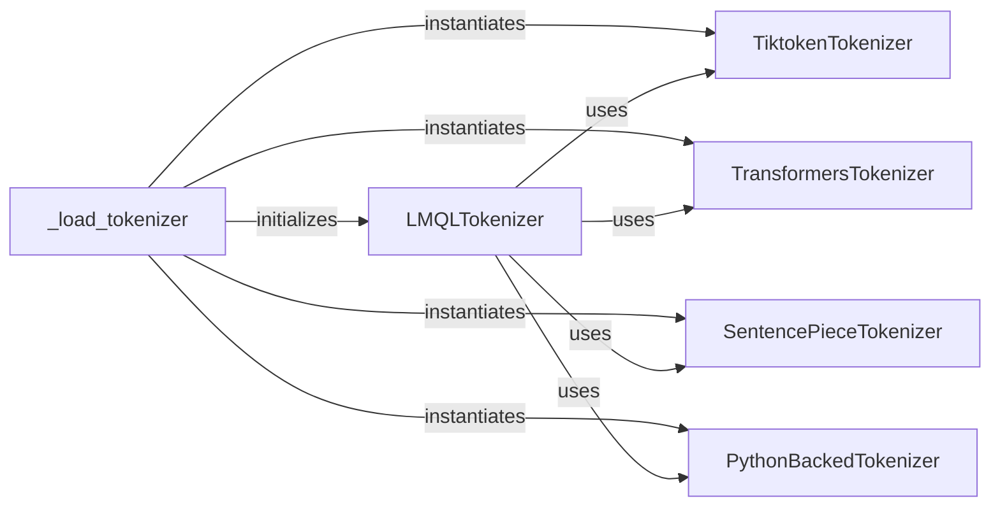

## Details

The Tokenizer subsystem is crucial for the LMQL project, providing the essential text-to-token and token-to-text conversion services required for interaction with Large Language Models. It embodies the Adapter and Strategy patterns to support diverse tokenizer implementations.

### LMQLTokenizer
Serves as the primary abstract interface and facade for all tokenization and detokenization operations within LMQL. It provides a consistent API, abstracting the complexities of various underlying tokenizer implementations, and manages special tokens and tokenizer properties. This component is critical for maintaining a clean separation between the LMQL runtime and specific LLM tokenizer details, embodying the Adapter Pattern.

**Related Classes/Methods**:

- <a href="https://github.com/eth-sri/lmql/blob/main/src/lmql/runtime/tokenizer.py#L27-L272" target="_blank" rel="noopener noreferrer">`lmql.runtime.tokenizer.LMQLTokenizer`:27-272</a>

### _load_tokenizer
A factory function responsible for dynamically selecting and instantiating the appropriate concrete tokenizer backend based on the provided model identifier or configuration. It ensures the correct tokenizer is loaded and initialized for use by LMQLTokenizer, acting as a key part of the Strategy Pattern implementation.

**Related Classes/Methods**:

- <a href="https://github.com/eth-sri/lmql/blob/main/src/lmql/runtime/tokenizer.py#L293-L363" target="_blank" rel="noopener noreferrer">`lmql.runtime.tokenizer._load_tokenizer`:293-363</a>

### TiktokenTokenizer
Provides the concrete implementation for tokenization using the tiktoken library, primarily used for OpenAI models. It handles encoding text to token IDs and decoding token IDs back to text, along with managing tiktoken-specific special tokens. This is one of the core strategies for LLM integration.

**Related Classes/Methods**:

- <a href="https://github.com/eth-sri/lmql/blob/main/src/lmql/runtime/tokenizers/tiktoken_tokenizer.py#L11-L114" target="_blank" rel="noopener noreferrer">`lmql.runtime.tokenizers.tiktoken_tokenizer.TiktokenTokenizer`:11-114</a>

### TransformersTokenizer
Implements tokenization logic by wrapping HuggingFace Transformers tokenizers. This component leverages the extensive model support of the HuggingFace ecosystem for encoding, decoding, and handling special tokens, significantly broadening LMQL's compatibility with various LLMs.

**Related Classes/Methods**:

- <a href="https://github.com/eth-sri/lmql/blob/main/src/lmql/runtime/tokenizers/hf_tokenizer.py#L6-L110" target="_blank" rel="noopener noreferrer">`lmql.runtime.tokenizers.hf_tokenizer.TransformersTokenizer`:6-110</a>

### SentencePieceTokenizer
Offers tokenization capabilities for models that utilize SentencePiece, a common subword tokenization algorithm (e.g., Llama models). It handles the specific encoding and decoding nuances of SentencePiece, ensuring accurate tokenization for these model architectures.

**Related Classes/Methods**:

- <a href="https://github.com/eth-sri/lmql/blob/main/src/lmql/runtime/tokenizers/sentencepiece_tokenizer.py#L1-L125" target="_blank" rel="noopener noreferrer">`lmql.runtime.tokenizers.sentencepiece_tokenizer.SentencePieceTokenizer`:1-125</a>

### PythonBackedTokenizer
Provides a pure Python implementation of a tokenizer. This serves as a fallback or for specific internal LMQL tokenization needs where external libraries might not be suitable or available, ensuring a baseline tokenization capability.

**Related Classes/Methods**:

- <a href="https://github.com/eth-sri/lmql/blob/main/src/lmql/runtime/tokenizers/pure_python_tokenizer.py#L1-L133" target="_blank" rel="noopener noreferrer">`lmql.runtime.tokenizers.pure_python_tokenizer.PythonBackedTokenizer`:1-133</a>

### [FAQ](https://github.com/CodeBoarding/GeneratedOnBoardings/tree/main?tab=readme-ov-file#faq)