```mermaid
graph LR
    Public_API_CLI["Public API & CLI"]
    LMQL_Language_Core["LMQL Language Core"]
    LMQL_Runtime["LMQL Runtime"]
    Decoder_Control_Library_DCLib_["Decoder Control Library (DCLib)"]
    LLM_Integration_Layer_LMTP_["LLM Integration Layer (LMTP)"]
    Tokenizer["Tokenizer"]
    Developer_Tooling_Output["Developer Tooling & Output"]
    LMQL_Standard_Library["LMQL Standard Library"]
    Public_API_CLI -- "submits queries to" --> LMQL_Language_Core
    Public_API_CLI -- "initiates execution via" --> LMQL_Runtime
    LMQL_Language_Core -- "compiles code for" --> LMQL_Runtime
    LMQL_Runtime -- "relies on" --> Decoder_Control_Library_DCLib_
    LMQL_Runtime -- "invokes functions from" --> LMQL_Standard_Library
    Decoder_Control_Library_DCLib_ -- "communicates with" --> LLM_Integration_Layer_LMTP_
    LLM_Integration_Layer_LMTP_ -- "utilizes" --> Tokenizer
    LMQL_Runtime -- "sends data to" --> Developer_Tooling_Output
    Developer_Tooling_Output -- "interacts with" --> Public_API_CLI
    click Public_API_CLI href "https://github.com/CodeBoarding/GeneratedOnBoardings/blob/main/lmql/Public_API_CLI.md" "Details"
    click LMQL_Language_Core href "https://github.com/CodeBoarding/GeneratedOnBoardings/blob/main/lmql/LMQL_Language_Core.md" "Details"
    click LMQL_Runtime href "https://github.com/CodeBoarding/GeneratedOnBoardings/blob/main/lmql/LMQL_Runtime.md" "Details"
    click Decoder_Control_Library_DCLib_ href "https://github.com/CodeBoarding/GeneratedOnBoardings/blob/main/lmql/Decoder_Control_Library_DCLib_.md" "Details"
    click LLM_Integration_Layer_LMTP_ href "https://github.com/CodeBoarding/GeneratedOnBoardings/blob/main/lmql/LLM_Integration_Layer_LMTP_.md" "Details"
    click Tokenizer href "https://github.com/CodeBoarding/GeneratedOnBoardings/blob/main/lmql/Tokenizer.md" "Details"
    click Developer_Tooling_Output href "https://github.com/CodeBoarding/GeneratedOnBoardings/blob/main/lmql/Developer_Tooling_Output.md" "Details"
    click LMQL_Standard_Library href "https://github.com/CodeBoarding/GeneratedOnBoardings/blob/main/lmql/LMQL_Standard_Library.md" "Details"
```

## Details

The LMQL architecture is structured to provide a seamless experience for defining and executing queries against Large Language Models. At its core, the Public API & CLI serves as the primary user interface, accepting LMQL queries. These queries are then processed by the LMQL Language Core, which compiles them into an executable Control Flow Graph. The LMQL Runtime takes this CFG and orchestrates the query's execution, leveraging the Decoder Control Library (DCLib) for fine-grained control over the LLM's decoding process. DCLib, in turn, interfaces with various LLM backends through the LLM Integration Layer (LMTP), which handles the complexities of model communication and relies on the Tokenizer for efficient text-to-token conversion. Throughout execution, the LMQL Runtime can utilize the LMQL Standard Library for extended functionalities, while all output, tracing, and debugging information are channeled to the Developer Tooling & Output component, providing comprehensive insights into the query's lifecycle. This modular design ensures clear separation of concerns, promoting extensibility and maintainability across the DSL runtime and development platform.

### Public API & CLI [[Expand]](./Public_API_CLI.md)
Provides the primary interfaces for users to interact with LMQL, offering both a high-level Python API for programmatic use and a command-line interface for direct execution and tooling.

**Related Classes/Methods**:

- <a href="https://github.com/eth-sri/lmql/blob/main/src/lmql/api/" target="_blank" rel="noopener noreferrer">`lmql.api`</a>
- <a href="https://github.com/eth-sri/lmql/blob/main/src/lmql/cli.py" target="_blank" rel="noopener noreferrer">`lmql.cli`</a>

### LMQL Language Core [[Expand]](./LMQL_Language_Core.md)
Responsible for parsing, validating, and compiling LMQL code into an internal Control Flow Graph (CFG) representation, defining the language's structure and operations.

**Related Classes/Methods**:

- <a href="https://github.com/eth-sri/lmql/blob/main/src/lmql/language/" target="_blank" rel="noopener noreferrer">`lmql.language`</a>
- <a href="https://github.com/eth-sri/lmql/blob/main/src/lmql/ops/" target="_blank" rel="noopener noreferrer">`lmql.ops`</a>

### LMQL Runtime [[Expand]](./LMQL_Runtime.md)
Executes the compiled LMQL queries, manages the program state, and orchestrates the overall query execution flow, interacting with other core components to fulfill query logic.

**Related Classes/Methods**:

- <a href="https://github.com/eth-sri/lmql/blob/main/src/lmql/runtime/" target="_blank" rel="noopener noreferrer">`lmql.runtime`</a>

### Decoder Control Library (DCLib) [[Expand]](./Decoder_Control_Library_DCLib_.md)
Offers a low-level, model-agnostic interface for fine-grained control over the LLM decoding process, including sequence manipulation, caching, and applying constraints during token generation.

**Related Classes/Methods**:

- <a href="https://github.com/eth-sri/lmql/blob/main/src/lmql/runtime/dclib/" target="_blank" rel="noopener noreferrer">`lmql.runtime.dclib`</a>

### LLM Integration Layer (LMTP) [[Expand]](./LLM_Integration_Layer_LMTP_.md)
Manages communication with diverse LLM backends (e.g., OpenAI, HuggingFace) using the LMQL Model Transport Protocol, handling requests, responses, streaming, and model serving capabilities.

**Related Classes/Methods**:

- <a href="https://github.com/eth-sri/lmql/blob/main/src/lmql/models/lmtp/" target="_blank" rel="noopener noreferrer">`lmql.models.lmtp`</a>
- <a href="https://github.com/eth-sri/lmql/blob/main/src/lmql/runtime/bopenai/" target="_blank" rel="noopener noreferrer">`lmql.runtime.bopenai`</a>

### Tokenizer [[Expand]](./Tokenizer.md)
Provides essential tokenization and detokenization services, adapting to various model-specific tokenizers to efficiently convert text to tokens and vice-versa for LLM interaction.

**Related Classes/Methods**:

- <a href="https://github.com/eth-sri/lmql/blob/main/src/lmql/runtime/tokenizer.py" target="_blank" rel="noopener noreferrer">`lmql.runtime.tokenizer`</a>
- <a href="https://github.com/eth-sri/lmql/blob/main/src/lmql/runtime/tokenizers/" target="_blank" rel="noopener noreferrer">`lmql.runtime.tokenizers`</a>

### Developer Tooling & Output [[Expand]](./Developer_Tooling_Output.md)
Encompasses interactive user interfaces like the web-based playground, live debugging views, and systems for managing query output and tracing execution for analysis and user feedback.

**Related Classes/Methods**:

- <a href="https://github.com/eth-sri/lmql/blob/main/src/lmql/ui/" target="_blank" rel="noopener noreferrer">`lmql.ui`</a>
- <a href="https://github.com/eth-sri/lmql/blob/main/src/lmql/runtime/output_writer.py" target="_blank" rel="noopener noreferrer">`lmql.runtime.output_writer`</a>
- <a href="https://github.com/eth-sri/lmql/blob/main/src/lmql/runtime/tracing/" target="_blank" rel="noopener noreferrer">`lmql.runtime.tracing`</a>
- <a href="https://github.com/eth-sri/lmql/blob/main/src/lmql/output/" target="_blank" rel="noopener noreferrer">`lmql.output`</a>

### LMQL Standard Library [[Expand]](./LMQL_Standard_Library.md)
A collection of built-in functions and utilities available for direct use within LMQL queries, extending the language's capabilities with common operations, tool integrations, and data handling.

**Related Classes/Methods**:

- <a href="https://github.com/eth-sri/lmql/blob/main/src/lmql/lib/" target="_blank" rel="noopener noreferrer">`lmql.lib`</a>

### [FAQ](https://github.com/CodeBoarding/GeneratedOnBoardings/tree/main?tab=readme-ov-file#faq)