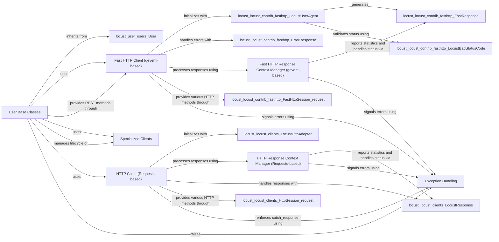

## Component Details

This component overview details the structure and interactions of various client interfaces within the Locust framework. It encompasses generic HTTP clients (both Requests-based and gevent-based Fast HTTP), their associated response context managers for handling success and failure, and specialized clients for protocols like OpenAI, MongoDB, and PostgreSQL. These clients are primarily utilized by different User base classes to simulate diverse load testing scenarios, with robust exception handling integrated across the system for error reporting and control.

### HTTP Client (Requests-based)
This component handles HTTP requests using the 'requests' library, providing session management, URL building, and robust error handling. It's designed to integrate seamlessly with Locust's statistics reporting.

**Related Classes/Methods**:

- <a href="https://github.com/locustio/locust/blob/master/locust/clients.py#L65-L319" target="_blank" rel="noopener noreferrer">`locust.locust.clients.HttpSession` (65:319)</a>
- <a href="https://github.com/locustio/locust/blob/master/locust/clients.py#L89-L115" target="_blank" rel="noopener noreferrer">`locust.locust.clients.HttpSession:__init__` (89:115)</a>
- <a href="https://github.com/locustio/locust/blob/master/locust/clients.py#L134-L228" target="_blank" rel="noopener noreferrer">`locust.locust.clients.HttpSession:request` (134:228)</a>
- <a href="https://github.com/locustio/locust/blob/master/locust/clients.py#L230-L245" target="_blank" rel="noopener noreferrer">`locust.locust.clients.HttpSession:_send_request_safe_mode` (230:245)</a>
- <a href="https://github.com/locustio/locust/blob/master/locust/clients.py#L247-L252" target="_blank" rel="noopener noreferrer">`locust.locust.clients.HttpSession:get` (247:252)</a>
- <a href="https://github.com/locustio/locust/blob/master/locust/clients.py#L254-L264" target="_blank" rel="noopener noreferrer">`locust.locust.clients.HttpSession:options` (254:264)</a>
- <a href="https://github.com/locustio/locust/blob/master/locust/clients.py#L266-L276" target="_blank" rel="noopener noreferrer">`locust.locust.clients.HttpSession:head` (266:276)</a>
- <a href="https://github.com/locustio/locust/blob/master/locust/clients.py#L278-L286" target="_blank" rel="noopener noreferrer">`locust.locust.clients.HttpSession:post` (278:286)</a>
- <a href="https://github.com/locustio/locust/blob/master/locust/clients.py#L288-L297" target="_blank" rel="noopener noreferrer">`locust.locust.clients.HttpSession:put` (288:297)</a>
- <a href="https://github.com/locustio/locust/blob/master/locust/clients.py#L299-L308" target="_blank" rel="noopener noreferrer">`locust.locust.clients.HttpSession:patch` (299:308)</a>
- <a href="https://github.com/locustio/locust/blob/master/locust/clients.py#L310-L319" target="_blank" rel="noopener noreferrer">`locust.locust.clients.HttpSession:delete` (310:319)</a>
- <a href="https://github.com/locustio/locust/blob/master/locust/clients.py#L432-L439" target="_blank" rel="noopener noreferrer">`locust.locust.clients.LocustHttpAdapter` (432:439)</a>
- <a href="https://github.com/locustio/locust/blob/master/locust/clients.py#L56-L62" target="_blank" rel="noopener noreferrer">`locust.locust.clients.LocustResponse` (56:62)</a>
- <a href="https://github.com/locustio/locust/blob/master/locust/clients.py#L443-L446" target="_blank" rel="noopener noreferrer">`locust.locust.clients._missing_catch_response_True` (443:446)</a>

### HTTP Response Context Manager (Requests-based)
This component provides a context manager for HTTP responses generated by the 'requests'-based client. It allows users to manually control the success or failure status of a request, overriding default HTTP status code behavior, and integrates with Locust's statistics reporting.

**Related Classes/Methods**:

- <a href="https://github.com/locustio/locust/blob/master/locust/clients.py#L322-L429" target="_blank" rel="noopener noreferrer">`locust.locust.clients.ResponseContextManager` (322:429)</a>
- <a href="https://github.com/locustio/locust/blob/master/locust/clients.py#L345-L389" target="_blank" rel="noopener noreferrer">`locust.locust.clients.ResponseContextManager:__exit__` (345:389)</a>
- <a href="https://github.com/locustio/locust/blob/master/locust/clients.py#L394-L408" target="_blank" rel="noopener noreferrer">`locust.locust.clients.ResponseContextManager:success` (394:408)</a>
- <a href="https://github.com/locustio/locust/blob/master/locust/clients.py#L410-L429" target="_blank" rel="noopener noreferrer">`locust.locust.clients.ResponseContextManager:failure` (410:429)</a>

### Fast HTTP Client (gevent-based)
This component offers a high-performance HTTP client built on 'geventhttpclient', designed for efficient request handling in high-concurrency load testing scenarios. It provides similar functionalities to the 'requests'-based client but with optimized resource usage.

**Related Classes/Methods**:

- <a href="https://github.com/locustio/locust/blob/master/locust/contrib/fasthttp.py#L104-L338" target="_blank" rel="noopener noreferrer">`locust.locust.contrib.fasthttp.FastHttpSession` (104:338)</a>
- <a href="https://github.com/locustio/locust/blob/master/locust/contrib/fasthttp.py#L107-L146" target="_blank" rel="noopener noreferrer">`locust.locust.contrib.fasthttp.FastHttpSession:__init__` (107:146)</a>
- <a href="https://github.com/locustio/locust/blob/master/locust/contrib/fasthttp.py#L155-L175" target="_blank" rel="noopener noreferrer">`locust.locust.contrib.fasthttp.FastHttpSession:_send_request_safe_mode` (155:175)</a>
- <a href="https://github.com/locustio/locust/blob/master/locust/contrib/fasthttp.py#L177-L293" target="_blank" rel="noopener noreferrer">`locust.locust.contrib.fasthttp.FastHttpSession:request` (177:293)</a>
- <a href="https://github.com/locustio/locust/blob/master/locust/contrib/fasthttp.py#L295-L297" target="_blank" rel="noopener noreferrer">`locust.locust.contrib.fasthttp.FastHttpSession:delete` (295:297)</a>
- <a href="https://github.com/locustio/locust/blob/master/locust/contrib/fasthttp.py#L299-L301" target="_blank" rel="noopener noreferrer">`locust.locust.contrib.fasthttp.FastHttpSession:get` (299:301)</a>
- <a href="https://github.com/locustio/locust/blob/master/locust/contrib/fasthttp.py#L303-L312" target="_blank" rel="noopener noreferrer">`locust.locust.contrib.fasthttp.FastHttpSession:iter_lines` (303:312)</a>
- <a href="https://github.com/locustio/locust/blob/master/locust/contrib/fasthttp.py#L314-L316" target="_blank" rel="noopener noreferrer">`locust.locust.contrib.fasthttp.FastHttpSession:head` (314:316)</a>
- <a href="https://github.com/locustio/locust/blob/master/locust/contrib/fasthttp.py#L318-L320" target="_blank" rel="noopener noreferrer">`locust.locust.contrib.fasthttp.FastHttpSession:options` (318:320)</a>
- <a href="https://github.com/locustio/locust/blob/master/locust/contrib/fasthttp.py#L322-L326" target="_blank" rel="noopener noreferrer">`locust.locust.contrib.fasthttp.FastHttpSession:patch` (322:326)</a>
- <a href="https://github.com/locustio/locust/blob/master/locust/contrib/fasthttp.py#L328-L332" target="_blank" rel="noopener noreferrer">`locust.locust.contrib.fasthttp.FastHttpSession:post` (328:332)</a>
- <a href="https://github.com/locustio/locust/blob/master/locust/contrib/fasthttp.py#L334-L338" target="_blank" rel="noopener noreferrer">`locust.locust.contrib.fasthttp.FastHttpSession:put` (334:338)</a>
- <a href="https://github.com/locustio/locust/blob/master/locust/contrib/fasthttp.py#L488-L576" target="_blank" rel="noopener noreferrer">`locust.locust.contrib.fasthttp.FastResponse` (488:576)</a>
- <a href="https://github.com/locustio/locust/blob/master/locust/contrib/fasthttp.py#L568-L571" target="_blank" rel="noopener noreferrer">`locust.locust.contrib.fasthttp.FastResponse:success` (568:571)</a>
- <a href="https://github.com/locustio/locust/blob/master/locust/contrib/fasthttp.py#L573-L576" target="_blank" rel="noopener noreferrer">`locust.locust.contrib.fasthttp.FastResponse:failure` (573:576)</a>
- <a href="https://github.com/locustio/locust/blob/master/locust/contrib/fasthttp.py#L608-L630" target="_blank" rel="noopener noreferrer">`locust.locust.contrib.fasthttp.LocustUserAgent` (608:630)</a>
- <a href="https://github.com/locustio/locust/blob/master/locust/contrib/fasthttp.py#L619-L625" target="_blank" rel="noopener noreferrer">`locust.locust.contrib.fasthttp.LocustUserAgent:_urlopen` (619:625)</a>
- <a href="https://github.com/locustio/locust/blob/master/locust/contrib/fasthttp.py#L627-L630" target="_blank" rel="noopener noreferrer">`locust.locust.contrib.fasthttp.LocustUserAgent:_verify_status` (627:630)</a>
- <a href="https://github.com/locustio/locust/blob/master/locust/contrib/fasthttp.py#L579-L597" target="_blank" rel="noopener noreferrer">`locust.locust.contrib.fasthttp.ErrorResponse` (579:597)</a>
- <a href="https://github.com/locustio/locust/blob/master/locust/contrib/fasthttp.py#L600-L605" target="_blank" rel="noopener noreferrer">`locust.locust.contrib.fasthttp.LocustBadStatusCode` (600:605)</a>

### Fast HTTP Response Context Manager (gevent-based)
This component provides a context manager for HTTP responses from the 'gevent'-based client. It enables manual success/failure reporting for requests and integrates these results into Locust's performance statistics.

**Related Classes/Methods**:

- <a href="https://github.com/locustio/locust/blob/master/locust/contrib/fasthttp.py#L633-L726" target="_blank" rel="noopener noreferrer">`locust.locust.contrib.fasthttp.ResponseContextManager` (633:726)</a>
- <a href="https://github.com/locustio/locust/blob/master/locust/contrib/fasthttp.py#L661-L686" target="_blank" rel="noopener noreferrer">`locust.locust.contrib.fasthttp.ResponseContextManager:__exit__` (661:686)</a>
- <a href="https://github.com/locustio/locust/blob/master/locust/contrib/fasthttp.py#L691-L705" target="_blank" rel="noopener noreferrer">`locust.locust.contrib.fasthttp.ResponseContextManager:success` (691:705)</a>
- <a href="https://github.com/locustio/locust/blob/master/locust/contrib/fasthttp.py#L707-L726" target="_blank" rel="noopener noreferrer">`locust.locust.contrib.fasthttp.ResponseContextManager:failure` (707:726)</a>

### User Base Classes
This component defines the foundational behavior for various types of Locust users, including generic HTTP users and specialized users for different protocols like OpenAI, MongoDB, and PostgreSQL. It provides the core structure for defining user tasks and interactions.

**Related Classes/Methods**:

- <a href="https://github.com/locustio/locust/blob/master/locust/user/users.py#L49-L238" target="_blank" rel="noopener noreferrer">`locust.user.users.User` (49:238)</a>
- <a href="https://github.com/locustio/locust/blob/master/locust/user/users.py#L241-L276" target="_blank" rel="noopener noreferrer">`locust.locust.user.users.HttpUser` (241:276)</a>
- <a href="https://github.com/locustio/locust/blob/master/locust/user/users.py#L259-L276" target="_blank" rel="noopener noreferrer">`locust.locust.user.users.HttpUser:__init__` (259:276)</a>
- <a href="https://github.com/locustio/locust/blob/master/locust/contrib/oai.py#L68-L73" target="_blank" rel="noopener noreferrer">`locust.locust.contrib.oai.OpenAIUser` (68:73)</a>
- <a href="https://github.com/locustio/locust/blob/master/locust/contrib/oai.py#L71-L73" target="_blank" rel="noopener noreferrer">`locust.locust.contrib.oai.OpenAIUser:__init__` (71:73)</a>
- <a href="https://github.com/locustio/locust/blob/master/locust/contrib/mongodb.py#L33-L41" target="_blank" rel="noopener noreferrer">`locust.locust.contrib.mongodb.MongoDBUser` (33:41)</a>
- <a href="https://github.com/locustio/locust/blob/master/locust/contrib/mongodb.py#L36-L38" target="_blank" rel="noopener noreferrer">`locust.locust.contrib.mongodb.MongoDBUser:__init__` (36:38)</a>
- <a href="https://github.com/locustio/locust/blob/master/locust/contrib/fasthttp.py#L341-L477" target="_blank" rel="noopener noreferrer">`locust.locust.contrib.fasthttp.FastHttpUser` (341:477)</a>
- <a href="https://github.com/locustio/locust/blob/master/locust/contrib/fasthttp.py#L391-L417" target="_blank" rel="noopener noreferrer">`locust.locust.contrib.fasthttp.FastHttpUser:__init__` (391:417)</a>
- <a href="https://github.com/locustio/locust/blob/master/locust/contrib/fasthttp.py#L420-L465" target="_blank" rel="noopener noreferrer">`locust.locust.contrib.fasthttp.FastHttpUser:rest` (420:465)</a>
- <a href="https://github.com/locustio/locust/blob/master/locust/contrib/fasthttp.py#L468-L477" target="_blank" rel="noopener noreferrer">`locust.locust.contrib.fasthttp.FastHttpUser:rest_` (468:477)</a>
- <a href="https://github.com/locustio/locust/blob/master/locust/contrib/postgres.py#L37-L45" target="_blank" rel="noopener noreferrer">`locust.locust.contrib.postgres.PostgresUser` (37:45)</a>
- <a href="https://github.com/locustio/locust/blob/master/locust/contrib/postgres.py#L40-L42" target="_blank" rel="noopener noreferrer">`locust.locust.contrib.postgres.PostgresUser:__init__` (40:42)</a>
- <a href="https://github.com/locustio/locust/blob/master/locust/contrib/postgres.py#L44-L45" target="_blank" rel="noopener noreferrer">`locust.locust.contrib.postgres.PostgresUser:on_stop` (44:45)</a>

### Exception Handling
This component centralizes custom exception classes used throughout the Locust framework. These exceptions are crucial for signaling specific error conditions, such as issues with response handling or configuration, and contribute to robust error reporting.

**Related Classes/Methods**:

- <a href="https://github.com/locustio/locust/blob/master/locust/exception.py#L1-L2" target="_blank" rel="noopener noreferrer">`locust.locust.exception.LocustError` (1:2)</a>
- <a href="https://github.com/locustio/locust/blob/master/locust/exception.py#L9-L10" target="_blank" rel="noopener noreferrer">`locust.locust.exception.CatchResponseError` (9:10)</a>

### Specialized Clients
This component encompasses client implementations tailored for interacting with specific protocols or services beyond standard HTTP, such as OpenAI, MongoDB, and PostgreSQL. These clients are utilized by their respective User classes to simulate diverse user behaviors.

**Related Classes/Methods**:

- <a href="https://github.com/locustio/locust/blob/master/locust/contrib/oai.py#L21-L65" target="_blank" rel="noopener noreferrer">`locust.locust.contrib.oai.OpenAIClient` (21:65)</a>
- <a href="https://github.com/locustio/locust/blob/master/locust/contrib/mongodb.py#L9-L30" target="_blank" rel="noopener noreferrer">`locust.locust.contrib.mongodb.MongoDBClient` (9:30)</a>
- <a href="https://github.com/locustio/locust/blob/master/locust/contrib/postgres.py#L8-L34" target="_blank" rel="noopener noreferrer">`locust.locust.contrib.postgres.PostgresClient` (8:34)</a>
- <a href="https://github.com/locustio/locust/blob/master/locust/contrib/postgres.py#L33-L34" target="_blank" rel="noopener noreferrer">`locust.locust.contrib.postgres.PostgresClient.close` (33:34)</a>

### [FAQ](https://github.com/CodeBoarding/GeneratedOnBoardings/tree/main?tab=readme-ov-file#faq)