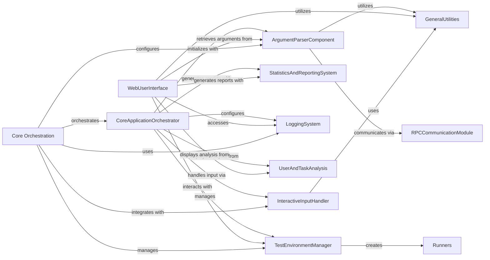

## Component Details

This graph illustrates the core components of the Locust load testing framework and their interdependencies. The `Core Orchestration` component acts as the central control, initiating the application flow by configuring argument parsing, managing the test environment, and integrating interactive input. The `CoreApplicationOrchestrator` handles the main test execution, including runner management, logging, and reporting. The `ArgumentParserComponent` is crucial for initial setup, handling command-line arguments and configuration. The `TestEnvironmentManager` maintains the test state and facilitates the creation of various `Runners` and the `WebUserInterface`. The `WebUserInterface` provides a graphical interface for test control and monitoring, relying on `StatisticsAndReportingSystem` for data visualization and `UserAndTaskAnalysis` for detailed insights. `LoggingSystem` ensures proper application logging, while `InteractiveInputHandler` enables runtime control. `RPCCommunicationModule` supports distributed testing, and `GeneralUtilities` provides common helper functions used across multiple components.

### Core Orchestration
This component serves as the central control unit of Locust. It is responsible for parsing command-line arguments, initializing the test environment, orchestrating the overall test execution flow (including starting and stopping runners), and managing global application settings. It also handles interactive input for runtime control.

**Related Classes/Methods**:

- <a href="https://github.com/locustio/locust/blob/master/locust/main.py#L160-L687" target="_blank" rel="noopener noreferrer">`locust.locust.main:main` (160:687)</a>
- <a href="https://github.com/locustio/locust/blob/master/locust/main.py#L75-L102" target="_blank" rel="noopener noreferrer">`locust.locust.main:create_environment` (75:102)</a>
- <a href="https://github.com/locustio/locust/blob/master/locust/main.py#L105-L157" target="_blank" rel="noopener noreferrer">`locust.locust.main:merge_locustfiles_content` (105:157)</a>
- <a href="https://github.com/locustio/locust/blob/master/locust/argument_parser.py#L287-L338" target="_blank" rel="noopener noreferrer">`locust.locust.argument_parser:parse_locustfile_option` (287:338)</a>
- <a href="https://github.com/locustio/locust/blob/master/locust/argument_parser.py#L341-L347" target="_blank" rel="noopener noreferrer">`locust.locust.argument_parser:get_locustfiles_locally` (341:347)</a>
- <a href="https://github.com/locustio/locust/blob/master/locust/argument_parser.py#L871-L876" target="_blank" rel="noopener noreferrer">`locust.locust.argument_parser:parse_options` (871:876)</a>
- <a href="https://github.com/locustio/locust/blob/master/locust/argument_parser.py#L860-L868" target="_blank" rel="noopener noreferrer">`locust.locust.argument_parser:get_parser` (860:868)</a>
- <a href="https://github.com/locustio/locust/blob/master/locust/argument_parser.py#L439-L857" target="_blank" rel="noopener noreferrer">`locust.locust.argument_parser:setup_parser_arguments` (439:857)</a>
- <a href="https://github.com/locustio/locust/blob/master/locust/argument_parser.py#L879-L885" target="_blank" rel="noopener noreferrer">`locust.locust.argument_parser:default_args_dict` (879:885)</a>
- <a href="https://github.com/locustio/locust/blob/master/locust/argument_parser.py#L896-L915" target="_blank" rel="noopener noreferrer">`locust.locust.argument_parser:ui_extra_args_dict` (896:915)</a>
- <a href="https://github.com/locustio/locust/blob/master/locust/input_events.py#L32-L38" target="_blank" rel="noopener noreferrer">`locust.locust.input_events.UnixKeyPoller:__init__` (32:38)</a>
- <a href="https://github.com/locustio/locust/blob/master/locust/input_events.py#L51-L62" target="_blank" rel="noopener noreferrer">`locust.locust.input_events.WindowsKeyPoller:__init__` (51:62)</a>
- <a href="https://github.com/locustio/locust/blob/master/locust/input_events.py#L91-L95" target="_blank" rel="noopener noreferrer">`locust.locust.input_events:get_poller` (91:95)</a>
- <a href="https://github.com/locustio/locust/blob/master/locust/input_events.py#L98-L119" target="_blank" rel="noopener noreferrer">`locust.locust.input_events:input_listener` (98:119)</a>

### ArgumentParserComponent
This component is responsible for parsing command-line arguments, loading configuration from various sources (like TOML files and environment variables), and managing the definition of available arguments. It also handles the logic for locating and potentially downloading Locust test files.

**Related Classes/Methods**:

- <a href="https://github.com/locustio/locust/blob/master/docs/conf.py#L56-L87" target="_blank" rel="noopener noreferrer">`locust.docs.conf:save_locust_env_variables` (56:87)</a>
- <a href="https://github.com/locustio/locust/blob/master/locust/argument_parser.py#L130-L141" target="_blank" rel="noopener noreferrer">`locust.locust.argument_parser:parse_locustfile_paths` (130:141)</a>
- <a href="https://github.com/locustio/locust/blob/master/locust/argument_parser.py#L144-L164" target="_blank" rel="noopener noreferrer">`locust.locust.argument_parser:_parse_locustfile_path` (144:164)</a>
- <a href="https://github.com/locustio/locust/blob/master/locust/argument_parser.py#L194-L240" target="_blank" rel="noopener noreferrer">`locust.locust.argument_parser:get_empty_argument_parser` (194:240)</a>
- <a href="https://github.com/locustio/locust/blob/master/locust/argument_parser.py#L243-L284" target="_blank" rel="noopener noreferrer">`locust.locust.argument_parser:download_locustfile_from_master` (243:284)</a>
- <a href="https://github.com/locustio/locust/blob/master/locust/argument_parser.py#L287-L338" target="_blank" rel="noopener noreferrer">`locust.locust.argument_parser:parse_locustfile_option` (287:338)</a>
- <a href="https://github.com/locustio/locust/blob/master/locust/argument_parser.py#L341-L347" target="_blank" rel="noopener noreferrer">`locust.locust.argument_parser:get_locustfiles_locally` (341:347)</a>
- <a href="https://github.com/locustio/locust/blob/master/locust/argument_parser.py#L368-L376" target="_blank" rel="noopener noreferrer">`locust.locust.argument_parser:retrieve_locustfiles_from_master` (368:376)</a>
- <a href="https://github.com/locustio/locust/blob/master/locust/argument_parser.py#L439-L857" target="_blank" rel="noopener noreferrer">`locust.locust.argument_parser:setup_parser_arguments` (439:857)</a>
- <a href="https://github.com/locustio/locust/blob/master/locust/argument_parser.py#L860-L868" target="_blank" rel="noopener noreferrer">`locust.locust.argument_parser:get_parser` (860:868)</a>
- <a href="https://github.com/locustio/locust/blob/master/locust/argument_parser.py#L871-L876" target="_blank" rel="noopener noreferrer">`locust.locust.argument_parser:parse_options` (871:876)</a>
- <a href="https://github.com/locustio/locust/blob/master/locust/argument_parser.py#L879-L885" target="_blank" rel="noopener noreferrer">`locust.locust.argument_parser:default_args_dict` (879:885)</a>
- <a href="https://github.com/locustio/locust/blob/master/locust/argument_parser.py#L896-L915" target="_blank" rel="noopener noreferrer">`locust.locust.argument_parser:ui_extra_args_dict` (896:915)</a>
- <a href="https://github.com/locustio/locust/blob/master/locust/argument_parser.py#L58-L103" target="_blank" rel="noopener noreferrer">`locust.locust.argument_parser.LocustArgumentParser` (58:103)</a>
- <a href="https://github.com/locustio/locust/blob/master/locust/argument_parser.py#L106-L127" target="_blank" rel="noopener noreferrer">`locust.locust.argument_parser.LocustTomlConfigParser` (106:127)</a>
- <a href="https://github.com/locustio/locust/blob/master/locust/argument_parser.py#L383-L388" target="_blank" rel="noopener noreferrer">`locust.locust.argument_parser.raise_argument_type_error` (383:388)</a>
- <a href="https://github.com/locustio/locust/blob/master/locust/argument_parser.py#L394-L398" target="_blank" rel="noopener noreferrer">`locust.locust.argument_parser.timespan` (394:398)</a>
- <a href="https://github.com/locustio/locust/blob/master/locust/argument_parser.py#L401-L412" target="_blank" rel="noopener noreferrer">`locust.locust.argument_parser.positive_integer` (401:412)</a>
- <a href="https://github.com/locustio/locust/blob/master/locust/argument_parser.py#L415-L436" target="_blank" rel="noopener noreferrer">`locust.locust.argument_parser.json_user_config` (415:436)</a>

### CoreApplicationOrchestrator
This component serves as the main entry point and orchestrator for the Locust application. It manages the overall flow of a load test, including initializing the environment, setting up logging, creating and managing test runners (local, master, worker), handling shutdown procedures, and integrating various sub-components.

**Related Classes/Methods**:

- <a href="https://github.com/locustio/locust/blob/master/locust/debug.py#L106-L165" target="_blank" rel="noopener noreferrer">`locust.locust.debug:run_single_user` (106:165)</a>
- <a href="https://github.com/locustio/locust/blob/master/locust/main.py#L75-L102" target="_blank" rel="noopener noreferrer">`locust.locust.main:create_environment` (75:102)</a>
- <a href="https://github.com/locustio/locust/blob/master/locust/main.py#L105-L157" target="_blank" rel="noopener noreferrer">`locust.locust.main:merge_locustfiles_content` (105:157)</a>
- <a href="https://github.com/locustio/locust/blob/master/locust/main.py#L160-L687" target="_blank" rel="noopener noreferrer">`locust.locust.main:main` (160:687)</a>
- <a href="https://github.com/locustio/locust/blob/master/locust/main.py#L506-L521" target="_blank" rel="noopener noreferrer">`locust.locust.main:main.stop_and_optionally_quit` (506:521)</a>
- <a href="https://github.com/locustio/locust/blob/master/locust/main.py#L523-L524" target="_blank" rel="noopener noreferrer">`locust.locust.main:main.spawn_run_time_quit_greenlet` (523:524)</a>
- <a href="https://github.com/locustio/locust/blob/master/locust/main.py#L535-L584" target="_blank" rel="noopener noreferrer">`locust.locust.main:main.start_automatic_run` (535:584)</a>
- <a href="https://github.com/locustio/locust/blob/master/locust/main.py#L620-L657" target="_blank" rel="noopener noreferrer">`locust.locust.main:main.shutdown` (620:657)</a>
- <a href="https://github.com/locustio/locust/blob/master/locust/main.py#L664-L669" target="_blank" rel="noopener noreferrer">`locust.locust.main:main.save_html_report` (664:669)</a>

### WebUserInterface
This component provides the interactive web-based interface for Locust. It allows users to start, stop, and monitor load tests, view real-time statistics, download reports, and configure test parameters through a graphical interface.

**Related Classes/Methods**:

- <a href="https://github.com/locustio/locust/blob/master/locust/web.py#L121-L588" target="_blank" rel="noopener noreferrer">`locust.locust.web.WebUI:__init__` (121:588)</a>
- <a href="https://github.com/locustio/locust/blob/master/locust/web.py#L656-L746" target="_blank" rel="noopener noreferrer">`locust.locust.web.WebUI:update_template_args` (656:746)</a>
- `locust.locust.web.WebUI.__init__._download_csv_suggest_file_name` (full file reference)
- `locust.locust.web.WebUI.__init__._download_csv_response` (full file reference)
- <a href="https://github.com/locustio/locust/blob/master/locust/web.py#L601-L603" target="_blank" rel="noopener noreferrer">`locust.locust.web.WebUI:start` (601:603)</a>
- <a href="https://github.com/locustio/locust/blob/master/locust/web.py#L624-L628" target="_blank" rel="noopener noreferrer">`locust.locust.web.WebUI:stop` (624:628)</a>
- <a href="https://github.com/locustio/locust/blob/master/locust/web.py#L759-L767" target="_blank" rel="noopener noreferrer">`locust.locust.web.WebUI:_update_user_classes` (759:767)</a>
- <a href="https://github.com/locustio/locust/blob/master/locust/web.py#L748-L757" target="_blank" rel="noopener noreferrer">`locust.locust.web.WebUI:_update_shape_class` (748:757)</a>
- <a href="https://github.com/locustio/locust/blob/master/locust/web.py#L769-L770" target="_blank" rel="noopener noreferrer">`locust.locust.web.WebUI:_stop_runners` (769:770)</a>

### TestEnvironmentManager
This component manages the core test environment, holding the state and configuration relevant to the load test. It is responsible for initializing user classes, load shapes, and providing methods for creating different types of test runners (local, master, worker) and the web UI.

**Related Classes/Methods**:

- <a href="https://github.com/locustio/locust/blob/master/locust/env.py#L22-L307" target="_blank" rel="noopener noreferrer">`locust.env.Environment` (22:307)</a>
- <a href="https://github.com/locustio/locust/blob/master/locust/env.py#L229-L253" target="_blank" rel="noopener noreferrer">`locust.locust.env.Environment._filter_tasks_by_tags` (229:253)</a>
- <a href="https://github.com/locustio/locust/blob/master/locust/env.py#L211-L223" target="_blank" rel="noopener noreferrer">`locust.locust.env.Environment.update_user_class` (211:223)</a>
- <a href="https://github.com/locustio/locust/blob/master/locust/env.py#L138-L150" target="_blank" rel="noopener noreferrer">`locust.locust.env.Environment.create_master_runner` (138:150)</a>
- <a href="https://github.com/locustio/locust/blob/master/locust/env.py#L152-L166" target="_blank" rel="noopener noreferrer">`locust.locust.env.Environment.create_worker_runner` (152:166)</a>
- <a href="https://github.com/locustio/locust/blob/master/locust/env.py#L132-L136" target="_blank" rel="noopener noreferrer">`locust.locust.env.Environment.create_local_runner` (132:136)</a>
- <a href="https://github.com/locustio/locust/blob/master/locust/env.py#L168-L209" target="_blank" rel="noopener noreferrer">`locust.locust.env.Environment.create_web_ui` (168:209)</a>

### StatisticsAndReportingSystem
This component is dedicated to collecting, processing, and presenting performance statistics and reports. It handles the generation of CSV data for requests, failures, and exceptions, as well as creating comprehensive HTML reports.

**Related Classes/Methods**:

- <a href="https://github.com/locustio/locust/blob/master/locust/stats.py#L939-L1036" target="_blank" rel="noopener noreferrer">`locust.locust.stats.StatsCSV` (939:1036)</a>
- <a href="https://github.com/locustio/locust/blob/master/locust/stats.py#L984-L987" target="_blank" rel="noopener noreferrer">`locust.locust.stats.StatsCSV.requests_csv` (984:987)</a>
- <a href="https://github.com/locustio/locust/blob/master/locust/stats.py#L1012-L1014" target="_blank" rel="noopener noreferrer">`locust.locust.stats.StatsCSV.failures_csv` (1012:1014)</a>
- <a href="https://github.com/locustio/locust/blob/master/locust/stats.py#L1027-L1029" target="_blank" rel="noopener noreferrer">`locust.locust.stats.StatsCSV.exceptions_csv` (1027:1029)</a>
- <a href="https://github.com/locustio/locust/blob/master/locust/stats.py#L1201-L1224" target="_blank" rel="noopener noreferrer">`locust.locust.stats.validate_stats_configuration` (1201:1224)</a>
- <a href="https://github.com/locustio/locust/blob/master/locust/stats.py#L1039-L1188" target="_blank" rel="noopener noreferrer">`locust.locust.stats.StatsCSVFileWriter` (1039:1188)</a>
- <a href="https://github.com/locustio/locust/blob/master/locust/stats.py#L892-L898" target="_blank" rel="noopener noreferrer">`locust.locust.stats.stats_printer` (892:898)</a>
- <a href="https://github.com/locustio/locust/blob/master/locust/stats.py#L819-L820" target="_blank" rel="noopener noreferrer">`locust.locust.stats.print_stats_json` (819:820)</a>
- <a href="https://github.com/locustio/locust/blob/master/locust/stats.py#L813-L816" target="_blank" rel="noopener noreferrer">`locust.locust.stats.print_stats` (813:816)</a>
- <a href="https://github.com/locustio/locust/blob/master/locust/stats.py#L843-L846" target="_blank" rel="noopener noreferrer">`locust.locust.stats.print_percentile_stats` (843:846)</a>
- <a href="https://github.com/locustio/locust/blob/master/locust/stats.py#L874-L877" target="_blank" rel="noopener noreferrer">`locust.locust.stats.print_error_report` (874:877)</a>
- <a href="https://github.com/locustio/locust/blob/master/locust/stats.py#L901-L902" target="_blank" rel="noopener noreferrer">`locust.locust.stats.sort_stats` (901:902)</a>
- <a href="https://github.com/locustio/locust/blob/master/locust/stats.py#L927-L936" target="_blank" rel="noopener noreferrer">`locust.locust.stats.stats_history` (927:936)</a>
- <a href="https://github.com/locustio/locust/blob/master/locust/html.py#L34-L110" target="_blank" rel="noopener noreferrer">`locust.locust.html.get_html_report` (34:110)</a>
- <a href="https://github.com/locustio/locust/blob/master/locust/html.py#L28-L31" target="_blank" rel="noopener noreferrer">`locust.locust.html.render_template_from` (28:31)</a>
- <a href="https://github.com/locustio/locust/blob/master/locust/html.py#L17-L25" target="_blank" rel="noopener noreferrer">`locust.locust.html.process_html_filename` (17:25)</a>

### LoggingSystem
This component manages the logging infrastructure for the Locust application, including setting up log levels, directing output to files or console, and handling exceptions within greenlets.

**Related Classes/Methods**:

- <a href="https://github.com/locustio/locust/blob/master/locust/log.py#L23-L76" target="_blank" rel="noopener noreferrer">`locust.log.setup_logging` (23:76)</a>
- <a href="https://github.com/locustio/locust/blob/master/locust/log.py#L88-L106" target="_blank" rel="noopener noreferrer">`locust.locust.log.greenlet_exception_logger` (88:106)</a>
- <a href="https://github.com/locustio/locust/blob/master/locust/log.py#L79-L85" target="_blank" rel="noopener noreferrer">`locust.locust.log.get_logs` (79:85)</a>

### UserAndTaskAnalysis
This component provides utilities for analyzing and displaying the distribution and execution ratios of user tasks within the load test.

**Related Classes/Methods**:

- <a href="https://github.com/locustio/locust/blob/master/locust/user/inspectuser.py#L53-L63" target="_blank" rel="noopener noreferrer">`locust.locust.user.inspectuser.get_ratio` (53:63)</a>
- <a href="https://github.com/locustio/locust/blob/master/locust/user/inspectuser.py#L11-L16" target="_blank" rel="noopener noreferrer">`locust.locust.user.inspectuser.print_task_ratio` (11:16)</a>
- <a href="https://github.com/locustio/locust/blob/master/locust/user/inspectuser.py#L19-L26" target="_blank" rel="noopener noreferrer">`locust.locust.user.inspectuser.print_task_ratio_json` (19:26)</a>

### RPCCommunicationModule
This module facilitates inter-process communication using ZeroMQ, primarily for enabling distributed load testing where master and worker nodes communicate.

**Related Classes/Methods**:

- <a href="https://github.com/locustio/locust/blob/master/locust/rpc/zmqrpc.py#L90-L94" target="_blank" rel="noopener noreferrer">`locust.rpc.zmqrpc.Client` (90:94)</a>
- <a href="https://github.com/locustio/locust/blob/master/locust/rpc/zmqrpc.py#L25-L29" target="_blank" rel="noopener noreferrer">`locust.rpc.zmqrpc.BaseSocket.send` (25:29)</a>
- <a href="https://github.com/locustio/locust/blob/master/locust/rpc/zmqrpc.py#L38-L46" target="_blank" rel="noopener noreferrer">`locust.rpc.zmqrpc.BaseSocket.recv` (38:46)</a>
- <a href="https://github.com/locustio/locust/blob/master/locust/rpc/zmqrpc.py#L62-L63" target="_blank" rel="noopener noreferrer">`locust.rpc.zmqrpc.BaseSocket.close` (62:63)</a>
- <a href="https://github.com/locustio/locust/blob/master/locust/rpc/protocol.py#L32-L47" target="_blank" rel="noopener noreferrer">`locust.rpc.protocol.Message` (32:47)</a>

### InteractiveInputHandler
This component is responsible for capturing and processing interactive keyboard inputs from the console, allowing users to dynamically control aspects of the running load test.

**Related Classes/Methods**:

- <a href="https://github.com/locustio/locust/blob/master/locust/input_events.py#L32-L38" target="_blank" rel="noopener noreferrer">`locust.locust.input_events.UnixKeyPoller:__init__` (32:38)</a>
- <a href="https://github.com/locustio/locust/blob/master/locust/input_events.py#L51-L62" target="_blank" rel="noopener noreferrer">`locust.locust.input_events.WindowsKeyPoller:__init__` (51:62)</a>
- <a href="https://github.com/locustio/locust/blob/master/locust/input_events.py#L91-L95" target="_blank" rel="noopener noreferrer">`locust.locust.input_events:get_poller` (91:95)</a>
- <a href="https://github.com/locustio/locust/blob/master/locust/input_events.py#L98-L119" target="_blank" rel="noopener noreferrer">`locust.locust.input_events:input_listener` (98:119)</a>
- <a href="https://github.com/locustio/locust/blob/master/locust/input_events.py#L67-L88" target="_blank" rel="noopener noreferrer">`locust.locust.input_events.WindowsKeyPoller.poll` (67:88)</a>
- <a href="https://github.com/locustio/locust/blob/master/locust/input_events.py#L64-L65" target="_blank" rel="noopener noreferrer">`locust.locust.input_events.WindowsKeyPoller.cleanup` (64:65)</a>
- <a href="https://github.com/locustio/locust/blob/master/locust/input_events.py#L27-L28" target="_blank" rel="noopener noreferrer">`locust.locust.input_events.InitError` (27:28)</a>

### GeneralUtilities
This component comprises a collection of miscellaneous utility functions that provide common functionalities such as URL validation, directory traversal, time span parsing, date formatting, and caching.

**Related Classes/Methods**:

- <a href="https://github.com/locustio/locust/blob/master/locust/util/url.py#L4-L15" target="_blank" rel="noopener noreferrer">`locust.locust.util.url.is_url` (4:15)</a>
- <a href="https://github.com/locustio/locust/blob/master/locust/util/directory.py#L4-L12" target="_blank" rel="noopener noreferrer">`locust.locust.util.directory.get_abspaths_in` (4:12)</a>
- <a href="https://github.com/locustio/locust/blob/master/locust/util/timespan.py#L5-L24" target="_blank" rel="noopener noreferrer">`locust.locust.util.timespan.parse_timespan` (5:24)</a>
- <a href="https://github.com/locustio/locust/blob/master/locust/util/date.py#L8-L9" target="_blank" rel="noopener noreferrer">`locust.locust.util.date.format_safe_timestamp` (8:9)</a>
- <a href="https://github.com/locustio/locust/blob/master/locust/util/cache.py#L5-L35" target="_blank" rel="noopener noreferrer">`locust.locust.util.cache.memoize` (5:35)</a>
- <a href="https://github.com/locustio/locust/blob/master/locust/util/load_locustfile.py#L27-L85" target="_blank" rel="noopener noreferrer">`locust.locust.util.load_locustfile.load_locustfile` (27:85)</a>

### Runners
This component represents the different types of test runners in Locust (Local, Master, Worker) responsible for executing user tasks and managing the load generation process.

**Related Classes/Methods**: _None_

### [FAQ](https://github.com/CodeBoarding/GeneratedOnBoardings/tree/main?tab=readme-ov-file#faq)