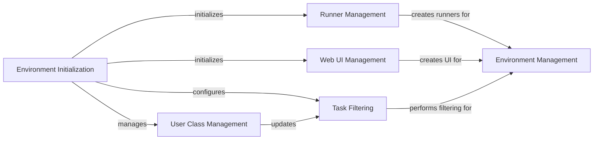

## Component Details

The Environment Management component in Locust is responsible for encapsulating the test environment's configuration and state. It acts as a central hub for managing user classes, event hooks, host settings, and provides methods for creating various test runners (local, master, worker) and the web UI. Its primary purpose is to ensure the test environment is correctly set up and managed throughout the load testing process, handling initialization, runner creation, web interface setup, task filtering, and user class updates.

### Environment Management
This component encapsulates the Locust test environment's configuration and state. It manages user classes, event hooks, host settings, and provides methods for creating different types of test runners and the web UI. It acts as a central repository for test-specific settings.

**Related Classes/Methods**:

- <a href="https://github.com/locustio/locust/blob/master/locust/env.py#L23-L114" target="_blank" rel="noopener noreferrer">`locust.locust.env.Environment:__init__` (23:114)</a>
- <a href="https://github.com/locustio/locust/blob/master/locust/env.py#L116-L130" target="_blank" rel="noopener noreferrer">`locust.locust.env.Environment:_create_runner` (116:130)</a>
- <a href="https://github.com/locustio/locust/blob/master/locust/env.py#L132-L136" target="_blank" rel="noopener noreferrer">`locust.locust.env.Environment:create_local_runner` (132:136)</a>
- <a href="https://github.com/locustio/locust/blob/master/locust/env.py#L138-L150" target="_blank" rel="noopener noreferrer">`locust.locust.env.Environment:create_master_runner` (138:150)</a>
- <a href="https://github.com/locustio/locust/blob/master/locust/env.py#L152-L166" target="_blank" rel="noopener noreferrer">`locust.locust.env.Environment:create_worker_runner` (152:166)</a>
- <a href="https://github.com/locustio/locust/blob/master/locust/env.py#L168-L209" target="_blank" rel="noopener noreferrer">`locust.locust.env.Environment:create_web_ui` (168:209)</a>
- <a href="https://github.com/locustio/locust/blob/master/locust/env.py#L229-L253" target="_blank" rel="noopener noreferrer">`locust.locust.env.Environment:_filter_tasks_by_tags` (229:253)</a>
- <a href="https://github.com/locustio/locust/blob/master/locust/env.py#L211-L223" target="_blank" rel="noopener noreferrer">`locust.locust.env.Environment:update_user_class` (211:223)</a>

### Environment Initialization
This component handles the initial setup of the Locust test environment. It initializes core components like event handlers, request statistics, and performs validation checks on user classes and load test shapes. It ensures the environment is correctly configured before test execution.

**Related Classes/Methods**:

- <a href="https://github.com/locustio/locust/blob/master/locust/env.py#L23-L114" target="_blank" rel="noopener noreferrer">`locust.locust.env.Environment:__init__` (23:114)</a>
- <a href="https://github.com/locustio/locust/blob/master/locust/event.py#L102-L278" target="_blank" rel="noopener noreferrer">`locust.locust.event.Events` (102:278)</a>
- <a href="https://github.com/locustio/locust/blob/master/locust/stats.py#L185-L270" target="_blank" rel="noopener noreferrer">`locust.locust.stats.RequestStats` (185:270)</a>
- <a href="https://github.com/locustio/locust/blob/master/locust/env.py#L255-L268" target="_blank" rel="noopener noreferrer">`locust.locust.env.Environment._remove_user_classes_with_weight_zero` (255:268)</a>
- <a href="https://github.com/locustio/locust/blob/master/locust/env.py#L290-L297" target="_blank" rel="noopener noreferrer">`locust.locust.env.Environment._validate_user_class_name_uniqueness` (290:297)</a>
- <a href="https://github.com/locustio/locust/blob/master/locust/env.py#L299-L303" target="_blank" rel="noopener noreferrer">`locust.locust.env.Environment._validate_shape_class_instance` (299:303)</a>

### Runner Management
This component is responsible for creating and managing different types of Locust runners (local, master, worker). It ensures that only one runner exists at a time and handles the association of the runner with the load test shape class.

**Related Classes/Methods**:

- <a href="https://github.com/locustio/locust/blob/master/locust/env.py#L116-L130" target="_blank" rel="noopener noreferrer">`locust.locust.env.Environment._create_runner` (116:130)</a>
- <a href="https://github.com/locustio/locust/blob/master/locust/exception.py#L77-L78" target="_blank" rel="noopener noreferrer">`locust.locust.exception.RunnerAlreadyExistsError` (77:78)</a>
- <a href="https://github.com/locustio/locust/blob/master/locust/env.py#L132-L136" target="_blank" rel="noopener noreferrer">`locust.locust.env.Environment.create_local_runner` (132:136)</a>
- <a href="https://github.com/locustio/locust/blob/master/locust/env.py#L138-L150" target="_blank" rel="noopener noreferrer">`locust.locust.env.Environment.create_master_runner` (138:150)</a>
- <a href="https://github.com/locustio/locust/blob/master/locust/env.py#L152-L166" target="_blank" rel="noopener noreferrer">`locust.locust.env.Environment.create_worker_runner` (152:166)</a>

### Web UI Management
This component handles the creation and configuration of the Locust Web UI. It allows for setting up the host, port, authentication, TLS, and other parameters for the web interface.

**Related Classes/Methods**:

- <a href="https://github.com/locustio/locust/blob/master/locust/env.py#L168-L209" target="_blank" rel="noopener noreferrer">`locust.locust.env.Environment.create_web_ui` (168:209)</a>
- <a href="https://github.com/locustio/locust/blob/master/locust/web.py#L87-L770" target="_blank" rel="noopener noreferrer">`locust.locust.web.WebUI` (87:770)</a>

### Task Filtering
This component is responsible for filtering tasks within user classes based on provided tags and exclude tags. It ensures that only relevant tasks are executed during the load test.

**Related Classes/Methods**:

- <a href="https://github.com/locustio/locust/blob/master/locust/env.py#L229-L253" target="_blank" rel="noopener noreferrer">`locust.locust.env.Environment._filter_tasks_by_tags` (229:253)</a>
- <a href="https://github.com/locustio/locust/blob/master/locust/user/task.py#L168-L204" target="_blank" rel="noopener noreferrer">`locust.locust.user.task.filter_tasks_by_tags` (168:204)</a>

### User Class Management
This component is responsible for updating and managing user classes within the Locust environment, including handling the removal of user classes with zero weight.

**Related Classes/Methods**:

- <a href="https://github.com/locustio/locust/blob/master/locust/env.py#L211-L223" target="_blank" rel="noopener noreferrer">`locust.locust.env.Environment.update_user_class` (211:223)</a>
- <a href="https://github.com/locustio/locust/blob/master/locust/env.py#L255-L268" target="_blank" rel="noopener noreferrer">`locust.locust.env.Environment._remove_user_classes_with_weight_zero` (255:268)</a>

### [FAQ](https://github.com/CodeBoarding/GeneratedOnBoardings/tree/main?tab=readme-ov-file#faq)