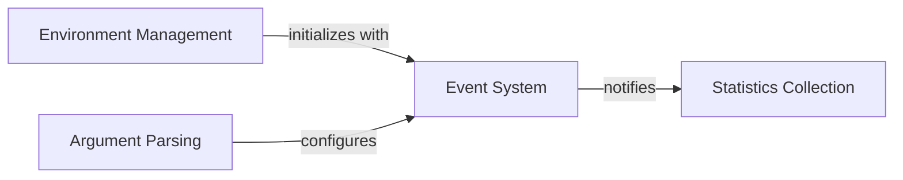

## Component Details

The Event System in Locust provides a robust publish-subscribe mechanism crucial for inter-component communication, enabling loose coupling and extensibility. It facilitates the notification of various system-wide occurrences, such as request completions, test lifecycle changes, and worker interactions. This system is deeply integrated with the Environment Management, which initializes and utilizes the event hooks, and is influenced by Argument Parsing for configuration. Statistics Collection components also heavily rely on this system to gather performance metrics by listening to relevant events.

### Event System
This foundational component provides a publish-subscribe mechanism for event-driven communication throughout the Locust application. It allows various components to register listeners for specific events (e.g., request completion, test start/stop, worker connection) and fire events to notify other parts of the system, promoting loose coupling. It comprises EventHook for individual event management and Events as a central registry for system-wide events.

**Related Classes/Methods**:

- <a href="https://github.com/locustio/locust/blob/master/locust/event.py#L14-L89" target="_blank" rel="noopener noreferrer">`locust.event.EventHook` (14:89)</a>
- <a href="https://github.com/locustio/locust/blob/master/locust/event.py#L57-L89" target="_blank" rel="noopener noreferrer">`locust.event.EventHook:measure` (57:89)</a>
- <a href="https://github.com/locustio/locust/blob/master/locust/event.py#L40-L54" target="_blank" rel="noopener noreferrer">`locust.event.EventHook:fire` (40:54)</a>
- <a href="https://github.com/locustio/locust/blob/master/locust/event.py#L33-L35" target="_blank" rel="noopener noreferrer">`locust.event.EventHook:add_listener` (33:35)</a>
- <a href="https://github.com/locustio/locust/blob/master/locust/event.py#L92-L99" target="_blank" rel="noopener noreferrer">`locust.event.DeprecatedEventHook` (92:99)</a>
- <a href="https://github.com/locustio/locust/blob/master/locust/event.py#L93-L95" target="_blank" rel="noopener noreferrer">`locust.event.DeprecatedEventHook:__init__` (93:95)</a>
- <a href="https://github.com/locustio/locust/blob/master/locust/event.py#L97-L99" target="_blank" rel="noopener noreferrer">`locust.event.DeprecatedEventHook:add_listener` (97:99)</a>
- <a href="https://github.com/locustio/locust/blob/master/locust/event.py#L102-L278" target="_blank" rel="noopener noreferrer">`locust.event.Events` (102:278)</a>
- <a href="https://github.com/locustio/locust/blob/master/locust/event.py#L270-L278" target="_blank" rel="noopener noreferrer">`locust.event.Events:__init__` (270:278)</a>

### Environment Management
The Environment component serves as the central configuration and runtime context for a Locust test. It holds references to user classes, event hooks, statistics, and manages the lifecycle of the test, including user class validation and runner creation.

**Related Classes/Methods**:

- <a href="https://github.com/locustio/locust/blob/master/locust/env.py#L22-L307" target="_blank" rel="noopener noreferrer">`locust.env.Environment` (22:307)</a>
- <a href="https://github.com/locustio/locust/blob/master/locust/env.py#L23-L114" target="_blank" rel="noopener noreferrer">`locust.env.Environment:__init__` (23:114)</a>
- <a href="https://github.com/locustio/locust/blob/master/locust/env.py#L255-L268" target="_blank" rel="noopener noreferrer">`locust.env.Environment._remove_user_classes_with_weight_zero` (255:268)</a>
- <a href="https://github.com/locustio/locust/blob/master/locust/env.py#L290-L297" target="_blank" rel="noopener noreferrer">`locust.env.Environment._validate_user_class_name_uniqueness` (290:297)</a>
- <a href="https://github.com/locustio/locust/blob/master/locust/env.py#L299-L303" target="_blank" rel="noopener noreferrer">`locust.env.Environment._validate_shape_class_instance` (299:303)</a>

### Statistics Collection
This component is responsible for collecting and managing statistics related to requests made during a Locust test. It aggregates data such as response times, request counts, and error rates.

**Related Classes/Methods**:

- <a href="https://github.com/locustio/locust/blob/master/locust/stats.py#L185-L270" target="_blank" rel="noopener noreferrer">`locust.stats.RequestStats` (185:270)</a>

### Argument Parsing
The Argument Parsing component handles the command-line arguments for Locust. It sets up the parser, defines available arguments, and processes them to configure the test environment.

**Related Classes/Methods**:

- `locust.argument_parser` (full file reference)
- <a href="https://github.com/locustio/locust/blob/master/locust/argument_parser.py#L860-L868" target="_blank" rel="noopener noreferrer">`locust.argument_parser:get_parser` (860:868)</a>
- <a href="https://github.com/locustio/locust/blob/master/locust/argument_parser.py#L194-L240" target="_blank" rel="noopener noreferrer">`locust.argument_parser.get_empty_argument_parser` (194:240)</a>
- <a href="https://github.com/locustio/locust/blob/master/locust/argument_parser.py#L439-L857" target="_blank" rel="noopener noreferrer">`locust.argument_parser.setup_parser_arguments` (439:857)</a>

### [FAQ](https://github.com/CodeBoarding/GeneratedOnBoardings/tree/main?tab=readme-ov-file#faq)