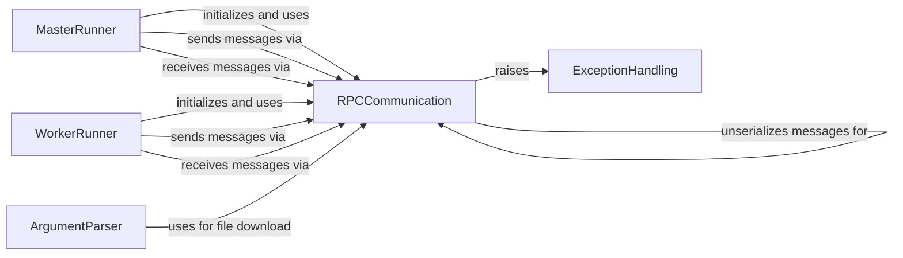

## Component Details

This graph illustrates the inter-process communication (IPC) subsystem within Locust, primarily focusing on how Master and Worker nodes communicate. The RPCCommunication component, built upon ZeroMQ, is central to this interaction, enabling the MasterRunner to send commands and receive statistics from WorkerRunner instances. ExceptionHandling ensures robust communication by defining specific RPC-related errors, while the ArgumentParser can leverage RPC for initial setup tasks like downloading locustfiles.

### MasterRunner
The MasterRunner component is responsible for orchestrating distributed load tests. It manages connections from worker nodes, dispatches user spawning instructions, aggregates performance statistics reported by workers, and handles overall test lifecycle events like starting, stopping, and quitting the test. It also monitors the health of connected workers through heartbeats.

**Related Classes/Methods**:

- <a href="https://github.com/locustio/locust/blob/master/locust/runners.py#L634-L1189" target="_blank" rel="noopener noreferrer">`locust.locust.runners.MasterRunner` (634:1189)</a>
- <a href="https://github.com/locustio/locust/blob/master/locust/runners.py#L859-L892" target="_blank" rel="noopener noreferrer">`locust.locust.runners.MasterRunner:stop` (859:892)</a>
- <a href="https://github.com/locustio/locust/blob/master/locust/runners.py#L894-L901" target="_blank" rel="noopener noreferrer">`locust.locust.runners.MasterRunner:quit` (894:901)</a>
- <a href="https://github.com/locustio/locust/blob/master/locust/runners.py#L950-L957" target="_blank" rel="noopener noreferrer">`locust.locust.runners.MasterRunner:reset_connection` (950:957)</a>
- <a href="https://github.com/locustio/locust/blob/master/locust/runners.py#L959-L1160" target="_blank" rel="noopener noreferrer">`locust.locust.runners.MasterRunner:client_listener` (959:1160)</a>
- <a href="https://github.com/locustio/locust/blob/master/locust/runners.py#L1174-L1189" target="_blank" rel="noopener noreferrer">`locust.locust.runners.MasterRunner:send_message` (1174:1189)</a>
- <a href="https://github.com/locustio/locust/blob/master/locust/runners.py#L644-L692" target="_blank" rel="noopener noreferrer">`locust.locust.runners.MasterRunner:__init__` (644:692)</a>

### WorkerRunner
The WorkerRunner component operates as a client in a distributed load test setup. It connects to a MasterRunner, receives commands to spawn and stop simulated users, executes the actual load generation tasks, and periodically reports its performance statistics and status back to the master. It also handles exceptions that occur during user execution.

**Related Classes/Methods**:

- <a href="https://github.com/locustio/locust/blob/master/locust/runners.py#L1192-L1488" target="_blank" rel="noopener noreferrer">`locust.locust.runners.WorkerRunner` (1192:1488)</a>
- <a href="https://github.com/locustio/locust/blob/master/locust/runners.py#L1204-L1249" target="_blank" rel="noopener noreferrer">`locust.locust.runners.WorkerRunner:__init__` (1204:1249)</a>
- <a href="https://github.com/locustio/locust/blob/master/locust/runners.py#L1251-L1260" target="_blank" rel="noopener noreferrer">`locust.locust.runners.WorkerRunner:spawning_complete` (1251:1260)</a>
- <a href="https://github.com/locustio/locust/blob/master/locust/runners.py#L1297-L1314" target="_blank" rel="noopener noreferrer">`locust.locust.runners.WorkerRunner:heartbeat` (1297:1314)</a>
- <a href="https://github.com/locustio/locust/blob/master/locust/runners.py#L1323-L1329" target="_blank" rel="noopener noreferrer">`locust.locust.runners.WorkerRunner:reset_connection` (1323:1329)</a>
- <a href="https://github.com/locustio/locust/blob/master/locust/runners.py#L1331-L1420" target="_blank" rel="noopener noreferrer">`locust.locust.runners.WorkerRunner:worker` (1331:1420)</a>
- <a href="https://github.com/locustio/locust/blob/master/locust/runners.py#L1449-L1458" target="_blank" rel="noopener noreferrer">`locust.locust.runners.WorkerRunner:send_message` (1449:1458)</a>
- <a href="https://github.com/locustio/locust/blob/master/locust/runners.py#L1460-L1463" target="_blank" rel="noopener noreferrer">`locust.locust.runners.WorkerRunner:_send_stats` (1460:1463)</a>
- <a href="https://github.com/locustio/locust/blob/master/locust/runners.py#L1468-L1488" target="_blank" rel="noopener noreferrer">`locust.locust.runners.WorkerRunner:connect_to_master` (1468:1488)</a>

### RPCCommunication
The RPCCommunication component facilitates inter-process communication (IPC) between Master and Worker nodes using ZeroMQ. It includes base socket functionalities for sending and receiving messages, and specialized client and server implementations for establishing and managing connections. The Message class defines the structure and serialization/deserialization of messages exchanged between nodes.

**Related Classes/Methods**:

- <a href="https://github.com/locustio/locust/blob/master/locust/rpc/zmqrpc.py#L14-L74" target="_blank" rel="noopener noreferrer">`locust.locust.rpc.zmqrpc.BaseSocket` (14:74)</a>
- <a href="https://github.com/locustio/locust/blob/master/locust/rpc/zmqrpc.py#L25-L29" target="_blank" rel="noopener noreferrer">`locust.locust.rpc.zmqrpc.BaseSocket:send` (25:29)</a>
- <a href="https://github.com/locustio/locust/blob/master/locust/rpc/zmqrpc.py#L32-L36" target="_blank" rel="noopener noreferrer">`locust.locust.rpc.zmqrpc.BaseSocket:send_to_client` (32:36)</a>
- <a href="https://github.com/locustio/locust/blob/master/locust/rpc/zmqrpc.py#L38-L46" target="_blank" rel="noopener noreferrer">`locust.locust.rpc.zmqrpc.BaseSocket:recv` (38:46)</a>
- <a href="https://github.com/locustio/locust/blob/master/locust/rpc/zmqrpc.py#L48-L60" target="_blank" rel="noopener noreferrer">`locust.locust.rpc.zmqrpc.BaseSocket:recv_from_client` (48:60)</a>
- <a href="https://github.com/locustio/locust/blob/master/locust/rpc/zmqrpc.py#L62-L63" target="_blank" rel="noopener noreferrer">`locust.locust.rpc.zmqrpc.BaseSocket:close` (62:63)</a>
- <a href="https://github.com/locustio/locust/blob/master/locust/rpc/zmqrpc.py#L65-L74" target="_blank" rel="noopener noreferrer">`locust.locust.rpc.zmqrpc.BaseSocket:ipv4_only` (65:74)</a>
- <a href="https://github.com/locustio/locust/blob/master/locust/rpc/zmqrpc.py#L77-L87" target="_blank" rel="noopener noreferrer">`locust.locust.rpc.zmqrpc.Server` (77:87)</a>
- <a href="https://github.com/locustio/locust/blob/master/locust/rpc/zmqrpc.py#L78-L87" target="_blank" rel="noopener noreferrer">`locust.locust.rpc.zmqrpc.Server:__init__` (78:87)</a>
- <a href="https://github.com/locustio/locust/blob/master/locust/rpc/zmqrpc.py#L90-L94" target="_blank" rel="noopener noreferrer">`locust.locust.rpc.zmqrpc.Client` (90:94)</a>
- <a href="https://github.com/locustio/locust/blob/master/locust/rpc/zmqrpc.py#L91-L94" target="_blank" rel="noopener noreferrer">`locust.locust.rpc.zmqrpc.Client:__init__` (91:94)</a>
- <a href="https://github.com/locustio/locust/blob/master/locust/rpc/protocol.py#L32-L47" target="_blank" rel="noopener noreferrer">`locust.locust.rpc.protocol.Message` (32:47)</a>
- <a href="https://github.com/locustio/locust/blob/master/locust/rpc/protocol.py#L45-L47" target="_blank" rel="noopener noreferrer">`locust.locust.rpc.protocol.Message:unserialize` (45:47)</a>

### ExceptionHandling
The ExceptionHandling component defines custom exception classes used throughout the Locust framework, particularly for signaling errors related to RPC communication. These exceptions help in managing and recovering from network and message-related issues during distributed test execution.

**Related Classes/Methods**:

- <a href="https://github.com/locustio/locust/blob/master/locust/exception.py#L49-L54" target="_blank" rel="noopener noreferrer">`locust.exception.RPCError` (49:54)</a>
- <a href="https://github.com/locustio/locust/blob/master/locust/exception.py#L57-L62" target="_blank" rel="noopener noreferrer">`locust.exception.RPCSendError` (57:62)</a>
- <a href="https://github.com/locustio/locust/blob/master/locust/exception.py#L65-L74" target="_blank" rel="noopener noreferrer">`locust.exception.RPCReceiveError` (65:74)</a>

### ArgumentParser
The ArgumentParser component is responsible for parsing command-line arguments provided to Locust. It handles various configuration options, including those related to distributed testing, and provides functionality to download locustfiles from a master node when running in worker mode.

**Related Classes/Methods**:

- `locust.locust.argument_parser` (full file reference)
- <a href="https://github.com/locustio/locust/blob/master/locust/argument_parser.py#L243-L284" target="_blank" rel="noopener noreferrer">`locust.locust.argument_parser:download_locustfile_from_master` (243:284)</a>

### [FAQ](https://github.com/CodeBoarding/GeneratedOnBoardings/tree/main?tab=readme-ov-file#faq)