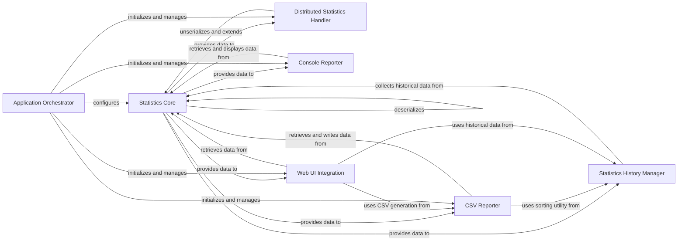

## Component Details

This subsystem is responsible for collecting, aggregating, and presenting performance statistics from load tests. It encompasses core statistical calculations, distributed data handling, various reporting formats (console, CSV, HTML), historical data management, and integration with the web UI. The Application Orchestrator configures and manages these components to ensure accurate and comprehensive reporting of load test results.

### Statistics Core
Manages the fundamental collection, storage, and calculation of performance metrics such as response times, request counts, and failure rates. It provides the raw and aggregated statistical data used by other reporting components.

**Related Classes/Methods**:

- <a href="https://github.com/locustio/locust/blob/master/locust/stats.py#L178-L182" target="_blank" rel="noopener noreferrer">`locust.locust.stats.EntriesDict:__missing__` (178:182)</a>
- <a href="https://github.com/locustio/locust/blob/master/locust/stats.py#L190-L201" target="_blank" rel="noopener noreferrer">`locust.locust.stats.RequestStats:__init__` (190:201)</a>
- <a href="https://github.com/locustio/locust/blob/master/locust/stats.py#L223-L225" target="_blank" rel="noopener noreferrer">`locust.locust.stats.RequestStats:log_request` (223:225)</a>
- <a href="https://github.com/locustio/locust/blob/master/locust/stats.py#L227-L237" target="_blank" rel="noopener noreferrer">`locust.locust.stats.RequestStats:log_error` (227:237)</a>
- <a href="https://github.com/locustio/locust/blob/master/locust/stats.py#L245-L253" target="_blank" rel="noopener noreferrer">`locust.locust.stats.RequestStats:reset_all` (245:253)</a>
- <a href="https://github.com/locustio/locust/blob/master/locust/stats.py#L255-L262" target="_blank" rel="noopener noreferrer">`locust.locust.stats.RequestStats:clear_all` (255:262)</a>
- <a href="https://github.com/locustio/locust/blob/master/locust/stats.py#L278-L328" target="_blank" rel="noopener noreferrer">`locust.locust.stats.StatsEntry:__init__` (278:328)</a>
- <a href="https://github.com/locustio/locust/blob/master/locust/stats.py#L330-L345" target="_blank" rel="noopener noreferrer">`locust.locust.stats.StatsEntry:reset` (330:345)</a>
- <a href="https://github.com/locustio/locust/blob/master/locust/stats.py#L347-L361" target="_blank" rel="noopener noreferrer">`locust.locust.stats.StatsEntry:log` (347:361)</a>
- <a href="https://github.com/locustio/locust/blob/master/locust/stats.py#L419-L433" target="_blank" rel="noopener noreferrer">`locust.locust.stats.StatsEntry:median_response_time` (419:433)</a>
- <a href="https://github.com/locustio/locust/blob/master/locust/stats.py#L436-L444" target="_blank" rel="noopener noreferrer">`locust.locust.stats.StatsEntry:current_rps` (436:444)</a>
- <a href="https://github.com/locustio/locust/blob/master/locust/stats.py#L447-L455" target="_blank" rel="noopener noreferrer">`locust.locust.stats.StatsEntry:current_fail_per_sec` (447:455)</a>
- <a href="https://github.com/locustio/locust/blob/master/locust/stats.py#L482-L524" target="_blank" rel="noopener noreferrer">`locust.locust.stats.StatsEntry:extend` (482:524)</a>
- <a href="https://github.com/locustio/locust/blob/master/locust/stats.py#L530-L540" target="_blank" rel="noopener noreferrer">`locust.locust.stats.StatsEntry:unserialize` (530:540)</a>
- <a href="https://github.com/locustio/locust/blob/master/locust/stats.py#L542-L548" target="_blank" rel="noopener noreferrer">`locust.locust.stats.StatsEntry:get_stripped_report` (542:548)</a>
- <a href="https://github.com/locustio/locust/blob/master/locust/stats.py#L581-L582" target="_blank" rel="noopener noreferrer">`locust.locust.stats.StatsEntry:__str__` (581:582)</a>
- <a href="https://github.com/locustio/locust/blob/master/locust/stats.py#L584-L591" target="_blank" rel="noopener noreferrer">`locust.locust.stats.StatsEntry:get_response_time_percentile` (584:591)</a>
- <a href="https://github.com/locustio/locust/blob/master/locust/stats.py#L593-L635" target="_blank" rel="noopener noreferrer">`locust.locust.stats.StatsEntry:get_current_response_time_percentile` (593:635)</a>
- <a href="https://github.com/locustio/locust/blob/master/locust/stats.py#L637-L647" target="_blank" rel="noopener noreferrer">`locust.locust.stats.StatsEntry:percentile` (637:647)</a>
- <a href="https://github.com/locustio/locust/blob/master/locust/stats.py#L649-L667" target="_blank" rel="noopener noreferrer">`locust.locust.stats.StatsEntry:_cache_response_times` (649:667)</a>
- <a href="https://github.com/locustio/locust/blob/master/locust/stats.py#L669-L691" target="_blank" rel="noopener noreferrer">`locust.locust.stats.StatsEntry:to_dict` (669:691)</a>
- <a href="https://github.com/locustio/locust/blob/master/locust/stats.py#L719-L721" target="_blank" rel="noopener noreferrer">`locust.locust.stats.StatsError:create_key` (719:721)</a>
- <a href="https://github.com/locustio/locust/blob/master/locust/stats.py#L744-L753" target="_blank" rel="noopener noreferrer">`locust.locust.stats.StatsError:serialize` (744:753)</a>
- <a href="https://github.com/locustio/locust/blob/master/locust/stats.py#L756-L757" target="_blank" rel="noopener noreferrer">`locust.locust.stats.StatsError:unserialize` (756:757)</a>
- <a href="https://github.com/locustio/locust/blob/master/locust/stats.py#L759-L765" target="_blank" rel="noopener noreferrer">`locust.locust.stats.StatsError:to_dict` (759:765)</a>

### Distributed Statistics Handler
Manages the synchronization and aggregation of performance statistics across master and worker nodes in a distributed load testing environment.

**Related Classes/Methods**:

- <a href="https://github.com/locustio/locust/blob/master/locust/stats.py#L786-L810" target="_blank" rel="noopener noreferrer">`locust.locust.stats:setup_distributed_stats_event_listeners` (786:810)</a>

### Console Reporter
Provides real-time and summarized performance statistics directly to the console, offering immediate feedback on the load test progress and results.

**Related Classes/Methods**:

- <a href="https://github.com/locustio/locust/blob/master/locust/stats.py#L813-L816" target="_blank" rel="noopener noreferrer">`locust.locust.stats:print_stats` (813:816)</a>
- <a href="https://github.com/locustio/locust/blob/master/locust/stats.py#L843-L846" target="_blank" rel="noopener noreferrer">`locust.locust.stats:print_percentile_stats` (843:846)</a>
- <a href="https://github.com/locustio/locust/blob/master/locust/stats.py#L849-L871" target="_blank" rel="noopener noreferrer">`locust.locust.stats:get_percentile_stats_summary` (849:871)</a>
- <a href="https://github.com/locustio/locust/blob/master/locust/stats.py#L874-L877" target="_blank" rel="noopener noreferrer">`locust.locust.stats:print_error_report` (874:877)</a>
- <a href="https://github.com/locustio/locust/blob/master/locust/stats.py#L892-L898" target="_blank" rel="noopener noreferrer">`locust.locust.stats:stats_printer` (892:898)</a>

### CSV Reporter
Generates and writes comprehensive performance statistics, including request, failure, and exception data, into CSV files for detailed offline analysis and archival.

**Related Classes/Methods**:

- <a href="https://github.com/locustio/locust/blob/master/locust/stats.py#L942-L974" target="_blank" rel="noopener noreferrer">`locust.locust.stats.StatsCSV:__init__` (942:974)</a>
- <a href="https://github.com/locustio/locust/blob/master/locust/stats.py#L984-L987" target="_blank" rel="noopener noreferrer">`locust.locust.stats.StatsCSV:requests_csv` (984:987)</a>
- <a href="https://github.com/locustio/locust/blob/master/locust/stats.py#L989-L1010" target="_blank" rel="noopener noreferrer">`locust.locust.stats.StatsCSV:_requests_data_rows` (989:1010)</a>
- <a href="https://github.com/locustio/locust/blob/master/locust/stats.py#L1012-L1014" target="_blank" rel="noopener noreferrer">`locust.locust.stats.StatsCSV:failures_csv` (1012:1014)</a>
- <a href="https://github.com/locustio/locust/blob/master/locust/stats.py#L1016-L1025" target="_blank" rel="noopener noreferrer">`locust.locust.stats.StatsCSV:_failures_data_rows` (1016:1025)</a>
- <a href="https://github.com/locustio/locust/blob/master/locust/stats.py#L1027-L1029" target="_blank" rel="noopener noreferrer">`locust.locust.stats.StatsCSV:exceptions_csv` (1027:1029)</a>
- <a href="https://github.com/locustio/locust/blob/master/locust/stats.py#L1042-L1082" target="_blank" rel="noopener noreferrer">`locust.locust.stats.StatsCSVFileWriter:__init__` (1042:1082)</a>
- <a href="https://github.com/locustio/locust/blob/master/locust/stats.py#L1084-L1085" target="_blank" rel="noopener noreferrer">`locust.locust.stats.StatsCSVFileWriter:__call__` (1084:1085)</a>
- <a href="https://github.com/locustio/locust/blob/master/locust/stats.py#L1087-L1128" target="_blank" rel="noopener noreferrer">`locust.locust.stats.StatsCSVFileWriter:stats_writer` (1087:1128)</a>
- <a href="https://github.com/locustio/locust/blob/master/locust/stats.py#L1130-L1167" target="_blank" rel="noopener noreferrer">`locust.locust.stats.StatsCSVFileWriter:_stats_history_data_rows` (1130:1167)</a>

### Statistics History Manager
Manages the historical data of performance metrics, enabling the generation of trend analyses and long-term performance reports.

**Related Classes/Methods**:

- <a href="https://github.com/locustio/locust/blob/master/locust/stats.py#L905-L924" target="_blank" rel="noopener noreferrer">`locust.locust.stats:update_stats_history` (905:924)</a>
- <a href="https://github.com/locustio/locust/blob/master/locust/stats.py#L927-L936" target="_blank" rel="noopener noreferrer">`locust.locust.stats:stats_history` (927:936)</a>

### Web UI Integration
Facilitates the display of real-time and historical performance statistics and reports within the Locust web interface, providing an interactive monitoring dashboard.

**Related Classes/Methods**:

- <a href="https://github.com/locustio/locust/blob/master/locust/html.py#L34-L110" target="_blank" rel="noopener noreferrer">`locust.locust.html:get_html_report` (34:110)</a>
- <a href="https://github.com/locustio/locust/blob/master/locust/web.py#L87-L770" target="_blank" rel="noopener noreferrer">`locust.locust.web.WebUI` (87:770)</a>

### Application Orchestrator
Oversees the overall setup and execution of the Locust load test, including the validation of configuration settings and the initialization of various core components.

**Related Classes/Methods**:

- <a href="https://github.com/locustio/locust/blob/master/locust/stats.py#L1201-L1224" target="_blank" rel="noopener noreferrer">`locust.locust.stats:validate_stats_configuration` (1201:1224)</a>
- <a href="https://github.com/locustio/locust/blob/master/locust/main.py#L160-L687" target="_blank" rel="noopener noreferrer">`locust.locust.main.main` (160:687)</a>

### [FAQ](https://github.com/CodeBoarding/GeneratedOnBoardings/tree/main?tab=readme-ov-file#faq)