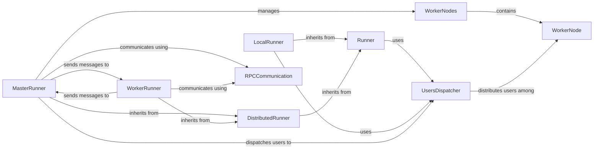

## Component Details

The Test Runner subsystem in Locust is responsible for orchestrating and managing the lifecycle of virtual users during a load test. It supports both local and distributed testing modes. The core `Runner` component provides the foundational logic for user spawning, stopping, and state management. `LocalRunner` handles single-process tests, while `MasterRunner` and `WorkerRunner` facilitate distributed testing by coordinating user distribution and collecting statistics across multiple nodes. The `UsersDispatcher` intelligently allocates users to available workers, and `RPCCommunication` handles the inter-node messaging in distributed setups.

### Runner
The abstract base class for all Locust test runners. It provides core functionalities like managing user greenlets, updating test state, monitoring system resources (CPU/memory), handling exceptions, and defining abstract methods for starting and sending messages.

**Related Classes/Methods**:

- <a href="https://github.com/locustio/locust/blob/master/locust/runners.py#L86-L128" target="_blank" rel="noopener noreferrer">`locust.locust.runners.Runner:__init__` (86:128)</a>
- <a href="https://github.com/locustio/locust/blob/master/locust/runners.py#L199-L230" target="_blank" rel="noopener noreferrer">`locust.locust.runners.Runner:spawn_users` (199:230)</a>
- <a href="https://github.com/locustio/locust/blob/master/locust/runners.py#L309-L322" target="_blank" rel="noopener noreferrer">`locust.locust.runners.Runner:start_shape` (309:322)</a>
- <a href="https://github.com/locustio/locust/blob/master/locust/runners.py#L324-L361" target="_blank" rel="noopener noreferrer">`locust.locust.runners.Runner:shape_worker` (324:361)</a>
- <a href="https://github.com/locustio/locust/blob/master/locust/runners.py#L363-L397" target="_blank" rel="noopener noreferrer">`locust.locust.runners.Runner:stop` (363:397)</a>
- <a href="https://github.com/locustio/locust/blob/master/locust/runners.py#L399-L404" target="_blank" rel="noopener noreferrer">`locust.locust.runners.Runner:quit` (399:404)</a>
- <a href="https://github.com/locustio/locust/blob/master/locust/runners.py#L232-L281" target="_blank" rel="noopener noreferrer">`locust.locust.runners.Runner:stop_users` (232:281)</a>

### LocalRunner
A concrete implementation of the Runner for single-process load tests. It manages user spawning and stopping within a single Locust instance and emulates inter-node messaging for internal communication.

**Related Classes/Methods**:

- <a href="https://github.com/locustio/locust/blob/master/locust/runners.py#L430-L449" target="_blank" rel="noopener noreferrer">`locust.locust.runners.LocalRunner:__init__` (430:449)</a>
- <a href="https://github.com/locustio/locust/blob/master/locust/runners.py#L451-L530" target="_blank" rel="noopener noreferrer">`locust.locust.runners.LocalRunner:_start` (451:530)</a>
- <a href="https://github.com/locustio/locust/blob/master/locust/runners.py#L532-L546" target="_blank" rel="noopener noreferrer">`locust.locust.runners.LocalRunner:start` (532:546)</a>
- <a href="https://github.com/locustio/locust/blob/master/locust/runners.py#L548-L551" target="_blank" rel="noopener noreferrer">`locust.locust.runners.LocalRunner:stop` (548:551)</a>
- <a href="https://github.com/locustio/locust/blob/master/locust/runners.py#L553-L566" target="_blank" rel="noopener noreferrer">`locust.locust.runners.LocalRunner:send_message` (553:566)</a>

### DistributedRunner
An abstract base class that extends Runner to provide common functionalities for distributed load testing, specifically setting up distributed stats event listeners.

**Related Classes/Methods**:

- <a href="https://github.com/locustio/locust/blob/master/locust/runners.py#L570-L572" target="_blank" rel="noopener noreferrer">`locust.locust.runners.DistributedRunner:__init__` (570:572)</a>

### MasterRunner
The central component in a distributed Locust setup. It orchestrates the load test across multiple worker nodes, manages worker connections, dispatches user spawning instructions, aggregates statistics, and handles communication with workers via RPC.

**Related Classes/Methods**:

- <a href="https://github.com/locustio/locust/blob/master/locust/runners.py#L644-L692" target="_blank" rel="noopener noreferrer">`locust.locust.runners.MasterRunner:__init__` (644:692)</a>
- <a href="https://github.com/locustio/locust/blob/master/locust/runners.py#L716-L721" target="_blank" rel="noopener noreferrer">`locust.locust.runners.MasterRunner:cpu_log_warning` (716:721)</a>
- <a href="https://github.com/locustio/locust/blob/master/locust/runners.py#L723-L833" target="_blank" rel="noopener noreferrer">`locust.locust.runners.MasterRunner:start` (723:833)</a>
- <a href="https://github.com/locustio/locust/blob/master/locust/runners.py#L859-L892" target="_blank" rel="noopener noreferrer">`locust.locust.runners.MasterRunner:stop` (859:892)</a>
- <a href="https://github.com/locustio/locust/blob/master/locust/runners.py#L894-L901" target="_blank" rel="noopener noreferrer">`locust.locust.runners.MasterRunner:quit` (894:901)</a>
- <a href="https://github.com/locustio/locust/blob/master/locust/runners.py#L903-L909" target="_blank" rel="noopener noreferrer">`locust.locust.runners.MasterRunner:check_stopped` (903:909)</a>
- <a href="https://github.com/locustio/locust/blob/master/locust/runners.py#L911-L948" target="_blank" rel="noopener noreferrer">`locust.locust.runners.MasterRunner:heartbeat_worker` (911:948)</a>
- <a href="https://github.com/locustio/locust/blob/master/locust/runners.py#L950-L957" target="_blank" rel="noopener noreferrer">`locust.locust.runners.MasterRunner:reset_connection` (950:957)</a>
- <a href="https://github.com/locustio/locust/blob/master/locust/runners.py#L959-L1160" target="_blank" rel="noopener noreferrer">`locust.locust.runners.MasterRunner:client_listener` (959:1160)</a>
- <a href="https://github.com/locustio/locust/blob/master/locust/runners.py#L1174-L1189" target="_blank" rel="noopener noreferrer">`locust.locust.runners.MasterRunner:send_message` (1174:1189)</a>

### WorkerRunner
A component that runs on a worker node in a distributed Locust setup. It connects to the MasterRunner, receives commands to start/stop users, executes the load test, and reports performance statistics and logs back to the master.

**Related Classes/Methods**:

- <a href="https://github.com/locustio/locust/blob/master/locust/runners.py#L1204-L1249" target="_blank" rel="noopener noreferrer">`locust.locust.runners.WorkerRunner:__init__` (1204:1249)</a>
- <a href="https://github.com/locustio/locust/blob/master/locust/runners.py#L1251-L1260" target="_blank" rel="noopener noreferrer">`locust.locust.runners.WorkerRunner:spawning_complete` (1251:1260)</a>
- <a href="https://github.com/locustio/locust/blob/master/locust/runners.py#L1267-L1295" target="_blank" rel="noopener noreferrer">`locust.locust.runners.WorkerRunner:start_worker` (1267:1295)</a>
- <a href="https://github.com/locustio/locust/blob/master/locust/runners.py#L1297-L1314" target="_blank" rel="noopener noreferrer">`locust.locust.runners.WorkerRunner:heartbeat` (1297:1314)</a>
- <a href="https://github.com/locustio/locust/blob/master/locust/runners.py#L1316-L1321" target="_blank" rel="noopener noreferrer">`locust.locust.runners.WorkerRunner:heartbeat_timeout_checker` (1316:1321)</a>
- <a href="https://github.com/locustio/locust/blob/master/locust/runners.py#L1323-L1329" target="_blank" rel="noopener noreferrer">`locust.locust.runners.WorkerRunner:reset_connection` (1323:1329)</a>
- <a href="https://github.com/locustio/locust/blob/master/locust/runners.py#L1331-L1420" target="_blank" rel="noopener noreferrer">`locust.locust.runners.WorkerRunner:worker` (1331:1420)</a>
- <a href="https://github.com/locustio/locust/blob/master/locust/runners.py#L1422-L1428" target="_blank" rel="noopener noreferrer">`locust.locust.runners.WorkerRunner:stats_reporter` (1422:1428)</a>
- <a href="https://github.com/locustio/locust/blob/master/locust/runners.py#L1430-L1447" target="_blank" rel="noopener noreferrer">`locust.locust.runners.WorkerRunner:logs_reporter` (1430:1447)</a>
- <a href="https://github.com/locustio/locust/blob/master/locust/runners.py#L1449-L1458" target="_blank" rel="noopener noreferrer">`locust.locust.runners.WorkerRunner:send_message` (1449:1458)</a>
- <a href="https://github.com/locustio/locust/blob/master/locust/runners.py#L1460-L1463" target="_blank" rel="noopener noreferrer">`locust.locust.runners.WorkerRunner:_send_stats` (1460:1463)</a>
- <a href="https://github.com/locustio/locust/blob/master/locust/runners.py#L1465-L1466" target="_blank" rel="noopener noreferrer">`locust.locust.runners.WorkerRunner:_send_logs` (1465:1466)</a>
- <a href="https://github.com/locustio/locust/blob/master/locust/runners.py#L1468-L1488" target="_blank" rel="noopener noreferrer">`locust.locust.runners.WorkerRunner:connect_to_master` (1468:1488)</a>

### WorkerNode
A data structure used by the MasterRunner to keep track of individual worker nodes, including their state, CPU/memory usage, and the number of users they are currently running.

**Related Classes/Methods**:

- <a href="https://github.com/locustio/locust/blob/master/locust/runners.py#L575-L588" target="_blank" rel="noopener noreferrer">`locust.locust.runners.WorkerNode` (575:588)</a>

### WorkerNodes
A collection class that manages multiple WorkerNode objects, providing methods to retrieve workers based on their state (ready, spawning, running, missing).

**Related Classes/Methods**:

- <a href="https://github.com/locustio/locust/blob/master/locust/runners.py#L603-L604" target="_blank" rel="noopener noreferrer">`locust.locust.runners.WorkerNodes:ready` (603:604)</a>
- <a href="https://github.com/locustio/locust/blob/master/locust/runners.py#L607-L608" target="_blank" rel="noopener noreferrer">`locust.locust.runners.WorkerNodes:spawning` (607:608)</a>
- <a href="https://github.com/locustio/locust/blob/master/locust/runners.py#L611-L612" target="_blank" rel="noopener noreferrer">`locust.locust.runners.WorkerNodes:running` (611:612)</a>
- <a href="https://github.com/locustio/locust/blob/master/locust/runners.py#L615-L616" target="_blank" rel="noopener noreferrer">`locust.locust.runners.WorkerNodes:missing` (615:616)</a>

### UsersDispatcher
This component is responsible for intelligently distributing the target number of users across available worker nodes (or locally) while adhering to the specified spawn rate and user class weights. It handles rebalancing users when workers connect or disconnect.

**Related Classes/Methods**:

- <a href="https://github.com/locustio/locust/blob/master/locust/dispatch.py#L70-L119" target="_blank" rel="noopener noreferrer">`locust.locust.dispatch.UsersDispatcher:__init__` (70:119)</a>
- <a href="https://github.com/locustio/locust/blob/master/locust/dispatch.py#L132-L136" target="_blank" rel="noopener noreferrer">`locust.locust.dispatch.UsersDispatcher:__next__` (132:136)</a>
- <a href="https://github.com/locustio/locust/blob/master/locust/dispatch.py#L152-L183" target="_blank" rel="noopener noreferrer">`locust.locust.dispatch.UsersDispatcher:_dispatcher` (152:183)</a>
- <a href="https://github.com/locustio/locust/blob/master/locust/dispatch.py#L185-L215" target="_blank" rel="noopener noreferrer">`locust.locust.dispatch.UsersDispatcher:new_dispatch` (185:215)</a>
- <a href="https://github.com/locustio/locust/blob/master/locust/dispatch.py#L217-L228" target="_blank" rel="noopener noreferrer">`locust.locust.dispatch.UsersDispatcher:add_worker` (217:228)</a>
- <a href="https://github.com/locustio/locust/blob/master/locust/dispatch.py#L230-L242" target="_blank" rel="noopener noreferrer">`locust.locust.dispatch.UsersDispatcher:remove_worker` (230:242)</a>
- <a href="https://github.com/locustio/locust/blob/master/locust/dispatch.py#L244-L268" target="_blank" rel="noopener noreferrer">`locust.locust.dispatch.UsersDispatcher:_prepare_rebalance` (244:268)</a>
- <a href="https://github.com/locustio/locust/blob/master/locust/dispatch.py#L339-L368" target="_blank" rel="noopener noreferrer">`locust.locust.dispatch.UsersDispatcher:_distribute_users` (339:368)</a>
- <a href="https://github.com/locustio/locust/blob/master/locust/dispatch.py#L370-L388" target="_blank" rel="noopener noreferrer">`locust.locust.dispatch.UsersDispatcher:_user_gen` (370:388)</a>

### RPCCommunication
These components handle the underlying network communication between Master and Worker nodes using ZeroMQ. Message defines the data format, BaseSocket provides generic socket operations, Server is for the master to listen for connections, and Client is for workers to connect to the master.

**Related Classes/Methods**:

- <a href="https://github.com/locustio/locust/blob/master/locust/rpc/zmqrpc.py#L14-L74" target="_blank" rel="noopener noreferrer">`locust.locust.rpc.zmqrpc.BaseSocket` (14:74)</a>
- <a href="https://github.com/locustio/locust/blob/master/locust/rpc/zmqrpc.py#L25-L29" target="_blank" rel="noopener noreferrer">`locust.locust.rpc.zmqrpc.BaseSocket.send` (25:29)</a>
- <a href="https://github.com/locustio/locust/blob/master/locust/rpc/zmqrpc.py#L32-L36" target="_blank" rel="noopener noreferrer">`locust.locust.rpc.zmqrpc.BaseSocket.send_to_client` (32:36)</a>
- <a href="https://github.com/locustio/locust/blob/master/locust/rpc/zmqrpc.py#L38-L46" target="_blank" rel="noopener noreferrer">`locust.locust.rpc.zmqrpc.BaseSocket.recv` (38:46)</a>
- <a href="https://github.com/locustio/locust/blob/master/locust/rpc/zmqrpc.py#L48-L60" target="_blank" rel="noopener noreferrer">`locust.locust.rpc.zmqrpc.BaseSocket.recv_from_client` (48:60)</a>
- <a href="https://github.com/locustio/locust/blob/master/locust/rpc/zmqrpc.py#L62-L63" target="_blank" rel="noopener noreferrer">`locust.locust.rpc.zmqrpc.BaseSocket.close` (62:63)</a>
- <a href="https://github.com/locustio/locust/blob/master/locust/rpc/zmqrpc.py#L77-L87" target="_blank" rel="noopener noreferrer">`locust.locust.rpc.zmqrpc.Server` (77:87)</a>
- <a href="https://github.com/locustio/locust/blob/master/locust/rpc/zmqrpc.py#L90-L94" target="_blank" rel="noopener noreferrer">`locust.locust.rpc.zmqrpc.Client` (90:94)</a>
- <a href="https://github.com/locustio/locust/blob/master/locust/rpc/protocol.py#L32-L47" target="_blank" rel="noopener noreferrer">`locust.locust.rpc.protocol.Message` (32:47)</a>
- <a href="https://github.com/locustio/locust/blob/master/locust/rpc/protocol.py#L41-L42" target="_blank" rel="noopener noreferrer">`locust.locust.rpc.protocol.Message.serialize` (41:42)</a>
- <a href="https://github.com/locustio/locust/blob/master/locust/rpc/protocol.py#L45-L47" target="_blank" rel="noopener noreferrer">`locust.locust.rpc.protocol.Message.unserialize` (45:47)</a>

### [FAQ](https://github.com/CodeBoarding/GeneratedOnBoardings/tree/main?tab=readme-ov-file#faq)