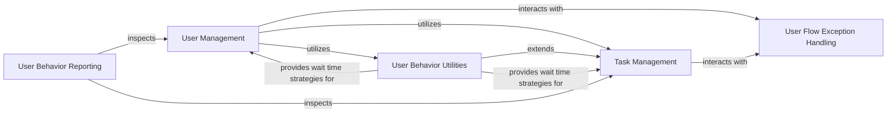

## Component Details

The 'User Behavior Definition' subsystem in Locust is central to simulating realistic user interactions during load tests. It primarily involves defining the actions and characteristics of virtual users through the 'User Management' and 'Task Management' components. 'User Management' handles the lifecycle and core properties of a simulated user, including how they initiate and execute tasks. 'Task Management' provides the framework for structuring these tasks into logical sets, managing their execution flow, and handling interruptions. Complementing these are 'User Behavior Utilities' which offer flexible wait time strategies and specialized task execution patterns like sequential tasks, and 'User Flow Exception Handling' which manages control flow within user and task execution. Finally, 'User Behavior Reporting' provides insights into the distribution and execution ratios of these defined user behaviors.

### User Management
This component defines the core behavior of simulated users in Locust. It includes the base User class, its metaclass for task collection, and specialized HTTP user functionality. It manages the lifecycle of a user, including starting, running tasks, waiting, and stopping.

**Related Classes/Methods**:

- <a href="https://github.com/locustio/locust/blob/master/locust/user/users.py#L35-L46" target="_blank" rel="noopener noreferrer">`locust.locust.user.users.UserMeta:__new__` (35:46)</a>
- <a href="https://github.com/locustio/locust/blob/master/locust/user/users.py#L143-L158" target="_blank" rel="noopener noreferrer">`locust.locust.user.users.User:run` (143:158)</a>
- <a href="https://github.com/locustio/locust/blob/master/locust/user/users.py#L160-L170" target="_blank" rel="noopener noreferrer">`locust.locust.user.users.User:wait` (160:170)</a>
- <a href="https://github.com/locustio/locust/blob/master/locust/user/users.py#L259-L276" target="_blank" rel="noopener noreferrer">`locust.locust.user.users.HttpUser:__init__` (259:276)</a>
- <a href="https://github.com/locustio/locust/blob/master/locust/user/users.py#L29-L46" target="_blank" rel="noopener noreferrer">`locust.locust.user.users.UserMeta` (29:46)</a>
- <a href="https://github.com/locustio/locust/blob/master/locust/user/users.py#L49-L238" target="_blank" rel="noopener noreferrer">`locust.locust.user.users.User` (49:238)</a>
- <a href="https://github.com/locustio/locust/blob/master/locust/user/users.py#L241-L276" target="_blank" rel="noopener noreferrer">`locust.locust.user.users.HttpUser` (241:276)</a>
- <a href="https://github.com/locustio/locust/blob/master/locust/contrib/oai.py#L68-L73" target="_blank" rel="noopener noreferrer">`locust.locust.contrib.oai.OpenAIUser` (68:73)</a>
- <a href="https://github.com/locustio/locust/blob/master/locust/contrib/mongodb.py#L33-L41" target="_blank" rel="noopener noreferrer">`locust.locust.contrib.mongodb.MongoDBUser` (33:41)</a>
- <a href="https://github.com/locustio/locust/blob/master/locust/contrib/fasthttp.py#L341-L477" target="_blank" rel="noopener noreferrer">`locust.locust.contrib.fasthttp.FastHttpUser` (341:477)</a>
- <a href="https://github.com/locustio/locust/blob/master/locust/contrib/postgres.py#L37-L45" target="_blank" rel="noopener noreferrer">`locust.locust.contrib.postgres.PostgresUser` (37:45)</a>

### Task Management
This component is responsible for defining, organizing, and executing tasks within Locust. It provides decorators for tasks and tags, mechanisms for collecting tasks from class hierarchies, and the core TaskSet class which orchestrates the execution flow of tasks, including scheduling, waiting, and handling interruptions.

**Related Classes/Methods**:

- <a href="https://github.com/locustio/locust/blob/master/locust/user/task.py#L39-L39" target="_blank" rel="noopener noreferrer">`locust.locust.user.task:task` (39:39)</a>
- <a href="https://github.com/locustio/locust/blob/master/locust/user/task.py#L98-L134" target="_blank" rel="noopener noreferrer">`locust.locust.user.task:tag` (98:134)</a>
- <a href="https://github.com/locustio/locust/blob/master/locust/user/task.py#L168-L204" target="_blank" rel="noopener noreferrer">`locust.locust.user.task:filter_tasks_by_tags` (168:204)</a>
- <a href="https://github.com/locustio/locust/blob/master/locust/user/task.py#L213-L215" target="_blank" rel="noopener noreferrer">`locust.locust.user.task.TaskSetMeta:__new__` (213:215)</a>
- <a href="https://github.com/locustio/locust/blob/master/locust/user/task.py#L323-L370" target="_blank" rel="noopener noreferrer">`locust.locust.user.task.TaskSet:run` (323:370)</a>
- <a href="https://github.com/locustio/locust/blob/master/locust/user/task.py#L372-L373" target="_blank" rel="noopener noreferrer">`locust.locust.user.task.TaskSet:execute_next_task` (372:373)</a>
- <a href="https://github.com/locustio/locust/blob/master/locust/user/task.py#L410-L427" target="_blank" rel="noopener noreferrer">`locust.locust.user.task.TaskSet:wait_time` (410:427)</a>
- <a href="https://github.com/locustio/locust/blob/master/locust/user/task.py#L429-L445" target="_blank" rel="noopener noreferrer">`locust.locust.user.task.TaskSet:wait` (429:445)</a>
- <a href="https://github.com/locustio/locust/blob/master/locust/user/task.py#L450-L457" target="_blank" rel="noopener noreferrer">`locust.locust.user.task.TaskSet:interrupt` (450:457)</a>
- <a href="https://github.com/locustio/locust/blob/master/locust/user/task.py#L39-L39" target="_blank" rel="noopener noreferrer">`locust.locust.user.task.task` (39:39)</a>
- <a href="https://github.com/locustio/locust/blob/master/locust/user/task.py#L98-L134" target="_blank" rel="noopener noreferrer">`locust.locust.user.task.tag` (98:134)</a>
- <a href="https://github.com/locustio/locust/blob/master/locust/user/task.py#L137-L165" target="_blank" rel="noopener noreferrer">`locust.locust.user.task.get_tasks_from_base_classes` (137:165)</a>
- <a href="https://github.com/locustio/locust/blob/master/locust/user/task.py#L168-L204" target="_blank" rel="noopener noreferrer">`locust.locust.user.task.filter_tasks_by_tags` (168:204)</a>
- <a href="https://github.com/locustio/locust/blob/master/locust/user/task.py#L207-L215" target="_blank" rel="noopener noreferrer">`locust.locust.user.task.TaskSetMeta` (207:215)</a>
- <a href="https://github.com/locustio/locust/blob/master/locust/user/task.py#L218-L464" target="_blank" rel="noopener noreferrer">`locust.locust.user.task.TaskSet` (218:464)</a>
- <a href="https://github.com/locustio/locust/blob/master/locust/user/task.py#L467-L490" target="_blank" rel="noopener noreferrer">`locust.locust.user.task.DefaultTaskSet` (467:490)</a>

### User Behavior Utilities
This component encompasses various utility functions related to user behavior, including different strategies for defining wait times between tasks and specialized task set behaviors like sequential task execution.

**Related Classes/Methods**:

- <a href="https://github.com/locustio/locust/blob/master/locust/user/wait_time.py#L60-L83" target="_blank" rel="noopener noreferrer">`locust.locust.user.wait_time:constant_throughput` (60:83)</a>
- <a href="https://github.com/locustio/locust/blob/master/locust/user/wait_time.py#L30-L57" target="_blank" rel="noopener noreferrer">`locust.locust.user.wait_time:constant_pacing` (30:57)</a>
- <a href="https://github.com/locustio/locust/blob/master/locust/user/wait_time.py#L18-L27" target="_blank" rel="noopener noreferrer">`locust.locust.user.wait_time:constant` (18:27)</a>
- <a href="https://github.com/locustio/locust/blob/master/locust/user/wait_time.py#L5-L15" target="_blank" rel="noopener noreferrer">`locust.locust.user.wait_time:between` (5:15)</a>
- <a href="https://github.com/locustio/locust/blob/master/locust/user/sequential_taskset.py#L45-L66" target="_blank" rel="noopener noreferrer">`locust.locust.user.sequential_taskset.SequentialTaskSet` (45:66)</a>
- <a href="https://github.com/locustio/locust/blob/master/locust/user/sequential_taskset.py#L57-L59" target="_blank" rel="noopener noreferrer">`locust.locust.user.sequential_taskset.SequentialTaskSet:__init__` (57:59)</a>
- <a href="https://github.com/locustio/locust/blob/master/locust/user/sequential_taskset.py#L61-L66" target="_blank" rel="noopener noreferrer">`locust.locust.user.sequential_taskset.SequentialTaskSet:get_next_task` (61:66)</a>

### User Flow Exception Handling
This component defines and manages custom exceptions used within Locust for controlling user and task flow, such as stopping users, rescheduling tasks, or indicating missing configurations.

**Related Classes/Methods**:

- <a href="https://github.com/locustio/locust/blob/master/locust/exception.py#L1-L2" target="_blank" rel="noopener noreferrer">`locust.exception.LocustError` (1:2)</a>
- <a href="https://github.com/locustio/locust/blob/master/locust/exception.py#L43-L46" target="_blank" rel="noopener noreferrer">`locust.exception.RescheduleTaskImmediately` (43:46)</a>
- <a href="https://github.com/locustio/locust/blob/master/locust/exception.py#L34-L40" target="_blank" rel="noopener noreferrer">`locust.exception.RescheduleTask` (34:40)</a>
- <a href="https://github.com/locustio/locust/blob/master/locust/exception.py#L30-L31" target="_blank" rel="noopener noreferrer">`locust.exception.StopUser` (30:31)</a>
- <a href="https://github.com/locustio/locust/blob/master/locust/exception.py#L17-L27" target="_blank" rel="noopener noreferrer">`locust.exception.InterruptTaskSet` (17:27)</a>
- <a href="https://github.com/locustio/locust/blob/master/locust/exception.py#L13-L14" target="_blank" rel="noopener noreferrer">`locust.exception.MissingWaitTimeError` (13:14)</a>

### User Behavior Reporting
This component is responsible for generating and displaying reports related to task execution ratios and distributions, specifically for user behavior.

**Related Classes/Methods**:

- <a href="https://github.com/locustio/locust/blob/master/locust/user/inspectuser.py#L11-L16" target="_blank" rel="noopener noreferrer">`locust.locust.user.inspectuser.print_task_ratio` (11:16)</a>
- <a href="https://github.com/locustio/locust/blob/master/locust/user/inspectuser.py#L19-L26" target="_blank" rel="noopener noreferrer">`locust.locust.user.inspectuser.print_task_ratio_json` (19:26)</a>
- <a href="https://github.com/locustio/locust/blob/master/locust/user/inspectuser.py#L53-L63" target="_blank" rel="noopener noreferrer">`locust.locust.user.inspectuser.get_ratio` (53:63)</a>
- <a href="https://github.com/locustio/locust/blob/master/locust/user/inspectuser.py#L29-L41" target="_blank" rel="noopener noreferrer">`locust.locust.user.inspectuser._calc_distribution` (29:41)</a>
- <a href="https://github.com/locustio/locust/blob/master/locust/user/inspectuser.py#L44-L50" target="_blank" rel="noopener noreferrer">`locust.locust.user.inspectuser._print_task_ratio` (44:50)</a>
- <a href="https://github.com/locustio/locust/blob/master/locust/user/inspectuser.py#L66-L81" target="_blank" rel="noopener noreferrer">`locust.locust.user.inspectuser._get_task_ratio` (66:81)</a>

### [FAQ](https://github.com/CodeBoarding/GeneratedOnBoardings/tree/main?tab=readme-ov-file#faq)