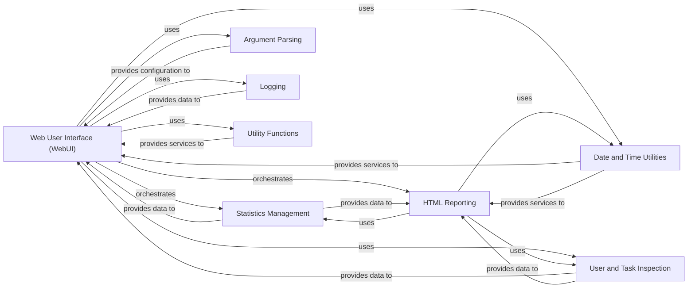

## Component Details

The Web User Interface (WebUI) component serves as the central control panel for Locust, providing a web-based interface for managing and monitoring load tests. It orchestrates interactions with the Statistics Management and HTML Reporting components to display real-time data and generate comprehensive reports. Additionally, it leverages Date and Time Utilities, User and Task Inspection, Argument Parsing, Logging, and other Utility Functions to provide a complete and configurable user experience. The WebUI initiates and terminates load tests, updates test parameters, and allows users to download various test-related data.

### Web User Interface (WebUI)
This is the core component responsible for setting up and running the Flask web application. It manages the web server, handles HTTP requests, orchestrates the starting and stopping of load tests, displays real-time statistics, and provides various download options for test data. It acts as the central control panel for Locust.

**Related Classes/Methods**:

- <a href="https://github.com/locustio/locust/blob/master/locust/web.py#L87-L770" target="_blank" rel="noopener noreferrer">`locust.locust.web.WebUI` (87:770)</a>
- <a href="https://github.com/locustio/locust/blob/master/locust/web.py#L121-L588" target="_blank" rel="noopener noreferrer">`locust.locust.web.WebUI:__init__` (121:588)</a>
- <a href="https://github.com/locustio/locust/blob/master/locust/web.py#L605-L622" target="_blank" rel="noopener noreferrer">`locust.locust.web.WebUI:start_server` (605:622)</a>
- <a href="https://github.com/locustio/locust/blob/master/locust/web.py#L656-L746" target="_blank" rel="noopener noreferrer">`locust.locust.web.WebUI:update_template_args` (656:746)</a>
- <a href="https://github.com/locustio/locust/blob/master/locust/web.py#L130-L217" target="_blank" rel="noopener noreferrer">`locust.locust.web.WebUI:swarm` (130:217)</a>
- <a href="https://github.com/locustio/locust/blob/master/locust/web.py#L624-L628" target="_blank" rel="noopener noreferrer">`locust.locust.web.WebUI:stop` (624:628)</a>
- <a href="https://github.com/locustio/locust/blob/master/locust/web.py#L300-L344" target="_blank" rel="noopener noreferrer">`locust.locust.web.WebUI:request_stats` (300:344)</a>
- <a href="https://github.com/locustio/locust/blob/master/locust/web.py#L240-L255" target="_blank" rel="noopener noreferrer">`locust.locust.web.WebUI:stats_report` (240:255)</a>
- `locust.locust.web.WebUI.__init__._download_csv_suggest_file_name` (full file reference)
- `locust.locust.web.WebUI.__init__._download_csv_response` (full file reference)
- <a href="https://github.com/locustio/locust/blob/master/locust/web.py#L759-L767" target="_blank" rel="noopener noreferrer">`locust.locust.web.WebUI._update_user_classes` (759:767)</a>
- <a href="https://github.com/locustio/locust/blob/master/locust/web.py#L748-L757" target="_blank" rel="noopener noreferrer">`locust.locust.web.WebUI._update_shape_class` (748:757)</a>
- `locust.locust.web.WebUI.start_server.RewriteFilter` (full file reference)

### HTML Reporting
This component is responsible for generating comprehensive HTML reports of the load test results. It gathers data from various sources, including statistics and user ratios, and renders them into a user-friendly HTML format for visualization and analysis.

**Related Classes/Methods**:

- <a href="https://github.com/locustio/locust/blob/master/locust/html.py#L34-L110" target="_blank" rel="noopener noreferrer">`locust.locust.html.get_html_report` (34:110)</a>
- <a href="https://github.com/locustio/locust/blob/master/locust/html.py#L28-L31" target="_blank" rel="noopener noreferrer">`locust.locust.html.render_template_from` (28:31)</a>

### Statistics Management
This component handles the collection, processing, and presentation of load test statistics. It includes functionalities for sorting statistics, updating historical data, and generating CSV reports for requests, failures, and exceptions.

**Related Classes/Methods**:

- <a href="https://github.com/locustio/locust/blob/master/locust/stats.py#L901-L902" target="_blank" rel="noopener noreferrer">`locust.locust.stats.sort_stats` (901:902)</a>
- <a href="https://github.com/locustio/locust/blob/master/locust/stats.py#L905-L924" target="_blank" rel="noopener noreferrer">`locust.locust.stats.update_stats_history` (905:924)</a>
- <a href="https://github.com/locustio/locust/blob/master/locust/stats.py#L939-L1036" target="_blank" rel="noopener noreferrer">`locust.locust.stats.StatsCSV` (939:1036)</a>
- <a href="https://github.com/locustio/locust/blob/master/locust/stats.py#L984-L987" target="_blank" rel="noopener noreferrer">`locust.locust.stats.StatsCSV.requests_csv` (984:987)</a>
- <a href="https://github.com/locustio/locust/blob/master/locust/stats.py#L1012-L1014" target="_blank" rel="noopener noreferrer">`locust.locust.stats.StatsCSV.failures_csv` (1012:1014)</a>
- <a href="https://github.com/locustio/locust/blob/master/locust/stats.py#L1027-L1029" target="_blank" rel="noopener noreferrer">`locust.locust.stats.StatsCSV.exceptions_csv` (1027:1029)</a>

### Date and Time Utilities
This component provides utility functions for formatting timestamps and durations, ensuring consistent and readable date and time representations across the application, particularly for reporting and logging.

**Related Classes/Methods**:

- <a href="https://github.com/locustio/locust/blob/master/locust/util/date.py#L4-L5" target="_blank" rel="noopener noreferrer">`locust.locust.util.date.format_utc_timestamp` (4:5)</a>
- <a href="https://github.com/locustio/locust/blob/master/locust/util/date.py#L12-L23" target="_blank" rel="noopener noreferrer">`locust.locust.util.date.format_duration` (12:23)</a>
- <a href="https://github.com/locustio/locust/blob/master/locust/util/date.py#L8-L9" target="_blank" rel="noopener noreferrer">`locust.locust.util.date.format_safe_timestamp` (8:9)</a>

### User and Task Inspection
This component is responsible for inspecting and calculating ratios related to user classes and their tasks. It helps in understanding the distribution and execution of user behaviors during a load test.

**Related Classes/Methods**:

- <a href="https://github.com/locustio/locust/blob/master/locust/user/inspectuser.py#L53-L63" target="_blank" rel="noopener noreferrer">`locust.locust.user.inspectuser.get_ratio` (53:63)</a>

### Argument Parsing
This component is responsible for parsing command-line arguments and providing them to the UI, allowing for dynamic configuration of the web interface based on user-provided options.

**Related Classes/Methods**:

- <a href="https://github.com/locustio/locust/blob/master/locust/argument_parser.py#L896-L915" target="_blank" rel="noopener noreferrer">`locust.locust.argument_parser.ui_extra_args_dict` (896:915)</a>

### Logging
This component provides functionalities for retrieving and managing logs generated during the load test, offering insights into the system's operations and any encountered issues.

**Related Classes/Methods**:

- <a href="https://github.com/locustio/locust/blob/master/locust/log.py#L79-L85" target="_blank" rel="noopener noreferrer">`locust.locust.log.get_logs` (79:85)</a>

### Utility Functions
This component encompasses various general-purpose utility functions, such as parsing time spans and memoization for caching, which support different parts of the Locust application.

**Related Classes/Methods**:

- <a href="https://github.com/locustio/locust/blob/master/locust/util/timespan.py#L5-L24" target="_blank" rel="noopener noreferrer">`locust.locust.util.timespan.parse_timespan` (5:24)</a>
- <a href="https://github.com/locustio/locust/blob/master/locust/util/cache.py#L5-L35" target="_blank" rel="noopener noreferrer">`locust.locust.util.cache.memoize` (5:35)</a>

### [FAQ](https://github.com/CodeBoarding/GeneratedOnBoardings/tree/main?tab=readme-ov-file#faq)