```mermaid
graph LR
    Core_Orchestration["Core Orchestration"]
    Environment_Management["Environment Management"]
    Test_Runner["Test Runner"]
    User_Behavior_Definition["User Behavior Definition"]
    Client_Interfaces["Client Interfaces"]
    Statistics_and_Reporting["Statistics and Reporting"]
    RPC_Communication["RPC Communication"]
    Web_User_Interface["Web User Interface"]
    Event_System["Event System"]
    Core_Orchestration -- "configures" --> Environment_Management
    Core_Orchestration -- "initiates" --> Test_Runner
    Core_Orchestration -- "initializes" --> Web_User_Interface
    Core_Orchestration -- "uses" --> Statistics_and_Reporting
    Core_Orchestration -- "uses" --> Event_System
    Environment_Management -- "creates" --> Test_Runner
    Environment_Management -- "initializes" --> Statistics_and_Reporting
    Environment_Management -- "initializes" --> Web_User_Interface
    Environment_Management -- "uses" --> User_Behavior_Definition
    Environment_Management -- "uses" --> Event_System
    Test_Runner -- "interacts with" --> User_Behavior_Definition
    Test_Runner -- "reports to" --> Statistics_and_Reporting
    Test_Runner -- "communicates with" --> RPC_Communication
    Test_Runner -- "uses" --> Event_System
    User_Behavior_Definition -- "utilizes" --> Client_Interfaces
    User_Behavior_Definition -- "can trigger" --> Event_System
    Client_Interfaces -- "report metrics to" --> Statistics_and_Reporting
    Client_Interfaces -- "fire events to" --> Event_System
    Statistics_and_Reporting -- "receives data from" --> Client_Interfaces
    Statistics_and_Reporting -- "receives data from" --> Test_Runner
    Statistics_and_Reporting -- "is used by" --> Web_User_Interface
    Statistics_and_Reporting -- "uses" --> Event_System
    RPC_Communication -- "is used by" --> Test_Runner
    RPC_Communication -- "interacts with" --> Event_System
    Web_User_Interface -- "retrieves data from" --> Test_Runner
    Web_User_Interface -- "retrieves data from" --> Statistics_and_Reporting
    Web_User_Interface -- "uses" --> Event_System
    Event_System -- "is used by" --> Core_Orchestration
    Event_System -- "is used by" --> Environment_Management
    Event_System -- "is used by" --> Test_Runner
    Event_System -- "is used by" --> User_Behavior_Definition
    Event_System -- "is used by" --> Client_Interfaces
    Event_System -- "is used by" --> Statistics_and_Reporting
    Event_System -- "is used by" --> RPC_Communication
    Event_System -- "is used by" --> Web_User_Interface
    click Core_Orchestration href "https://github.com/CodeBoarding/GeneratedOnBoardings/blob/main/locust/Core Orchestration.md" "Details"
    click Environment_Management href "https://github.com/CodeBoarding/GeneratedOnBoardings/blob/main/locust/Environment Management.md" "Details"
    click Test_Runner href "https://github.com/CodeBoarding/GeneratedOnBoardings/blob/main/locust/Test Runner.md" "Details"
    click User_Behavior_Definition href "https://github.com/CodeBoarding/GeneratedOnBoardings/blob/main/locust/User Behavior Definition.md" "Details"
    click Client_Interfaces href "https://github.com/CodeBoarding/GeneratedOnBoardings/blob/main/locust/Client Interfaces.md" "Details"
    click Statistics_and_Reporting href "https://github.com/CodeBoarding/GeneratedOnBoardings/blob/main/locust/Statistics and Reporting.md" "Details"
    click RPC_Communication href "https://github.com/CodeBoarding/GeneratedOnBoardings/blob/main/locust/RPC Communication.md" "Details"
    click Web_User_Interface href "https://github.com/CodeBoarding/GeneratedOnBoardings/blob/main/locust/Web User Interface.md" "Details"
    click Event_System href "https://github.com/CodeBoarding/GeneratedOnBoardings/blob/main/locust/Event System.md" "Details"
```

## Component Details

The Locust architecture is designed for distributed load testing, centered around a `Core Orchestration` component that manages the test lifecycle from argument parsing to initiating the test run. It leverages an `Environment Management` component to configure the test environment, including user classes and event handling. The core of the execution is handled by the `Test Runner`, which manages virtual users and coordinates distributed testing through `RPC Communication` with worker nodes. User behavior is defined by the `User Behavior Definition` component, which utilizes various `Client Interfaces` (HTTP, FastHTTP, etc.) to interact with the system under test. All interactions and performance metrics are captured by the `Statistics and Reporting` component, which provides data for the `Web User Interface` for real-time monitoring and reporting. A central `Event System` facilitates decoupled communication between all these components, enabling a flexible and extensible architecture.

### Core Orchestration
This component serves as the central control unit of Locust. It is responsible for parsing command-line arguments, initializing the test environment, orchestrating the overall test execution flow (including starting and stopping runners), and managing global application settings. It also handles interactive input for runtime control.

**Related Classes/Methods**:

- <a href="https://github.com/locustio/locust/blob/master/locust/main.py#L160-L687" target="_blank" rel="noopener noreferrer">`locust.locust.main:main` (160:687)</a>
- <a href="https://github.com/locustio/locust/blob/master/locust/main.py#L75-L102" target="_blank" rel="noopener noreferrer">`locust.locust.main:create_environment` (75:102)</a>
- <a href="https://github.com/locustio/locust/blob/master/locust/main.py#L105-L157" target="_blank" rel="noopener noreferrer">`locust.locust.main:merge_locustfiles_content` (105:157)</a>
- <a href="https://github.com/locustio/locust/blob/master/locust/argument_parser.py#L287-L338" target="_blank" rel="noopener noreferrer">`locust.locust.argument_parser:parse_locustfile_option` (287:338)</a>
- <a href="https://github.com/locustio/locust/blob/master/locust/argument_parser.py#L341-L347" target="_blank" rel="noopener noreferrer">`locust.locust.argument_parser:get_locustfiles_locally` (341:347)</a>
- <a href="https://github.com/locustio/locust/blob/master/locust/argument_parser.py#L871-L876" target="_blank" rel="noopener noreferrer">`locust.locust.argument_parser:parse_options` (871:876)</a>
- <a href="https://github.com/locustio/locust/blob/master/locust/argument_parser.py#L860-L868" target="_blank" rel="noopener noreferrer">`locust.locust.argument_parser:get_parser` (860:868)</a>
- <a href="https://github.com/locustio/locust/blob/master/locust/argument_parser.py#L439-L857" target="_blank" rel="noopener noreferrer">`locust.locust.argument_parser:setup_parser_arguments` (439:857)</a>
- <a href="https://github.com/locustio/locust/blob/master/locust/argument_parser.py#L879-L885" target="_blank" rel="noopener noreferrer">`locust.locust.argument_parser:default_args_dict` (879:885)</a>
- <a href="https://github.com/locustio/locust/blob/master/locust/argument_parser.py#L896-L915" target="_blank" rel="noopener noreferrer">`locust.locust.argument_parser:ui_extra_args_dict` (896:915)</a>
- <a href="https://github.com/locustio/locust/blob/master/locust/input_events.py#L32-L38" target="_blank" rel="noopener noreferrer">`locust.locust.input_events.UnixKeyPoller:__init__` (32:38)</a>
- <a href="https://github.com/locustio/locust/blob/master/locust/input_events.py#L51-L62" target="_blank" rel="noopener noreferrer">`locust.locust.input_events.WindowsKeyPoller:__init__` (51:62)</a>
- <a href="https://github.com/locustio/locust/blob/master/locust/input_events.py#L91-L95" target="_blank" rel="noopener noreferrer">`locust.locust.input_events:get_poller` (91:95)</a>
- <a href="https://github.com/locustio/locust/blob/master/locust/input_events.py#L98-L119" target="_blank" rel="noopener noreferrer">`locust.locust.input_events:input_listener` (98:119)</a>

### Environment Management
This component encapsulates the Locust test environment's configuration and state. It manages user classes, event hooks, host settings, and provides methods for creating different types of test runners and the web UI. It acts as a central repository for test-specific settings.

**Related Classes/Methods**:

- <a href="https://github.com/locustio/locust/blob/master/locust/env.py#L23-L114" target="_blank" rel="noopener noreferrer">`locust.locust.env.Environment:__init__` (23:114)</a>
- <a href="https://github.com/locustio/locust/blob/master/locust/env.py#L116-L130" target="_blank" rel="noopener noreferrer">`locust.locust.env.Environment:_create_runner` (116:130)</a>
- <a href="https://github.com/locustio/locust/blob/master/locust/env.py#L132-L136" target="_blank" rel="noopener noreferrer">`locust.locust.env.Environment:create_local_runner` (132:136)</a>
- <a href="https://github.com/locustio/locust/blob/master/locust/env.py#L138-L150" target="_blank" rel="noopener noreferrer">`locust.locust.env.Environment:create_master_runner` (138:150)</a>
- <a href="https://github.com/locustio/locust/blob/master/locust/env.py#L152-L166" target="_blank" rel="noopener noreferrer">`locust.locust.env.Environment:create_worker_runner` (152:166)</a>
- <a href="https://github.com/locustio/locust/blob/master/locust/env.py#L168-L209" target="_blank" rel="noopener noreferrer">`locust.locust.env.Environment:create_web_ui` (168:209)</a>
- <a href="https://github.com/locustio/locust/blob/master/locust/env.py#L229-L253" target="_blank" rel="noopener noreferrer">`locust.locust.env.Environment:_filter_tasks_by_tags` (229:253)</a>
- <a href="https://github.com/locustio/locust/blob/master/locust/env.py#L211-L223" target="_blank" rel="noopener noreferrer">`locust.locust.env.Environment:update_user_class` (211:223)</a>

### Test Runner
This component is responsible for managing the lifecycle of virtual users and coordinating the load test execution. It includes implementations for local, master, and worker modes, handling user spawning, stopping, and distributing users across nodes in a distributed setup.

**Related Classes/Methods**:

- <a href="https://github.com/locustio/locust/blob/master/locust/runners.py#L86-L128" target="_blank" rel="noopener noreferrer">`locust.locust.runners.Runner:__init__` (86:128)</a>
- <a href="https://github.com/locustio/locust/blob/master/locust/runners.py#L199-L230" target="_blank" rel="noopener noreferrer">`locust.locust.runners.Runner:spawn_users` (199:230)</a>
- <a href="https://github.com/locustio/locust/blob/master/locust/runners.py#L309-L322" target="_blank" rel="noopener noreferrer">`locust.locust.runners.Runner:start_shape` (309:322)</a>
- <a href="https://github.com/locustio/locust/blob/master/locust/runners.py#L324-L361" target="_blank" rel="noopener noreferrer">`locust.locust.runners.Runner:shape_worker` (324:361)</a>
- <a href="https://github.com/locustio/locust/blob/master/locust/runners.py#L363-L397" target="_blank" rel="noopener noreferrer">`locust.locust.runners.Runner:stop` (363:397)</a>
- <a href="https://github.com/locustio/locust/blob/master/locust/runners.py#L399-L404" target="_blank" rel="noopener noreferrer">`locust.locust.runners.Runner:quit` (399:404)</a>
- <a href="https://github.com/locustio/locust/blob/master/locust/runners.py#L430-L449" target="_blank" rel="noopener noreferrer">`locust.locust.runners.LocalRunner:__init__` (430:449)</a>
- <a href="https://github.com/locustio/locust/blob/master/locust/runners.py#L451-L530" target="_blank" rel="noopener noreferrer">`locust.locust.runners.LocalRunner:_start` (451:530)</a>
- <a href="https://github.com/locustio/locust/blob/master/locust/runners.py#L532-L546" target="_blank" rel="noopener noreferrer">`locust.locust.runners.LocalRunner:start` (532:546)</a>
- <a href="https://github.com/locustio/locust/blob/master/locust/runners.py#L548-L551" target="_blank" rel="noopener noreferrer">`locust.locust.runners.LocalRunner:stop` (548:551)</a>
- <a href="https://github.com/locustio/locust/blob/master/locust/runners.py#L553-L566" target="_blank" rel="noopener noreferrer">`locust.locust.runners.LocalRunner:send_message` (553:566)</a>
- <a href="https://github.com/locustio/locust/blob/master/locust/runners.py#L570-L572" target="_blank" rel="noopener noreferrer">`locust.locust.runners.DistributedRunner:__init__` (570:572)</a>
- <a href="https://github.com/locustio/locust/blob/master/locust/runners.py#L603-L604" target="_blank" rel="noopener noreferrer">`locust.locust.runners.WorkerNodes:ready` (603:604)</a>
- <a href="https://github.com/locustio/locust/blob/master/locust/runners.py#L607-L608" target="_blank" rel="noopener noreferrer">`locust.locust.runners.WorkerNodes:spawning` (607:608)</a>
- <a href="https://github.com/locustio/locust/blob/master/locust/runners.py#L611-L612" target="_blank" rel="noopener noreferrer">`locust.locust.runners.WorkerNodes:running` (611:612)</a>
- <a href="https://github.com/locustio/locust/blob/master/locust/runners.py#L615-L616" target="_blank" rel="noopener noreferrer">`locust.locust.runners.WorkerNodes:missing` (615:616)</a>
- <a href="https://github.com/locustio/locust/blob/master/locust/runners.py#L644-L692" target="_blank" rel="noopener noreferrer">`locust.locust.runners.MasterRunner:__init__` (644:692)</a>
- <a href="https://github.com/locustio/locust/blob/master/locust/runners.py#L716-L721" target="_blank" rel="noopener noreferrer">`locust.locust.runners.MasterRunner:cpu_log_warning` (716:721)</a>
- <a href="https://github.com/locustio/locust/blob/master/locust/runners.py#L723-L833" target="_blank" rel="noopener noreferrer">`locust.locust.runners.MasterRunner:start` (723:833)</a>
- <a href="https://github.com/locustio/locust/blob/master/locust/runners.py#L859-L892" target="_blank" rel="noopener noreferrer">`locust.locust.runners.MasterRunner:stop` (859:892)</a>
- <a href="https://github.com/locustio/locust/blob/master/locust/runners.py#L894-L901" target="_blank" rel="noopener noreferrer">`locust.locust.runners.MasterRunner:quit` (894:901)</a>
- <a href="https://github.com/locustio/locust/blob/master/locust/runners.py#L903-L909" target="_blank" rel="noopener noreferrer">`locust.locust.runners.MasterRunner:check_stopped` (903:909)</a>
- <a href="https://github.com/locustio/locust/blob/master/locust/runners.py#L911-L948" target="_blank" rel="noopener noreferrer">`locust.locust.runners.MasterRunner:heartbeat_worker` (911:948)</a>
- <a href="https://github.com/locustio/locust/blob/master/locust/runners.py#L950-L957" target="_blank" rel="noopener noreferrer">`locust.locust.runners.MasterRunner:reset_connection` (950:957)</a>
- <a href="https://github.com/locustio/locust/blob/master/locust/runners.py#L959-L1160" target="_blank" rel="noopener noreferrer">`locust.locust.runners.MasterRunner:client_listener` (959:1160)</a>
- <a href="https://github.com/locustio/locust/blob/master/locust/runners.py#L1174-L1189" target="_blank" rel="noopener noreferrer">`locust.locust.runners.MasterRunner:send_message` (1174:1189)</a>
- <a href="https://github.com/locustio/locust/blob/master/locust/runners.py#L1204-L1249" target="_blank" rel="noopener noreferrer">`locust.locust.runners.WorkerRunner:__init__` (1204:1249)</a>
- <a href="https://github.com/locustio/locust/blob/master/locust/runners.py#L1251-L1260" target="_blank" rel="noopener noreferrer">`locust.locust.runners.WorkerRunner:spawning_complete` (1251:1260)</a>
- <a href="https://github.com/locustio/locust/blob/master/locust/runners.py#L1267-L1295" target="_blank" rel="noopener noreferrer">`locust.locust.runners.WorkerRunner:start_worker` (1267:1295)</a>
- <a href="https://github.com/locustio/locust/blob/master/locust/runners.py#L1297-L1314" target="_blank" rel="noopener noreferrer">`locust.locust.runners.WorkerRunner:heartbeat` (1297:1314)</a>
- <a href="https://github.com/locustio/locust/blob/master/locust/runners.py#L1316-L1321" target="_blank" rel="noopener noreferrer">`locust.locust.runners.WorkerRunner:heartbeat_timeout_checker` (1316:1321)</a>
- <a href="https://github.com/locustio/locust/blob/master/locust/runners.py#L1323-L1329" target="_blank" rel="noopener noreferrer">`locust.locust.runners.WorkerRunner:reset_connection` (1323:1329)</a>
- <a href="https://github.com/locustio/locust/blob/master/locust/runners.py#L1331-L1420" target="_blank" rel="noopener noreferrer">`locust.locust.runners.WorkerRunner:worker` (1331:1420)</a>
- <a href="https://github.com/locustio/locust/blob/master/locust/runners.py#L1422-L1428" target="_blank" rel="noopener noreferrer">`locust.locust.runners.WorkerRunner:stats_reporter` (1422:1428)</a>
- <a href="https://github.com/locustio/locust/blob/master/locust/runners.py#L1430-L1447" target="_blank" rel="noopener noreferrer">`locust.locust.runners.WorkerRunner:logs_reporter` (1430:1447)</a>
- <a href="https://github.com/locustio/locust/blob/master/locust/runners.py#L1449-L1458" target="_blank" rel="noopener noreferrer">`locust.locust.runners.WorkerRunner:send_message` (1449:1458)</a>
- <a href="https://github.com/locustio/locust/blob/master/locust/runners.py#L1460-L1463" target="_blank" rel="noopener noreferrer">`locust.locust.runners.WorkerRunner:_send_stats` (1460:1463)</a>
- <a href="https://github.com/locustio/locust/blob/master/locust/runners.py#L1465-L1466" target="_blank" rel="noopener noreferrer">`locust.locust.runners.WorkerRunner:_send_logs` (1465:1466)</a>
- <a href="https://github.com/locustio/locust/blob/master/locust/runners.py#L1468-L1488" target="_blank" rel="noopener noreferrer">`locust.locust.runners.WorkerRunner:connect_to_master` (1468:1488)</a>
- <a href="https://github.com/locustio/locust/blob/master/locust/dispatch.py#L70-L119" target="_blank" rel="noopener noreferrer">`locust.locust.dispatch.UsersDispatcher:__init__` (70:119)</a>
- <a href="https://github.com/locustio/locust/blob/master/locust/dispatch.py#L132-L136" target="_blank" rel="noopener noreferrer">`locust.locust.dispatch.UsersDispatcher:__next__` (132:136)</a>
- <a href="https://github.com/locustio/locust/blob/master/locust/dispatch.py#L152-L183" target="_blank" rel="noopener noreferrer">`locust.locust.dispatch.UsersDispatcher:_dispatcher` (152:183)</a>
- <a href="https://github.com/locustio/locust/blob/master/locust/dispatch.py#L185-L215" target="_blank" rel="noopener noreferrer">`locust.locust.dispatch.UsersDispatcher:new_dispatch` (185:215)</a>
- <a href="https://github.com/locustio/locust/blob/master/locust/dispatch.py#L217-L228" target="_blank" rel="noopener noreferrer">`locust.locust.dispatch.UsersDispatcher:add_worker` (217:228)</a>
- <a href="https://github.com/locustio/locust/blob/master/locust/dispatch.py#L230-L242" target="_blank" rel="noopener noreferrer">`locust.locust.dispatch.UsersDispatcher:remove_worker` (230:242)</a>
- <a href="https://github.com/locustio/locust/blob/master/locust/dispatch.py#L244-L268" target="_blank" rel="noopener noreferrer">`locust.locust.dispatch.UsersDispatcher:_prepare_rebalance` (244:268)</a>
- <a href="https://github.com/locustio/locust/blob/master/locust/dispatch.py#L339-L368" target="_blank" rel="noopener noreferrer">`locust.locust.dispatch.UsersDispatcher:_distribute_users` (339:368)</a>
- <a href="https://github.com/locustio/locust/blob/master/locust/dispatch.py#L370-L388" target="_blank" rel="noopener noreferrer">`locust.locust.dispatch.UsersDispatcher:_user_gen` (370:388)</a>
- <a href="https://github.com/locustio/locust/blob/master/locust/runners.py#L232-L281" target="_blank" rel="noopener noreferrer">`locust.locust.runners.Runner:stop_users` (232:281)</a>

### User Behavior Definition
This component defines the actions and behavior of virtual users during a load test. It includes the core `User` and `TaskSet` classes, which encapsulate the tasks to be executed, wait times between tasks, and mechanisms for task interruption.

**Related Classes/Methods**:

- <a href="https://github.com/locustio/locust/blob/master/locust/user/users.py#L35-L46" target="_blank" rel="noopener noreferrer">`locust.locust.user.users.UserMeta:__new__` (35:46)</a>
- <a href="https://github.com/locustio/locust/blob/master/locust/user/users.py#L143-L158" target="_blank" rel="noopener noreferrer">`locust.locust.user.users.User:run` (143:158)</a>
- <a href="https://github.com/locustio/locust/blob/master/locust/user/users.py#L160-L170" target="_blank" rel="noopener noreferrer">`locust.locust.user.users.User:wait` (160:170)</a>
- <a href="https://github.com/locustio/locust/blob/master/locust/user/users.py#L259-L276" target="_blank" rel="noopener noreferrer">`locust.locust.user.users.HttpUser:__init__` (259:276)</a>
- <a href="https://github.com/locustio/locust/blob/master/locust/user/inspectuser.py#L11-L16" target="_blank" rel="noopener noreferrer">`locust.locust.user.inspectuser:print_task_ratio` (11:16)</a>
- <a href="https://github.com/locustio/locust/blob/master/locust/user/inspectuser.py#L19-L26" target="_blank" rel="noopener noreferrer">`locust.locust.user.inspectuser:print_task_ratio_json` (19:26)</a>
- <a href="https://github.com/locustio/locust/blob/master/locust/user/inspectuser.py#L44-L50" target="_blank" rel="noopener noreferrer">`locust.locust.user.inspectuser:_print_task_ratio` (44:50)</a>
- <a href="https://github.com/locustio/locust/blob/master/locust/user/inspectuser.py#L53-L63" target="_blank" rel="noopener noreferrer">`locust.locust.user.inspectuser:get_ratio` (53:63)</a>
- <a href="https://github.com/locustio/locust/blob/master/locust/user/inspectuser.py#L66-L81" target="_blank" rel="noopener noreferrer">`locust.locust.user.inspectuser:_get_task_ratio` (66:81)</a>
- <a href="https://github.com/locustio/locust/blob/master/locust/user/task.py#L39-L39" target="_blank" rel="noopener noreferrer">`locust.locust.user.task:task` (39:39)</a>
- <a href="https://github.com/locustio/locust/blob/master/locust/user/task.py#L98-L134" target="_blank" rel="noopener noreferrer">`locust.locust.user.task:tag` (98:134)</a>
- <a href="https://github.com/locustio/locust/blob/master/locust/user/task.py#L168-L204" target="_blank" rel="noopener noreferrer">`locust.locust.user.task:filter_tasks_by_tags` (168:204)</a>
- <a href="https://github.com/locustio/locust/blob/master/locust/user/task.py#L213-L215" target="_blank" rel="noopener noreferrer">`locust.locust.user.task.TaskSetMeta:__new__` (213:215)</a>
- <a href="https://github.com/locustio/locust/blob/master/locust/user/task.py#L323-L370" target="_blank" rel="noopener noreferrer">`locust.locust.user.task.TaskSet:run` (323:370)</a>
- <a href="https://github.com/locustio/locust/blob/master/locust/user/task.py#L372-L373" target="_blank" rel="noopener noreferrer">`locust.locust.user.task.TaskSet:execute_next_task` (372:373)</a>
- <a href="https://github.com/locustio/locust/blob/master/locust/user/task.py#L410-L427" target="_blank" rel="noopener noreferrer">`locust.locust.user.task.TaskSet:wait_time` (410:427)</a>
- <a href="https://github.com/locustio/locust/blob/master/locust/user/task.py#L429-L445" target="_blank" rel="noopener noreferrer">`locust.locust.user.task.TaskSet:wait` (429:445)</a>
- <a href="https://github.com/locustio/locust/blob/master/locust/user/task.py#L450-L457" target="_blank" rel="noopener noreferrer">`locust.locust.user.task.TaskSet:interrupt` (450:457)</a>
- <a href="https://github.com/locustio/locust/blob/master/locust/user/wait_time.py#L60-L83" target="_blank" rel="noopener noreferrer">`locust.locust.user.wait_time:constant_throughput` (60:83)</a>
- <a href="https://github.com/locustio/locust/blob/master/locust/user/sequential_taskset.py#L57-L59" target="_blank" rel="noopener noreferrer">`locust.locust.user.sequential_taskset.SequentialTaskSet:__init__` (57:59)</a>
- <a href="https://github.com/locustio/locust/blob/master/locust/user/sequential_taskset.py#L61-L66" target="_blank" rel="noopener noreferrer">`locust.locust.user.sequential_taskset.SequentialTaskSet:get_next_task` (61:66)</a>
- <a href="https://github.com/locustio/locust/blob/master/locust/user/wait_time.py#L18-L27" target="_blank" rel="noopener noreferrer">`locust.locust.user.wait_time:constant` (18:27)</a>

### Client Interfaces
This component provides the actual client implementations for making requests to the target system. It includes generic HTTP clients and specialized clients for various protocols (e.g., FastHTTP, OpenAI, MongoDB, PostgreSQL). It handles request building, sending, response processing, and integrates with the statistics collection.

**Related Classes/Methods**:

- <a href="https://github.com/locustio/locust/blob/master/locust/clients.py#L89-L115" target="_blank" rel="noopener noreferrer">`locust.locust.clients.HttpSession:__init__` (89:115)</a>
- <a href="https://github.com/locustio/locust/blob/master/locust/clients.py#L134-L228" target="_blank" rel="noopener noreferrer">`locust.locust.clients.HttpSession:request` (134:228)</a>
- <a href="https://github.com/locustio/locust/blob/master/locust/clients.py#L230-L245" target="_blank" rel="noopener noreferrer">`locust.locust.clients.HttpSession:_send_request_safe_mode` (230:245)</a>
- <a href="https://github.com/locustio/locust/blob/master/locust/clients.py#L247-L252" target="_blank" rel="noopener noreferrer">`locust.locust.clients.HttpSession:get` (247:252)</a>
- <a href="https://github.com/locustio/locust/blob/master/locust/clients.py#L254-L264" target="_blank" rel="noopener noreferrer">`locust.locust.clients.HttpSession:options` (254:264)</a>
- <a href="https://github.com/locustio/locust/blob/master/locust/clients.py#L266-L276" target="_blank" rel="noopener noreferrer">`locust.locust.clients.HttpSession:head` (266:276)</a>
- <a href="https://github.com/locustio/locust/blob/master/locust/clients.py#L278-L286" target="_blank" rel="noopener noreferrer">`locust.locust.clients.HttpSession:post` (278:286)</a>
- <a href="https://github.com/locustio/locust/blob/master/locust/clients.py#L288-L297" target="_blank" rel="noopener noreferrer">`locust.locust.clients.HttpSession:put` (288:297)</a>
- <a href="https://github.com/locustio/locust/blob/master/locust/clients.py#L299-L308" target="_blank" rel="noopener noreferrer">`locust.locust.clients.HttpSession:patch` (299:308)</a>
- <a href="https://github.com/locustio/locust/blob/master/locust/clients.py#L310-L319" target="_blank" rel="noopener noreferrer">`locust.locust.clients.HttpSession:delete` (310:319)</a>
- <a href="https://github.com/locustio/locust/blob/master/locust/clients.py#L345-L389" target="_blank" rel="noopener noreferrer">`locust.locust.clients.ResponseContextManager:__exit__` (345:389)</a>
- <a href="https://github.com/locustio/locust/blob/master/locust/clients.py#L394-L408" target="_blank" rel="noopener noreferrer">`locust.locust.clients.ResponseContextManager:success` (394:408)</a>
- <a href="https://github.com/locustio/locust/blob/master/locust/clients.py#L410-L429" target="_blank" rel="noopener noreferrer">`locust.locust.clients.ResponseContextManager:failure` (410:429)</a>
- <a href="https://github.com/locustio/locust/blob/master/locust/clients.py#L443-L446" target="_blank" rel="noopener noreferrer">`locust.locust.clients:_missing_catch_response_True` (443:446)</a>
- <a href="https://github.com/locustio/locust/blob/master/locust/contrib/fasthttp.py#L107-L146" target="_blank" rel="noopener noreferrer">`locust.locust.contrib.fasthttp.FastHttpSession:__init__` (107:146)</a>
- <a href="https://github.com/locustio/locust/blob/master/locust/contrib/fasthttp.py#L155-L175" target="_blank" rel="noopener noreferrer">`locust.locust.contrib.fasthttp.FastHttpSession:_send_request_safe_mode` (155:175)</a>
- <a href="https://github.com/locustio/locust/blob/master/locust/contrib/fasthttp.py#L177-L293" target="_blank" rel="noopener noreferrer">`locust.locust.contrib.fasthttp.FastHttpSession:request` (177:293)</a>
- <a href="https://github.com/locustio/locust/blob/master/locust/contrib/fasthttp.py#L295-L297" target="_blank" rel="noopener noreferrer">`locust.locust.contrib.fasthttp.FastHttpSession:delete` (295:297)</a>
- <a href="https://github.com/locustio/locust/blob/master/locust/contrib/fasthttp.py#L299-L301" target="_blank" rel="noopener noreferrer">`locust.locust.contrib.fasthttp.FastHttpSession:get` (299:301)</a>
- <a href="https://github.com/locustio/locust/blob/master/locust/contrib/fasthttp.py#L303-L312" target="_blank" rel="noopener noreferrer">`locust.locust.contrib.fasthttp.FastHttpSession:iter_lines` (303:312)</a>
- <a href="https://github.com/locustio/locust/blob/master/locust/contrib/fasthttp.py#L314-L316" target="_blank" rel="noopener noreferrer">`locust.locust.contrib.fasthttp.FastHttpSession:head` (314:316)</a>
- <a href="https://github.com/locustio/locust/blob/master/locust/contrib/fasthttp.py#L318-L320" target="_blank" rel="noopener noreferrer">`locust.locust.contrib.fasthttp.FastHttpSession:options` (318:320)</a>
- <a href="https://github.com/locustio/locust/blob/master/locust/contrib/fasthttp.py#L322-L326" target="_blank" rel="noopener noreferrer">`locust.locust.contrib.fasthttp.FastHttpSession:patch` (322:326)</a>
- <a href="https://github.com/locustio/locust/blob/master/locust/contrib/fasthttp.py#L328-L332" target="_blank" rel="noopener noreferrer">`locust.locust.contrib.fasthttp.FastHttpSession:post` (328:332)</a>
- <a href="https://github.com/locustio/locust/blob/master/locust/contrib/fasthttp.py#L334-L338" target="_blank" rel="noopener noreferrer">`locust.locust.contrib.fasthttp.FastHttpSession:put` (334:338)</a>
- <a href="https://github.com/locustio/locust/blob/master/locust/contrib/fasthttp.py#L391-L417" target="_blank" rel="noopener noreferrer">`locust.locust.contrib.fasthttp.FastHttpUser:__init__` (391:417)</a>
- <a href="https://github.com/locustio/locust/blob/master/locust/contrib/fasthttp.py#L420-L465" target="_blank" rel="noopener noreferrer">`locust.locust.contrib.fasthttp.FastHttpUser:rest` (420:465)</a>
- <a href="https://github.com/locustio/locust/blob/master/locust/contrib/fasthttp.py#L468-L477" target="_blank" rel="noopener noreferrer">`locust.locust.contrib.fasthttp.FastHttpUser:rest_` (468:477)</a>
- <a href="https://github.com/locustio/locust/blob/master/locust/contrib/fasthttp.py#L568-L571" target="_blank" rel="noopener noreferrer">`locust.locust.contrib.fasthttp.FastResponse:success` (568:571)</a>
- <a href="https://github.com/locustio/locust/blob/master/locust/contrib/fasthttp.py#L573-L576" target="_blank" rel="noopener noreferrer">`locust.locust.contrib.fasthttp.FastResponse:failure` (573:576)</a>
- <a href="https://github.com/locustio/locust/blob/master/locust/contrib/fasthttp.py#L619-L625" target="_blank" rel="noopener noreferrer">`locust.locust.contrib.fasthttp.LocustUserAgent:_urlopen` (619:625)</a>
- <a href="https://github.com/locustio/locust/blob/master/locust/contrib/fasthttp.py#L627-L630" target="_blank" rel="noopener noreferrer">`locust.locust.contrib.fasthttp.LocustUserAgent:_verify_status` (627:630)</a>
- <a href="https://github.com/locustio/locust/blob/master/locust/contrib/fasthttp.py#L661-L686" target="_blank" rel="noopener noreferrer">`locust.locust.contrib.fasthttp.ResponseContextManager:__exit__` (661:686)</a>
- <a href="https://github.com/locustio/locust/blob/master/locust/contrib/fasthttp.py#L691-L705" target="_blank" rel="noopener noreferrer">`locust.locust.contrib.fasthttp.ResponseContextManager:success` (691:705)</a>
- <a href="https://github.com/locustio/locust/blob/master/locust/contrib/fasthttp.py#L707-L726" target="_blank" rel="noopener noreferrer">`locust.locust.contrib.fasthttp.ResponseContextManager:failure` (707:726)</a>
- <a href="https://github.com/locustio/locust/blob/master/locust/contrib/oai.py#L71-L73" target="_blank" rel="noopener noreferrer">`locust.locust.contrib.oai.OpenAIUser:__init__` (71:73)</a>
- <a href="https://github.com/locustio/locust/blob/master/locust/contrib/mongodb.py#L36-L38" target="_blank" rel="noopener noreferrer">`locust.locust.contrib.mongodb.MongoDBUser:__init__` (36:38)</a>
- <a href="https://github.com/locustio/locust/blob/master/locust/contrib/postgres.py#L40-L42" target="_blank" rel="noopener noreferrer">`locust.locust.contrib.postgres.PostgresUser:__init__` (40:42)</a>
- <a href="https://github.com/locustio/locust/blob/master/locust/contrib/postgres.py#L44-L45" target="_blank" rel="noopener noreferrer">`locust.locust.contrib.postgres.PostgresUser:on_stop` (44:45)</a>

### Statistics and Reporting
This component is responsible for collecting, aggregating, and presenting performance statistics from the load test. It tracks request metrics (response times, failures, RPS), manages error reports, and generates various output formats like console summaries, CSV files, and HTML reports.

**Related Classes/Methods**:

- <a href="https://github.com/locustio/locust/blob/master/locust/stats.py#L178-L182" target="_blank" rel="noopener noreferrer">`locust.locust.stats.EntriesDict:__missing__` (178:182)</a>
- <a href="https://github.com/locustio/locust/blob/master/locust/stats.py#L190-L201" target="_blank" rel="noopener noreferrer">`locust.locust.stats.RequestStats:__init__` (190:201)</a>
- <a href="https://github.com/locustio/locust/blob/master/locust/stats.py#L223-L225" target="_blank" rel="noopener noreferrer">`locust.locust.stats.RequestStats:log_request` (223:225)</a>
- <a href="https://github.com/locustio/locust/blob/master/locust/stats.py#L227-L237" target="_blank" rel="noopener noreferrer">`locust.locust.stats.RequestStats:log_error` (227:237)</a>
- <a href="https://github.com/locustio/locust/blob/master/locust/stats.py#L245-L253" target="_blank" rel="noopener noreferrer">`locust.locust.stats.RequestStats:reset_all` (245:253)</a>
- <a href="https://github.com/locustio/locust/blob/master/locust/stats.py#L255-L262" target="_blank" rel="noopener noreferrer">`locust.locust.stats.RequestStats:clear_all` (255:262)</a>
- <a href="https://github.com/locustio/locust/blob/master/locust/stats.py#L278-L328" target="_blank" rel="noopener noreferrer">`locust.locust.stats.StatsEntry:__init__` (278:328)</a>
- <a href="https://github.com/locustio/locust/blob/master/locust/stats.py#L330-L345" target="_blank" rel="noopener noreferrer">`locust.locust.stats.StatsEntry:reset` (330:345)</a>
- <a href="https://github.com/locustio/locust/blob/master/locust/stats.py#L347-L361" target="_blank" rel="noopener noreferrer">`locust.locust.stats.StatsEntry:log` (347:361)</a>
- <a href="https://github.com/locustio/locust/blob/master/locust/stats.py#L419-L433" target="_blank" rel="noopener noreferrer">`locust.locust.stats.StatsEntry:median_response_time` (419:433)</a>
- <a href="https://github.com/locustio/locust/blob/master/locust/stats.py#L436-L444" target="_blank" rel="noopener noreferrer">`locust.locust.stats.StatsEntry:current_rps` (436:444)</a>
- <a href="https://github.com/locustio/locust/blob/master/locust/stats.py#L447-L455" target="_blank" rel="noopener noreferrer">`locust.locust.stats.StatsEntry:current_fail_per_sec` (447:455)</a>
- <a href="https://github.com/locustio/locust/blob/master/locust/stats.py#L482-L524" target="_blank" rel="noopener noreferrer">`locust.locust.stats.StatsEntry:extend` (482:524)</a>
- <a href="https://github.com/locustio/locust/blob/master/locust/stats.py#L530-L540" target="_blank" rel="noopener noreferrer">`locust.locust.stats.StatsEntry:unserialize` (530:540)</a>
- <a href="https://github.com/locustio/locust/blob/master/locust/stats.py#L542-L548" target="_blank" rel="noopener noreferrer">`locust.locust.stats.StatsEntry:get_stripped_report` (542:548)</a>
- <a href="https://github.com/locustio/locust/blob/master/locust/stats.py#L581-L582" target="_blank" rel="noopener noreferrer">`locust.locust.stats.StatsEntry:__str__` (581:582)</a>
- <a href="https://github.com/locustio/locust/blob/master/locust/stats.py#L584-L591" target="_blank" rel="noopener noreferrer">`locust.locust.stats.StatsEntry:get_response_time_percentile` (584:591)</a>
- <a href="https://github.com/locustio/locust/blob/master/locust/stats.py#L593-L635" target="_blank" rel="noopener noreferrer">`locust.locust.stats.StatsEntry:get_current_response_time_percentile` (593:635)</a>
- <a href="https://github.com/locustio/locust/blob/master/locust/stats.py#L637-L647" target="_blank" rel="noopener noreferrer">`locust.locust.stats.StatsEntry:percentile` (637:647)</a>
- <a href="https://github.com/locustio/locust/blob/master/locust/stats.py#L649-L667" target="_blank" rel="noopener noreferrer">`locust.locust.stats.StatsEntry:_cache_response_times` (649:667)</a>
- <a href="https://github.com/locustio/locust/blob/master/locust/stats.py#L669-L691" target="_blank" rel="noopener noreferrer">`locust.locust.stats.StatsEntry:to_dict` (669:691)</a>
- <a href="https://github.com/locustio/locust/blob/master/locust/stats.py#L719-L721" target="_blank" rel="noopener noreferrer">`locust.locust.stats.StatsError:create_key` (719:721)</a>
- <a href="https://github.com/locustio/locust/blob/master/locust/stats.py#L744-L753" target="_blank" rel="noopener noreferrer">`locust.locust.stats.StatsError:serialize` (744:753)</a>
- <a href="https://github.com/locustio/locust/blob/master/locust/stats.py#L756-L757" target="_blank" rel="noopener noreferrer">`locust.locust.stats.StatsError:unserialize` (756:757)</a>
- <a href="https://github.com/locustio/locust/blob/master/locust/stats.py#L759-L765" target="_blank" rel="noopener noreferrer">`locust.locust.stats.StatsError:to_dict` (759:765)</a>
- <a href="https://github.com/locustio/locust/blob/master/locust/stats.py#L786-L810" target="_blank" rel="noopener noreferrer">`locust.locust.stats:setup_distributed_stats_event_listeners` (786:810)</a>
- <a href="https://github.com/locustio/locust/blob/master/locust/stats.py#L813-L816" target="_blank" rel="noopener noreferrer">`locust.locust.stats:print_stats` (813:816)</a>
- <a href="https://github.com/locustio/locust/blob/master/locust/stats.py#L843-L846" target="_blank" rel="noopener noreferrer">`locust.locust.stats:print_percentile_stats` (843:846)</a>
- <a href="https://github.com/locustio/locust/blob/master/locust/stats.py#L849-L871" target="_blank" rel="noopener noreferrer">`locust.locust.stats:get_percentile_stats_summary` (849:871)</a>
- <a href="https://github.com/locustio/locust/blob/master/locust/stats.py#L874-L877" target="_blank" rel="noopener noreferrer">`locust.locust.stats:print_error_report` (874:877)</a>
- <a href="https://github.com/locustio/locust/blob/master/locust/stats.py#L892-L898" target="_blank" rel="noopener noreferrer">`locust.locust.stats:stats_printer` (892:898)</a>
- <a href="https://github.com/locustio/locust/blob/master/locust/stats.py#L905-L924" target="_blank" rel="noopener noreferrer">`locust.locust.stats:update_stats_history` (905:924)</a>
- <a href="https://github.com/locustio/locust/blob/master/locust/stats.py#L927-L936" target="_blank" rel="noopener noreferrer">`locust.locust.stats:stats_history` (927:936)</a>
- <a href="https://github.com/locustio/locust/blob/master/locust/stats.py#L942-L974" target="_blank" rel="noopener noreferrer">`locust.locust.stats.StatsCSV:__init__` (942:974)</a>
- <a href="https://github.com/locustio/locust/blob/master/locust/stats.py#L984-L987" target="_blank" rel="noopener noreferrer">`locust.locust.stats.StatsCSV:requests_csv` (984:987)</a>
- <a href="https://github.com/locustio/locust/blob/master/locust/stats.py#L989-L1010" target="_blank" rel="noopener noreferrer">`locust.locust.stats.StatsCSV:_requests_data_rows` (989:1010)</a>
- <a href="https://github.com/locustio/locust/blob/master/locust/stats.py#L1012-L1014" target="_blank" rel="noopener noreferrer">`locust.locust.stats.StatsCSV:failures_csv` (1012:1014)</a>
- <a href="https://github.com/locustio/locust/blob/master/locust/stats.py#L1016-L1025" target="_blank" rel="noopener noreferrer">`locust.locust.stats.StatsCSV:_failures_data_rows` (1016:1025)</a>
- <a href="https://github.com/locustio/locust/blob/master/locust/stats.py#L1027-L1029" target="_blank" rel="noopener noreferrer">`locust.locust.stats.StatsCSV:exceptions_csv` (1027:1029)</a>
- <a href="https://github.com/locustio/locust/blob/master/locust/stats.py#L1042-L1082" target="_blank" rel="noopener noreferrer">`locust.locust.stats.StatsCSVFileWriter:__init__` (1042:1082)</a>
- <a href="https://github.com/locustio/locust/blob/master/locust/stats.py#L1084-L1085" target="_blank" rel="noopener noreferrer">`locust.locust.stats.StatsCSVFileWriter:__call__` (1084:1085)</a>
- <a href="https://github.com/locustio/locust/blob/master/locust/stats.py#L1087-L1128" target="_blank" rel="noopener noreferrer">`locust.locust.stats.StatsCSVFileWriter:stats_writer` (1087:1128)</a>
- <a href="https://github.com/locustio/locust/blob/master/locust/stats.py#L1130-L1167" target="_blank" rel="noopener noreferrer">`locust.locust.stats.StatsCSVFileWriter:_stats_history_data_rows` (1130:1167)</a>
- <a href="https://github.com/locustio/locust/blob/master/locust/stats.py#L1201-L1224" target="_blank" rel="noopener noreferrer">`locust.locust.stats:validate_stats_configuration` (1201:1224)</a>
- <a href="https://github.com/locustio/locust/blob/master/locust/html.py#L34-L110" target="_blank" rel="noopener noreferrer">`locust.locust.html:get_html_report` (34:110)</a>

### RPC Communication
This component facilitates inter-process communication (IPC) between Locust master and worker nodes in a distributed testing setup. It uses ZeroMQ for reliable message passing, enabling the master to send commands (e.g., spawn, stop) and workers to send reports (e.g., stats, heartbeats, exceptions).

**Related Classes/Methods**:

- <a href="https://github.com/locustio/locust/blob/master/locust/rpc/zmqrpc.py#L25-L29" target="_blank" rel="noopener noreferrer">`locust.locust.rpc.zmqrpc.BaseSocket:send` (25:29)</a>
- <a href="https://github.com/locustio/locust/blob/master/locust/rpc/zmqrpc.py#L32-L36" target="_blank" rel="noopener noreferrer">`locust.locust.rpc.zmqrpc.BaseSocket:send_to_client` (32:36)</a>
- <a href="https://github.com/locustio/locust/blob/master/locust/rpc/zmqrpc.py#L38-L46" target="_blank" rel="noopener noreferrer">`locust.locust.rpc.zmqrpc.BaseSocket:recv` (38:46)</a>
- <a href="https://github.com/locustio/locust/blob/master/locust/rpc/zmqrpc.py#L48-L60" target="_blank" rel="noopener noreferrer">`locust.locust.rpc.zmqrpc.BaseSocket:recv_from_client` (48:60)</a>
- <a href="https://github.com/locustio/locust/blob/master/locust/rpc/zmqrpc.py#L78-L87" target="_blank" rel="noopener noreferrer">`locust.locust.rpc.zmqrpc.Server:__init__` (78:87)</a>
- <a href="https://github.com/locustio/locust/blob/master/locust/rpc/zmqrpc.py#L91-L94" target="_blank" rel="noopener noreferrer">`locust.locust.rpc.zmqrpc.Client:__init__` (91:94)</a>
- <a href="https://github.com/locustio/locust/blob/master/locust/rpc/protocol.py#L45-L47" target="_blank" rel="noopener noreferrer">`locust.locust.rpc.protocol.Message:unserialize` (45:47)</a>

### Web User Interface
This component provides a web-based interface for controlling and monitoring Locust load tests. It allows users to start/stop tests, view real-time statistics, manage user classes, and download reports through a browser. It interacts with the test runner and statistics components to display relevant information.

**Related Classes/Methods**:

- <a href="https://github.com/locustio/locust/blob/master/locust/web.py#L121-L588" target="_blank" rel="noopener noreferrer">`locust.locust.web.WebUI:__init__` (121:588)</a>
- <a href="https://github.com/locustio/locust/blob/master/locust/web.py#L605-L622" target="_blank" rel="noopener noreferrer">`locust.locust.web.WebUI:start_server` (605:622)</a>
- <a href="https://github.com/locustio/locust/blob/master/locust/web.py#L656-L746" target="_blank" rel="noopener noreferrer">`locust.locust.web.WebUI:update_template_args` (656:746)</a>
- <a href="https://github.com/locustio/locust/blob/master/locust/html.py#L34-L110" target="_blank" rel="noopener noreferrer">`locust.locust.html:get_html_report` (34:110)</a>
- <a href="https://github.com/locustio/locust/blob/master/locust/web.py#L130-L217" target="_blank" rel="noopener noreferrer">`locust.locust.web.WebUI:swarm` (130:217)</a>
- <a href="https://github.com/locustio/locust/blob/master/locust/web.py#L624-L628" target="_blank" rel="noopener noreferrer">`locust.locust.web.WebUI:stop` (624:628)</a>
- <a href="https://github.com/locustio/locust/blob/master/locust/web.py#L300-L344" target="_blank" rel="noopener noreferrer">`locust.locust.web.WebUI:request_stats` (300:344)</a>
- <a href="https://github.com/locustio/locust/blob/master/locust/web.py#L240-L255" target="_blank" rel="noopener noreferrer">`locust.locust.web.WebUI:stats_report` (240:255)</a>

### Event System
This foundational component provides a publish-subscribe mechanism for event-driven communication throughout the Locust application. It allows various components to register listeners for specific events (e.g., request completion, test start/stop, worker connection) and fire events to notify other parts of the system, promoting loose coupling.

**Related Classes/Methods**:

- <a href="https://github.com/locustio/locust/blob/master/locust/event.py#L57-L89" target="_blank" rel="noopener noreferrer">`locust.locust.event.EventHook:measure` (57:89)</a>
- <a href="https://github.com/locustio/locust/blob/master/locust/event.py#L93-L95" target="_blank" rel="noopener noreferrer">`locust.locust.event.DeprecatedEventHook:__init__` (93:95)</a>
- <a href="https://github.com/locustio/locust/blob/master/locust/event.py#L97-L99" target="_blank" rel="noopener noreferrer">`locust.locust.event.DeprecatedEventHook:add_listener` (97:99)</a>
- <a href="https://github.com/locustio/locust/blob/master/locust/event.py#L270-L278" target="_blank" rel="noopener noreferrer">`locust.locust.event.Events:__init__` (270:278)</a>
- <a href="https://github.com/locustio/locust/blob/master/locust/event.py#L33-L35" target="_blank" rel="noopener noreferrer">`locust.locust.event.EventHook:add_listener` (33:35)</a>
- <a href="https://github.com/locustio/locust/blob/master/locust/event.py#L40-L54" target="_blank" rel="noopener noreferrer">`locust.locust.event.EventHook:fire` (40:54)</a>

### [FAQ](https://github.com/CodeBoarding/GeneratedOnBoardings/tree/main?tab=readme-ov-file#faq)