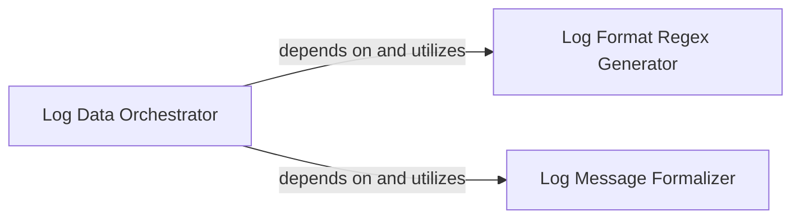

## Details

The `Log Data Ingestion Module` is responsible for loading raw log data, applying initial preprocessing, and converting it into a structured format suitable for parsing.

### Log Data Orchestrator
This is the primary component of the ingestion subsystem. It orchestrates the entire log data loading and initial parsing process. Its core responsibility is to read raw log data, coordinate the generation and application of a regular expression for parsing, and integrate formalized messages into a structured Pandas DataFrame. This component acts as the central control point for log data entering the analysis pipeline.

**Related Classes/Methods**:

- <a href="https://github.com/logpai/logparser/blob/main/logparser/utils/logloader.py#L33-L70" target="_blank" rel="noopener noreferrer">`logparser.utils.logloader.load_to_dataframe`:33-70</a>

### Log Format Regex Generator
A specialized utility component responsible for converting a human-readable log format string into a precise regular expression pattern. This regex is essential for accurately extracting variable fields from raw log lines. Its distinct role supports the modularity and extensibility of the system, allowing for different regex generation strategies if needed.

**Related Classes/Methods**:

- <a href="https://github.com/logpai/logparser/blob/main/logparser/utils/logloader.py#L72-L86" target="_blank" rel="noopener noreferrer">`logparser.utils.logloader._generate_logformat_regex`:72-86</a>

### Log Message Formalizer
An internal helper component focused on post-parsing preprocessing of individual log messages. It performs crucial steps like cleaning, normalizing, or standardizing extracted fields to ensure data quality and consistency before the messages are integrated into the final structured output. This component ensures that data is in a suitable format for subsequent analysis.

**Related Classes/Methods**:

- <a href="https://github.com/logpai/logparser/blob/main/logparser/utils/logloader.py#L89-L103" target="_blank" rel="noopener noreferrer">`logparser.utils.logloader.formalize_message`:89-103</a>

### [FAQ](https://github.com/CodeBoarding/GeneratedOnBoardings/tree/main?tab=readme-ov-file#faq)