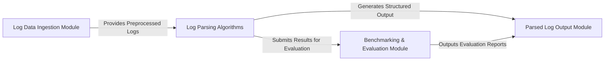

## Details

The `logparser` architecture is designed around a core pipeline for log analysis. Raw log data enters via the **Log Data Ingestion Module**, which preprocesses it into a structured format. This data then flows into the **Log Parsing Algorithms** component, a central hub representing various pluggable parsing strategies. Each algorithm processes the logs to extract structured events and templates. The parsed results are simultaneously sent to the **Parsed Log Output Module** for storage and to the **Benchmarking & Evaluation Module** for performance assessment. Finally, the evaluation reports generated by the benchmarking module are also directed to the **Parsed Log Output Module** for output. This clear, modular flow facilitates easy integration of new parsing techniques and robust comparative studies, making it ideal for a flow graph representation.

### Log Data Ingestion Module [[Expand]](./Log_Data_Ingestion_Module.md)
Responsible for loading raw log data from various sources, applying initial preprocessing steps, and converting it into a structured format (e.g., Pandas DataFrame) suitable for parsing. It handles the initial parsing of log lines based on a defined format.

**Related Classes/Methods**:

- <a href="https://github.com/logpai/logparser/blob/main/logparser/utils/logloader.py#L33-L70" target="_blank" rel="noopener noreferrer">`logparser.utils.logloader.load_to_dataframe`:33-70</a>
- <a href="https://github.com/logpai/logparser/blob/main/logparser/utils/logloader.py#L72-L86" target="_blank" rel="noopener noreferrer">`logparser.utils.logloader._generate_logformat_regex`:72-86</a>

### Log Parsing Algorithms
This central component represents the collection of all pluggable log parsing algorithms. It embodies the `Parsing Algorithm Interface`, allowing various algorithms (e.g., AEL, Drain, NuLog, DivLog, IPLoM, LKE, LogMine, MoLFI, Spell, Brain, LFA, LogCluster, LogSig, SHISO, SLCT, ULP, LenMa) to be seamlessly integrated and swapped. Each algorithm implements its unique logic to transform raw log messages into structured event templates.

**Related Classes/Methods**:

- <a href="https://github.com/logpai/logparser/blob/main/logparser/AEL/AEL.py" target="_blank" rel="noopener noreferrer">`logparser.AEL.AEL:parse`</a>
- <a href="https://github.com/logpai/logparser/blob/main/logparser/Drain/Drain.py" target="_blank" rel="noopener noreferrer">`logparser.Drain.Drain:parse`</a>
- <a href="https://github.com/logpai/logparser/blob/main/logparser/NuLog/NuLog.py" target="_blank" rel="noopener noreferrer">`logparser.NuLog.NuLog:parse`</a>
- <a href="https://github.com/logpai/logparser/blob/main/logparser/DivLog/DivLog.py" target="_blank" rel="noopener noreferrer">`logparser.DivLog.DivLog:parse`</a>
- <a href="https://github.com/logpai/logparser/blob/main/logparser/IPLoM/IPLoM.py" target="_blank" rel="noopener noreferrer">`logparser.IPLoM.IPLoM:parse`</a>
- <a href="https://github.com/logpai/logparser/blob/main/logparser/LKE/LKE.py" target="_blank" rel="noopener noreferrer">`logparser.LKE.LKE:parse`</a>
- <a href="https://github.com/logpai/logparser/blob/main/logparser/LogMine/src/LogMine.py" target="_blank" rel="noopener noreferrer">`logparser.LogMine.src.LogMine:parse`</a>
- <a href="https://github.com/logpai/logparser/blob/main/logparser/MoLFI/src/MoLFI.py" target="_blank" rel="noopener noreferrer">`logparser.MoLFI.src.MoLFI:parse`</a>
- <a href="https://github.com/logpai/logparser/blob/main/logparser/Spell/Spell.py" target="_blank" rel="noopener noreferrer">`logparser.Spell.Spell:parse`</a>
- <a href="https://github.com/logpai/logparser/blob/main/logparser/Brain/Brain.py" target="_blank" rel="noopener noreferrer">`logparser.Brain.Brain:parse`</a>
- <a href="https://github.com/logpai/logparser/blob/main/logparser/LFA/LFA.py" target="_blank" rel="noopener noreferrer">`logparser.LFA.LFA:parse`</a>
- <a href="https://github.com/logpai/logparser/blob/main/logparser/LogCluster/src/LogCluster.py" target="_blank" rel="noopener noreferrer">`logparser.LogCluster.src.LogCluster:parse`</a>
- <a href="https://github.com/logpai/logparser/blob/main/logparser/LogSig/LogSig.py" target="_blank" rel="noopener noreferrer">`logparser.LogSig.LogSig:parse`</a>
- <a href="https://github.com/logpai/logparser/blob/main/logparser/SHISO/SHISO.py" target="_blank" rel="noopener noreferrer">`logparser.SHISO.SHISO:parse`</a>
- <a href="https://github.com/logpai/logparser/blob/main/logparser/SLCT/src/SLCT.py" target="_blank" rel="noopener noreferrer">`logparser.SLCT.src.SLCT:parse`</a>
- <a href="https://github.com/logpai/logparser/blob/main/logparser/ULP/ULP.py" target="_blank" rel="noopener noreferrer">`logparser.ULP.ULP:parse`</a>
- <a href="https://github.com/logpai/logparser/blob/main/logparser/LenMa/src/LenMa.py" target="_blank" rel="noopener noreferrer">`logparser.LenMa.src.LenMa:parse`</a>

### Parsed Log Output Module
Manages the final output of the parsed log data. This includes formatting the results (e.g., structured logs, templates, event IDs) and writing them to specified destinations (e.g., files, databases, console). It also handles the output of evaluation reports.

**Related Classes/Methods**:

- <a href="https://github.com/logpai/logparser/blob/main/logparser/AEL/AEL.py" target="_blank" rel="noopener noreferrer">`logparser.AEL.AEL:dump`</a>

### Benchmarking & Evaluation Module
Provides functionalities for evaluating the performance and accuracy of different log parsing algorithms. It compares parsed results against ground truth data and generates metrics (e.g., accuracy, precision, recall, F1-score) for comparative analysis.

**Related Classes/Methods**:

- <a href="https://github.com/logpai/logparser/blob/main/logparser/utils/evaluator.py" target="_blank" rel="noopener noreferrer">`logparser.utils.evaluator:evaluate`</a>

### [FAQ](https://github.com/CodeBoarding/GeneratedOnBoardings/tree/main?tab=readme-ov-file#faq)