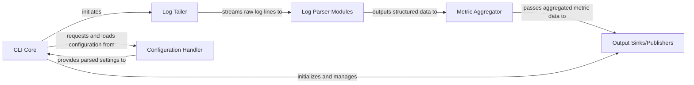

## Details

The logster application is designed as a modular log processing pipeline. Its core functionality revolves around a CLI Core that orchestrates the entire process. This core component is responsible for parsing command-line arguments, loading configuration, and dynamically initializing the Log Tailer, Log Parser Modules, and Output Sinks/Publishers. The Log Tailer continuously reads log data, which is then fed to the Log Parser Modules for transformation into structured metrics. These structured metrics are subsequently processed by the Metric Aggregator for statistical analysis before being dispatched to various external systems via the Output Sinks/Publishers. The Configuration Handler underpins the system by providing all necessary settings to these components.

### CLI Core
The central orchestration component responsible for initializing the application, parsing command-line arguments, loading configurations, and coordinating the execution flow of the Log Tailer, Parser Modules, Metric Aggregator, and Output Sinks. It acts as the main entry point for the logster application.

**Related Classes/Methods**:

- <a href="https://github.com/etsy/logster/blob/master/bin/logster" target="_blank" rel="noopener noreferrer">`bin/logster`</a>

### Log Tailer
Responsible for continuously reading and streaming new log data from specified files. It handles file I/O, potentially using mechanisms like pygtail or fcntl.flock for efficient and robust log file monitoring. It feeds raw log lines to the Log Parser Modules.

**Related Classes/Methods**:

- <a href="https://github.com/etsy/logster/blob/master/logster/tailers/logtailtailer.py#L5-L23" target="_blank" rel="noopener noreferrer">`logster.tailers.logtailtailer.LogtailTailer`:5-23</a>

### Log Parser Modules
A pluggable component responsible for transforming raw log lines into structured data. Each module is designed to understand specific log formats (e.g., Apache, Nginx) and extract relevant metrics. These modules output structured data (e.g., dictionaries or objects) that the Metric Aggregator can process.

**Related Classes/Methods**:

- <a href="https://github.com/etsy/logster/blob/master/logster/parsers/MetricLogster.py#L43-L104" target="_blank" rel="noopener noreferrer">`logster.parsers.MetricLogster.MetricLogster`:43-104</a>

### Metric Aggregator [[Expand]](./Metric_Aggregator.md)
Processes structured data received from Log Parser Modules. Its core responsibility is to perform statistical calculations and aggregations (e.g., median, percentile, counts, mean) on numerical data streams. It prepares the aggregated metrics for output to various sinks.

**Related Classes/Methods**:

- <a href="https://github.com/etsy/logster/blob/master/logster/parsers/stats_helper.py#L7-L8" target="_blank" rel="noopener noreferrer">`logster.parsers.stats_helper.find_median`:7-8</a>
- <a href="https://github.com/etsy/logster/blob/master/logster/parsers/stats_helper.py#L11-L23" target="_blank" rel="noopener noreferrer">`logster.parsers.stats_helper.find_percentile`:11-23</a>
- <a href="https://github.com/etsy/logster/blob/master/logster/parsers/stats_helper.py#L25-L29" target="_blank" rel="noopener noreferrer">`logster.parsers.stats_helper.find_mean`:25-29</a>

### Output Sinks/Publishers
A pluggable component responsible for dispatching the aggregated metrics to various external monitoring or data storage systems (e.g., Graphite, Ganglia, Amazon CloudWatch, Nagios, StatsD). Each sink implements the necessary protocol to publish the processed data.

**Related Classes/Methods**:

- <a href="https://github.com/etsy/logster/blob/master/logster/outputs/graphite.py#L6-L62" target="_blank" rel="noopener noreferrer">`logster.outputs.graphite.GraphiteOutput`:6-62</a>

### Configuration Handler
Manages the application's settings, including which log files to monitor, which parser modules to use, and the configuration for output sinks. It ensures that all components are initialized with the correct parameters.

**Related Classes/Methods**:

- <a href="https://github.com/etsy/logster/blob/master/bin/logster" target="_blank" rel="noopener noreferrer">`bin/logster`</a>

### [FAQ](https://github.com/CodeBoarding/GeneratedOnBoardings/tree/main?tab=readme-ov-file#faq)