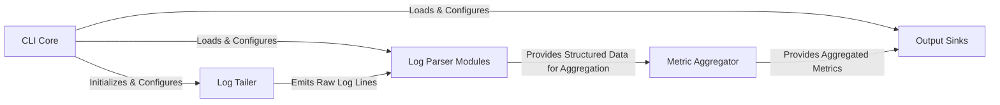

## Details

The Logster application operates as a modular pipeline designed for efficient log processing and metric publication. The `CLI Core` acts as the central orchestrator, setting up and managing the data flow. Raw log data is continuously ingested by the `Log Tailer`, which feeds into the `Log Parser Modules` for transformation into structured formats. These structured logs are then processed by the `Metric Aggregator` to derive meaningful metrics. Finally, the `Output Sinks` are responsible for formatting and dispatching these aggregated metrics to various external monitoring systems, completing the data flow from log ingestion to external reporting.

### CLI Core
The central orchestration component responsible for parsing command-line arguments, loading configurations, and managing the lifecycle of the Log Tailer, Log Parser Modules, and Output Sinks. It serves as the primary entry point for the Logster application.

**Related Classes/Methods**:

- <a href="https://github.com/etsy/logster/blob/master/logster/parsers/ErrorLogLogster.py#L15-L73" target="_blank" rel="noopener noreferrer">`logster`:15-73</a>

### Log Tailer
The input layer responsible for continuously monitoring and reading log files. It maintains state to resume from the last read position and abstracts different log tailing mechanisms.

**Related Classes/Methods**:

- <a href="https://github.com/etsy/logster/blob/master/logster/tailers/logtailtailer.py" target="_blank" rel="noopener noreferrer">`logster.tailers.logtailtailer`</a>
- <a href="https://github.com/etsy/logster/blob/master/logster/tailers/pygtailtailer.py" target="_blank" rel="noopener noreferrer">`logster.tailers.pygtailtailer`</a>
- <a href="https://github.com/etsy/logster/blob/master/logster/tailers" target="_blank" rel="noopener noreferrer">`logster.tailers`</a>

### Log Parser Modules
A collection of pluggable processing components. Each module parses specific log formats, extracting relevant information (e.g., metrics, events) from raw log lines and transforming it into a structured format.

**Related Classes/Methods**:

- <a href="https://github.com/etsy/logster/blob/master/logster/parsers/JsonLogster.py" target="_blank" rel="noopener noreferrer">`logster.parsers.JsonLogster`</a>
- <a href="https://github.com/etsy/logster/blob/master/logster/parsers/ErrorLogLogster.py" target="_blank" rel="noopener noreferrer">`logster.parsers.ErrorLogLogster`</a>
- <a href="https://github.com/etsy/logster/blob/master/logster/parsers/Log4jLogster.py" target="_blank" rel="noopener noreferrer">`logster.parsers.Log4jLogster`</a>
- <a href="https://github.com/etsy/logster/blob/master/logster/parsers/MetricLogster.py" target="_blank" rel="noopener noreferrer">`logster.parsers.MetricLogster`</a>

### Metric Aggregator [[Expand]](./Metric_Aggregator.md)
Processes structured data from Log Parser Modules, performing statistical calculations and aggregations (e.g., median, percentile, counts) before output.

**Related Classes/Methods**:

- <a href="https://github.com/etsy/logster/blob/master/logster/parsers/stats_helper.py" target="_blank" rel="noopener noreferrer">`logster.parsers.stats_helper`</a>

### Output Sinks
A group of pluggable output components responsible for formatting and publishing aggregated metrics to various external monitoring systems.

**Related Classes/Methods**:

- <a href="https://github.com/etsy/logster/blob/master/logster/outputs/cloudwatch.py" target="_blank" rel="noopener noreferrer">`logster.outputs.cloudwatch`</a>
- <a href="https://github.com/etsy/logster/blob/master/logster/outputs/graphite.py" target="_blank" rel="noopener noreferrer">`logster.outputs.graphite`</a>
- <a href="https://github.com/etsy/logster/blob/master/logster/outputs/ganglia.py" target="_blank" rel="noopener noreferrer">`logster.outputs.ganglia`</a>
- <a href="https://github.com/etsy/logster/blob/master/logster/outputs/statsd.py" target="_blank" rel="noopener noreferrer">`logster.outputs.statsd`</a>

### [FAQ](https://github.com/CodeBoarding/GeneratedOnBoardings/tree/main?tab=readme-ov-file#faq)