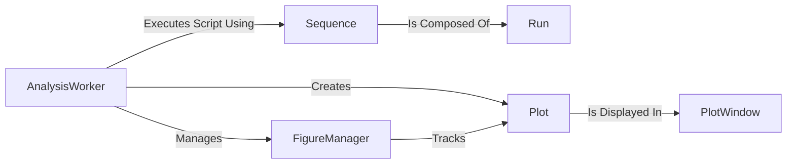

## Details

A revised architectural analysis based on feedback, correcting inaccuracies in component definitions and relationship mappings.

### AnalysisWorker
The orchestrator for the analysis subprocess. It sets up the environment, executes the user script, creates logical `Plot` instances as requested by the script, and manages the `FigureManager`.

**Related Classes/Methods**:

- `lyse/analysis_subprocess.py`

### Sequence
The primary Data Access API for analysis scripts. It provides access to a sequence of experimental shots (composed of `Run`s) from HDF5 files.

**Related Classes/Methods**:

- `lyse.Sequence`

### Run
A data structure representing a single experimental run. It is used by the `Sequence` component to provide granular data access to the analysis script.

**Related Classes/Methods**:

- `lyse.Run`

### FigureManager
A management component that oversees all figures created during an analysis run. It is responsible for tracking and cleaning up `Plot` instances.

**Related Classes/Methods**:

- `lyse/figure_manager.py`

### Plot
A logical, non-GUI component representing a single figure requested by an analysis script. It holds the data and properties of a plot before it is rendered.

**Related Classes/Methods**: _None_

### PlotWindow
The view component, a PyQt5 GUI window that renders a single matplotlib figure in the main Lyse process. It handles direct user interaction with the plot visualization.

**Related Classes/Methods**:

- `lyse/__main__.py`

### [FAQ](https://github.com/CodeBoarding/GeneratedOnBoardings/tree/main?tab=readme-ov-file#faq)