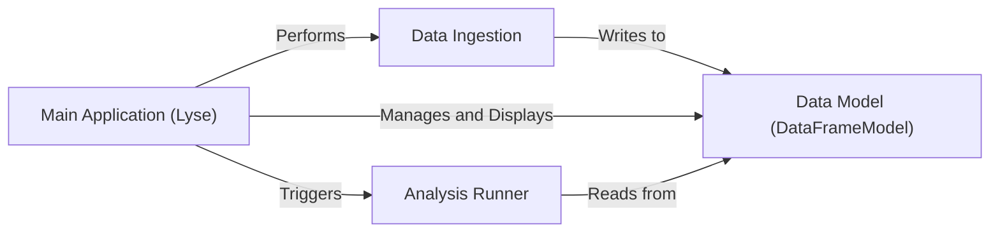

## Details

One paragraph explaining the functionality which is represented by this graph. What the main flow is and what is its purpose.

### Main Application (Lyse)
The central GUI component and application entry point. It constructs the primary window, which includes the file display (`FileBox`), analysis routine management (`RoutineBox`), and view configuration (`EditColumns`). It is responsible for orchestrating all user interactions, initiating file monitoring, and triggering analysis runs.

**Related Classes/Methods**:

- <a href="https://github.com/labscript-suite/lyse/blob/master/lyse/__main__.py#L1-L1" target="_blank" rel="noopener noreferrer">`lyse.__main__.Lyse` (1:1)</a>
- <a href="https://github.com/labscript-suite/lyse/blob/master/lyse/__main__.py#L1-L1" target="_blank" rel="noopener noreferrer">`lyse.__main__.FileBox` (1:1)</a>
- <a href="https://github.com/labscript-suite/lyse/blob/master/lyse/__main__.py#L1-L1" target="_blank" rel="noopener noreferrer">`lyse.__main__.RoutineBox` (1:1)</a>
- <a href="https://github.com/labscript-suite/lyse/blob/master/lyse/__main__.py#L1-L1" target="_blank" rel="noopener noreferrer">`lyse.__main__.EditColumns` (1:1)</a>

### Data Model (DataFrameModel)
The core data structure of the application (the "Model" in MVC). It holds experimental data in a pandas DataFrame and provides a thread-safe interface for reading and writing data, notifying views of changes. The `Main Application` monitors it for updates.

**Related Classes/Methods**:

- <a href="https://github.com/labscript-suite/lyse/blob/master/lyse/__main__.py#L1-L1" target="_blank" rel="noopener noreferrer">`lyse.__main__.DataFrameModel` (1:1)</a>

### Analysis Runner
A backend component responsible for executing analysis scripts in isolated, separate processes. This critical design choice, triggered by the `Main Application`, ensures that user script errors do not crash the main GUI application.

**Related Classes/Methods**:

- <a href="https://github.com/labscript-suite/lyse/blob/master/lyse/analysis_subprocess.py#L1-L1" target="_blank" rel="noopener noreferrer">`lyse.analysis_subprocess` (1:1)</a>

### Data Ingestion
A core responsibility of the `Main Application`, not a separate component. It involves monitoring a directory for new HDF5 files, parsing them, and loading the data into the shared `Data Model`. This process is the primary trigger for updating the application's state.

**Related Classes/Methods**:

- <a href="https://github.com/labscript-suite/lyse/blob/master/lyse/__main__.py#L1-L1" target="_blank" rel="noopener noreferrer">`lyse.__main__` (1:1)</a>

### [FAQ](https://github.com/CodeBoarding/GeneratedOnBoardings/tree/main?tab=readme-ov-file#faq)