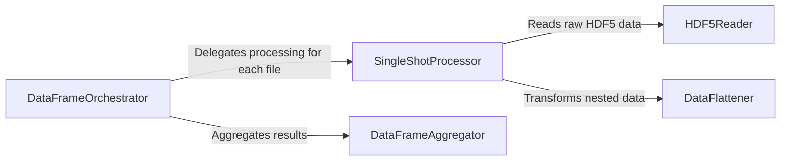

## Details

One paragraph explaining the functionality which is represented by this graph. What the main flow is and what is its purpose.

### DataFrameOrchestrator
The top-level entry point (`get_dataframe_from_shots`) that manages the entire workflow. It iterates over a list of file paths, delegates the processing of each file, and aggregates the results into a single, unified DataFrame for the application.

**Related Classes/Methods**:

- <a href="https://github.com/labscript-suite/lyse/blob/master/lyse/dataframe_utilities.py#L119-L120" target="_blank" rel="noopener noreferrer">`lyse.dataframe_utilities:get_dataframe_from_shots` (119:120)</a>

### SingleShotProcessor
The main worker (`get_dataframe_from_shot`) for an individual data file. It orchestrates the extraction and transformation of data from a single HDF5 file into a pandas Series, which is a row in the final DataFrame.

**Related Classes/Methods**:

- <a href="https://github.com/labscript-suite/lyse/blob/master/lyse/dataframe_utilities.py#L113-L117" target="_blank" rel="noopener noreferrer">`lyse.dataframe_utilities:get_dataframe_from_shot` (113:117)</a>

### HDF5Reader
The data extraction component (`get_nested_dict_from_shot`). It interfaces directly with the HDF5 file format, reading the raw, hierarchical data and metadata into a nested Python dictionary. It also handles type conversions, such as parsing timestamps.

**Related Classes/Methods**:

- <a href="https://github.com/labscript-suite/lyse/blob/master/lyse/dataframe_utilities.py#L27-L72" target="_blank" rel="noopener noreferrer">`lyse.dataframe_utilities:get_nested_dict_from_shot` (27:72)</a>

### DataFlattener
A critical transformation utility (`flatten_dict`). It converts the nested dictionary from the `HDF5Reader` into a flat, single-level dictionary. This structure is essential for creating a tabular pandas Series/DataFrame.

**Related Classes/Methods**:

- <a href="https://github.com/labscript-suite/lyse/blob/master/lyse/dataframe_utilities.py#L74-L85" target="_blank" rel="noopener noreferrer">`lyse.dataframe_utilities:flatten_dict` (74:85)</a>

### DataFrameAggregator
The final assembly component (`concat_with_padding`). It merges the individual Series/DataFrames from each shot into one master DataFrame. Its key function is to ensure structural consistency by padding missing columns, guaranteeing a well-formed dataset.

**Related Classes/Methods**:

- <a href="https://github.com/labscript-suite/lyse/blob/master/lyse/dataframe_utilities.py#L141-L152" target="_blank" rel="noopener noreferrer">`lyse.dataframe_utilities:concat_with_padding` (141:152)</a>

### [FAQ](https://github.com/CodeBoarding/GeneratedOnBoardings/tree/main?tab=readme-ov-file#faq)