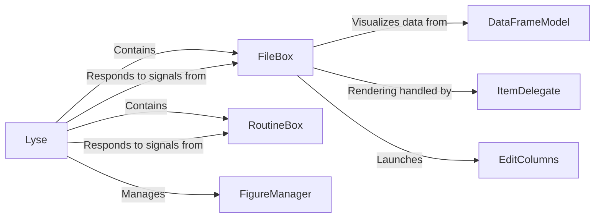

## Details

One paragraph explaining the functionality which is represented by this graph. What the main flow is and what is its purpose.

### Lyse
The main application window and central controller. It orchestrates the layout and interactions of all other major UI components. It responds to user actions (e.g., file selection, routine execution) by updating the data model and coordinating other components.

**Related Classes/Methods**:

- `lyse.__main__.Lyse`

### FileBox
A crucial view component that displays the list of data files (shots) and their analysis status in a table. It is the primary interface for data selection and inspection, emitting signals to the `Lyse` component upon user interaction.

**Related Classes/Methods**:

- `lyse.__main__.FileBox`

### RoutineBox
A view component responsible for displaying and managing the list of available analysis routines. It allows users to select which scripts to execute on the data and notifies the `Lyse` component of the selection.

**Related Classes/Methods**:

- `lyse.__main__.RoutineBox`

### DataFrameModel
The data model that serves as the bridge between the application's core pandas DataFrame and the `FileBox` view. Implemented as a `QAbstractTableModel`, it manages data access and notifies the view of updates.

**Related Classes/Methods**:

- `lyse.__main__.DataFrameModel`

### FigureManager
Manages the creation, display, and lifecycle of all plot windows generated by the analysis routines. It ensures that figures are displayed correctly and are associated with the relevant data.

**Related Classes/Methods**:

- `lyse.figure_manager`

### EditColumns
A dialog window, launched from the `FileBox`, that allows users to customize which data columns are visible in the main data view.

**Related Classes/Methods**:

- `lyse.__main__.EditColumns`

### ItemDelegate
A helper class that provides custom rendering logic for items within the `FileBox` view. It is used to visually represent the analysis status of each data file, for example, by using different colors or icons.

**Related Classes/Methods**:

- `lyse.__main__.ItemDelegate`

### [FAQ](https://github.com/CodeBoarding/GeneratedOnBoardings/tree/main?tab=readme-ov-file#faq)