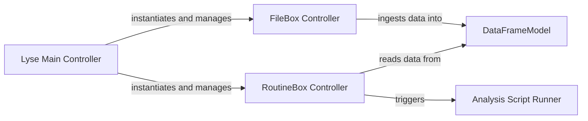

## Details

One paragraph explaining the functionality which is represented by this graph. What the main flow is and what is its purpose.

### Lyse Main Controller
The application's central orchestrator and top-level GUI window. It initializes all primary sub-components, connects user actions to backend logic, and manages the application's overall lifecycle. It serves as the container for the `FileBox` and `RoutineBox`, delegating specific control tasks to them.

**Related Classes/Methods**:

- `lyse.Lyse` (1:1)

### FileBox Controller
A specialized controller responsible for managing the data input lifecycle. It monitors the filesystem for new HDF5 data files, ingests their contents, and updates the central `DataFrameModel`. This component effectively bridges the filesystem with the application's internal data state.

**Related Classes/Methods**:

- `lyse.FileBox` (1:1)

### RoutineBox Controller
A specialized controller for managing and executing user-provided analysis scripts. It displays available scripts to the user, manages their execution state (e.g., running, stopped), and launches them in isolated processes to ensure application stability.

**Related Classes/Methods**:

- `lyse.RoutineBox` (1:1)

### DataFrameModel
The application's central data store, acting as the 'Model' in an MVC-like pattern. It holds the scientific data in a structured pandas DataFrame. This component does not contain control logic but is manipulated by controllers (`FileBox`) and read by other parts of the system (`RoutineBox`).

**Related Classes/Methods**:

- `lyse.DataFrameModel` (1:1)

### Analysis Script Runner
Manages the execution of a single user-provided analysis script in an isolated subprocess. It prepares the script's environment, including its module namespace and path, communicates with the parent process to receive analysis tasks, and handles the lifecycle of the script's execution. This ensures that user scripts do not interfere with the main application's stability.

**Related Classes/Methods**:

- <a href="https://github.com/labscript-suite/lyse/blob/master/lyse/analysis_subprocess.py#L231-L428" target="_blank" rel="noopener noreferrer">`lyse.analysis_subprocess.AnalysisWorker` (231:428)</a>

### [FAQ](https://github.com/CodeBoarding/GeneratedOnBoardings/tree/main?tab=readme-ov-file#faq)