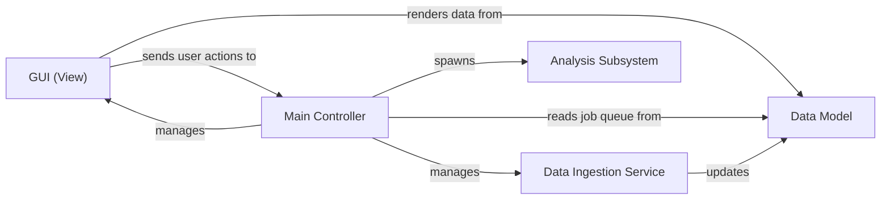

## Details

One paragraph explaining the functionality which is represented by this graph. What the main flow is and what is its purpose.

### GUI (View) [[Expand]](./GUI_View_.md)
The user-facing interface built with PyQt5. It is responsible for visualizing the contents of the `Data Model`, including the list of data files and their analysis status. It captures all user interactions (e.g., adding analysis routines, selecting data) and forwards them as signals to the `Main Controller`.

**Related Classes/Methods**:

- `lyse/__main__.py`
- `lyse/figure_manager.py`
- `lyse/main.ui`
- `lyse/edit_columns.ui`
- `lyse/filebox.ui`
- `lyse/plot_window.ui`
- `lyse/routinebox.ui`

### Main Controller [[Expand]](./Main_Controller.md)
The application's central orchestrator. It initializes the GUI and all other components, connects user actions from the GUI to backend logic, and manages the application's overall state. It monitors the `Data Model` to schedule analysis tasks.

**Related Classes/Methods**:

- `lyse/__main__.py`

### Data Model [[Expand]](./Data_Model.md)
The single source of truth for the application's state, implemented as a central pandas DataFrame. It represents the collection of all data files ("shots") and their associated metadata and analysis results. The GUI directly visualizes this model, and it serves as the job queue for the analysis pipeline.

**Related Classes/Methods**:

- `lyse/dataframe_utilities.py`

### Data Ingestion Service [[Expand]](./Data_Ingestion_Service.md)
A file-monitoring component that watches for new HDF5 data files. Upon detection, it uses data processing utilities to parse the file and updates the `Data Model` with a new row, triggering downstream analysis. This service acts as the entry point for the data processing pipeline.

**Related Classes/Methods**:

- `lyse/__main__.py`

### Analysis Subsystem [[Expand]](./Analysis_Subsystem.md)
An isolated component responsible for executing user-provided analysis scripts in a separate process. This critical design choice ensures the main application remains responsive and stable. It includes the analysis worker and a dedicated Data Access API (`Run.py`) that provides a simplified, safe interface for scripts to read HDF5 files and save results.

**Related Classes/Methods**:

- `lyse/analysis_subprocess.py`

### [FAQ](https://github.com/CodeBoarding/GeneratedOnBoardings/tree/main?tab=readme-ov-file#faq)