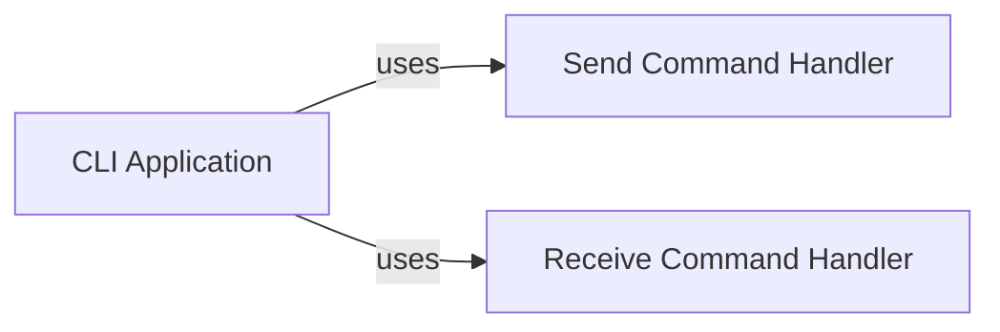

## Details

Initial analysis of the Wormhole CLI, focusing on the main application and its 'send' and 'receive' command handlers.

### CLI Application
Entry point for the Wormhole CLI application.

**Related Classes/Methods**:

### Send Command Handler
Handles the 'send' command, encrypting and transferring files.

**Related Classes/Methods**:

### Receive Command Handler
Handles the 'receive' command, decrypting and receiving files.

**Related Classes/Methods**:

### [FAQ](https://github.com/CodeBoarding/GeneratedOnBoardings/tree/main?tab=readme-ov-file#faq)