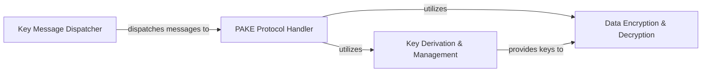

## Details

The `_key.py` module in `src/wormhole` serves as the central cryptographic module, orchestrating secure key exchange and data encryption. It primarily leverages two internal classes, `Key` and `_SortedKey`, along with several helper functions, to manage the lifecycle of cryptographic operations. The `Key` class acts as the initial message dispatcher, handling the receipt and ordering of "wormhole codes" and PAKE messages. Once these are processed, it delegates to the `_SortedKey` class, which then takes charge of the PAKE protocol execution, shared secret computation, and subsequent session key derivation for data encryption. Helper functions within the module provide essential cryptographic primitives for key derivation and data encryption/decryption.

### Key Message Dispatcher
This component, embodied by the `Key` class, acts as the primary entry point for incoming cryptographic messages. It is responsible for receiving and correctly ordering the "wormhole code" (`got_code`) and PAKE messages (`got_pake`), ensuring they are processed in the correct sequence before being dispatched to the `PAKE Protocol Handler`.

**Related Classes/Methods**:

- <a href="https://github.com/magic-wormhole/magic-wormhole/blob/master/src/wormhole/_key.py" target="_blank" rel="noopener noreferrer">`src/wormhole/_key.py::Key`</a>
- <a href="https://github.com/magic-wormhole/magic-wormhole/blob/master/src/wormhole/_key.py" target="_blank" rel="noopener noreferrer">`src/wormhole/_key.py::Key:got_code`</a>
- <a href="https://github.com/magic-wormhole/magic-wormhole/blob/master/src/wormhole/_key.py" target="_blank" rel="noopener noreferrer">`src/wormhole/_key.py::Key:got_pake`</a>
- <a href="https://github.com/magic-wormhole/magic-wormhole/blob/master/src/wormhole/_key.py" target="_blank" rel="noopener noreferrer">`src/wormhole/_key.py::Key:deliver_code`</a>
- <a href="https://github.com/magic-wormhole/magic-wormhole/blob/master/src/wormhole/_key.py" target="_blank" rel="noopener noreferrer">`src/wormhole/_key.py::Key:deliver_pake`</a>
- <a href="https://github.com/magic-wormhole/magic-wormhole/blob/master/src/wormhole/_key.py" target="_blank" rel="noopener noreferrer">`src/wormhole/_key.py::Key:deliver_code_and_stashed_pake`</a>

### PAKE Protocol Handler
Implemented by the `_SortedKey` class, this component is central to the Password Authenticated Key Exchange (PAKE) protocol. It processes the sorted PAKE messages, computes the shared secret key, and manages the state transitions of the PAKE handshake. It also initiates the derivation of session keys for data encryption.

**Related Classes/Methods**:

- <a href="https://github.com/magic-wormhole/magic-wormhole/blob/master/src/wormhole/_key.py" target="_blank" rel="noopener noreferrer">`src/wormhole/_key.py::_SortedKey`</a>
- <a href="https://github.com/magic-wormhole/magic-wormhole/blob/master/src/wormhole/_key.py" target="_blank" rel="noopener noreferrer">`src/wormhole/_key.py::_SortedKey:got_code`</a>
- <a href="https://github.com/magic-wormhole/magic-wormhole/blob/master/src/wormhole/_key.py" target="_blank" rel="noopener noreferrer">`src/wormhole/_key.py::_SortedKey:got_pake`</a>
- <a href="https://github.com/magic-wormhole/magic-wormhole/blob/master/src/wormhole/_key.py" target="_blank" rel="noopener noreferrer">`src/wormhole/_key.py::_SortedKey:got_pake_good`</a>
- <a href="https://github.com/magic-wormhole/magic-wormhole/blob/master/src/wormhole/_key.py" target="_blank" rel="noopener noreferrer">`src/wormhole/_key.py::_SortedKey:build_pake`</a>
- <a href="https://github.com/magic-wormhole/magic-wormhole/blob/master/src/wormhole/_key.py" target="_blank" rel="noopener noreferrer">`src/wormhole/_key.py::_SortedKey:compute_key`</a>

### Key Derivation & Management
This component encompasses the functions responsible for generating and securely deriving cryptographic keys. It includes general key derivation (`derive_key`) and phase-specific key derivation (`derive_phase_key`), ensuring that appropriate keys are generated for different stages of the cryptographic process.

**Related Classes/Methods**:

- <a href="https://github.com/magic-wormhole/magic-wormhole/blob/master/src/wormhole/_key.py" target="_blank" rel="noopener noreferrer">`src/wormhole/_key.py::derive_key`</a>
- <a href="https://github.com/magic-wormhole/magic-wormhole/blob/master/src/wormhole/_key.py" target="_blank" rel="noopener noreferrer">`src/wormhole/_key.py::derive_phase_key`</a>

### Data Encryption & Decryption
This component provides the core functionality for encrypting and decrypting application data using the established session keys. It ensures the confidentiality of transferred information by applying cryptographic operations to plaintext and ciphertext.

**Related Classes/Methods**:

- <a href="https://github.com/magic-wormhole/magic-wormhole/blob/master/src/wormhole/_key.py" target="_blank" rel="noopener noreferrer">`src/wormhole/_key.py::encrypt_data`</a>
- <a href="https://github.com/magic-wormhole/magic-wormhole/blob/master/src/wormhole/_key.py" target="_blank" rel="noopener noreferrer">`src/wormhole/_key.py::decrypt_data`</a>

### [FAQ](https://github.com/CodeBoarding/GeneratedOnBoardings/tree/main?tab=readme-ov-file#faq)