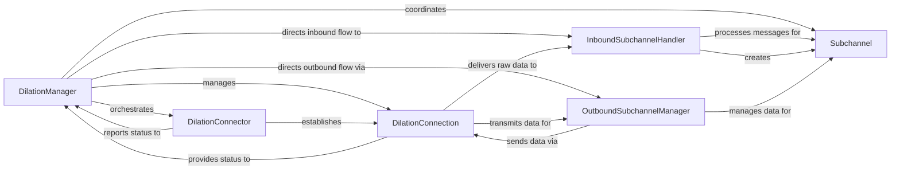

## Details

The Dilation subsystem in `magic-wormhole` is orchestrated by the `DilationManager`, which serves as the central control point for establishing and maintaining a dilated connection. The `DilationManager` delegates connection establishment to the `DilationConnector`, which is responsible for initiating and managing the underlying `DilationConnection`. This `DilationConnection` provides the secure, low-level transport for all data. For multiplexed communication, the system utilizes `Subchannel` instances, whose lifecycle is coordinated by the `DilationManager`. Incoming subchannel-specific messages are handled by the `InboundSubchannelHandler`, which processes and routes data to the appropriate `Subchannel` and also creates new `Subchannel` instances as needed. Outbound data flow for subchannels is managed by the `OutboundSubchannelManager`, which prepares and streams data onto the `Subchannel` and then sends it via the `DilationConnection`. This architecture ensures a clear separation of concerns between connection management, secure transport, and logical channel multiplexing.

### DilationManager
Orchestrates the overall dilation process, manages the state of the dilated connection, handles dilation-specific messages (e.g., ping/pong, reconnect signals, connection hints), and coordinates the establishment and teardown of the underlying network connection. It acts as the central control point for the dilation protocol.

**Related Classes/Methods**:

- <a href="https://github.com/magic-wormhole/magic-wormhole/blob/master/src/wormhole/_interfaces.py#L523-L524" target="_blank" rel="noopener noreferrer">`DilationManager`:523-524</a>

### DilationConnection
Handles the low-level network communication for the dilated wormhole. This includes framing and unframing messages, performing the initial handshake, and managing the encryption/decryption of data records exchanged over the connection. It acts as the secure transport layer for the dilation protocol.

**Related Classes/Methods**:

- <a href="https://github.com/magic-wormhole/magic-wormhole/blob/master/src/wormhole/_dilation/connection.py#L1-L999999" target="_blank" rel="noopener noreferrer">`DilationConnection`:1-999999</a>

### Subchannel
Represents a single logical communication channel multiplexed over the main dilated connection. It provides an interface for applications to send and receive data, and manages the state (open, closed, half-closed) of its specific channel.

**Related Classes/Methods**:

- <a href="https://github.com/magic-wormhole/magic-wormhole/blob/master/src/wormhole/_interfaces.py#L531-L532" target="_blank" rel="noopener noreferrer">`Subchannel`:531-532</a>

### DilationConnector
Manages the establishment of the underlying network connections for the dilated wormhole. This includes initiating outbound connections and listening for inbound connections. It handles connection attempts, retries, and the selection of suitable connection methods based on hints.

**Related Classes/Methods**:

- <a href="https://github.com/magic-wormhole/magic-wormhole/blob/master/src/wormhole/_interfaces.py#L527-L528" target="_blank" rel="noopener noreferrer">`DilationConnector`:527-528</a>

### InboundSubchannelHandler
Processes incoming dilation messages specifically related to subchannels (e.g., `handle_open`, `handle_data`, `handle_close`). It is responsible for routing these messages to the correct `Subchannel` instance and handling errors related to missing or duplicate subchannels.

**Related Classes/Methods**:

- <a href="https://github.com/magic-wormhole/magic-wormhole/blob/master/src/wormhole/_dilation/inbound.py#L1-L999999" target="_blank" rel="noopener noreferrer">`InboundSubchannelHandler`:1-999999</a>

### OutboundSubchannelManager
Manages the outbound data flow for subchannels. It handles the registration and unregistration of data producers for subchannels, controls the pausing, resuming, and stopping of data production, and manages the streaming of data from producers onto the subchannels.

**Related Classes/Methods**:

- <a href="https://github.com/magic-wormhole/magic-wormhole/blob/master/src/wormhole/_dilation/outbound.py#L1-L999999" target="_blank" rel="noopener noreferrer">`OutboundSubchannelManager`:1-999999</a>

### [FAQ](https://github.com/CodeBoarding/GeneratedOnBoardings/tree/main?tab=readme-ov-file#faq)