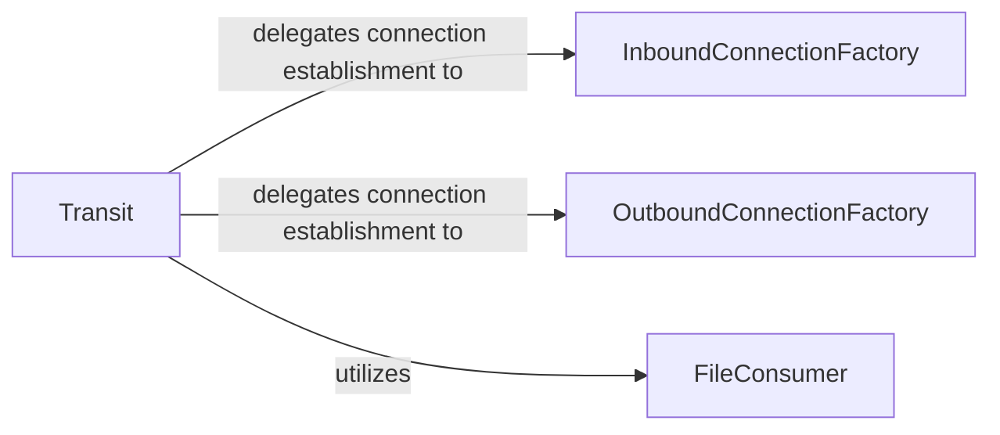

## Details

The Direct Transit Module is primarily encapsulated within the wormhole.transit package, specifically the src/wormhole/transit.py file. This module is responsible for establishing and managing direct peer-to-peer TCP connections, including various strategies like direct IP, NAT traversal, and relay fallback.

### Transit
The central orchestrator of the direct transit subsystem. It manages the entire lifecycle of peer-to-peer TCP connections, from establishment and negotiation to data transfer. It abstracts the complexities of different connection strategies (direct, NAT traversal, relay fallback).

**Related Classes/Methods**:

- <a href="https://github.com/magic-wormhole/magic-wormhole/blob/master/src/wormhole/transit.py" target="_blank" rel="noopener noreferrer">`wormhole.transit.Transit`</a>

### InboundConnectionFactory
A factory component dedicated to handling and managing the creation of protocols for incoming direct connections. It listens for and accepts new connection requests from peers.

**Related Classes/Methods**:

- <a href="https://github.com/magic-wormhole/magic-wormhole/blob/master/src/wormhole/transit.py#L420-L469" target="_blank" rel="noopener noreferrer">`wormhole.transit.InboundConnectionFactory`:420-469</a>

### OutboundConnectionFactory
A factory component responsible for initiating and managing the creation of protocols for outgoing direct connections. It handles the process of establishing connections to remote peers.

**Related Classes/Methods**:

- <a href="https://github.com/magic-wormhole/magic-wormhole/blob/master/src/wormhole/transit.py#L400-L417" target="_blank" rel="noopener noreferrer">`wormhole.transit.OutboundConnectionFactory`:400-417</a>

### FileConsumer
A utility component focused on the persistence aspect of data transfer. It is responsible for writing received data streams to a designated file on the local system.

**Related Classes/Methods**:

- <a href="https://github.com/magic-wormhole/magic-wormhole/blob/master/src/wormhole/transit.py#L887-L909" target="_blank" rel="noopener noreferrer">`wormhole.transit.FileConsumer`:887-909</a>

### [FAQ](https://github.com/CodeBoarding/GeneratedOnBoardings/tree/main?tab=readme-ov-file#faq)