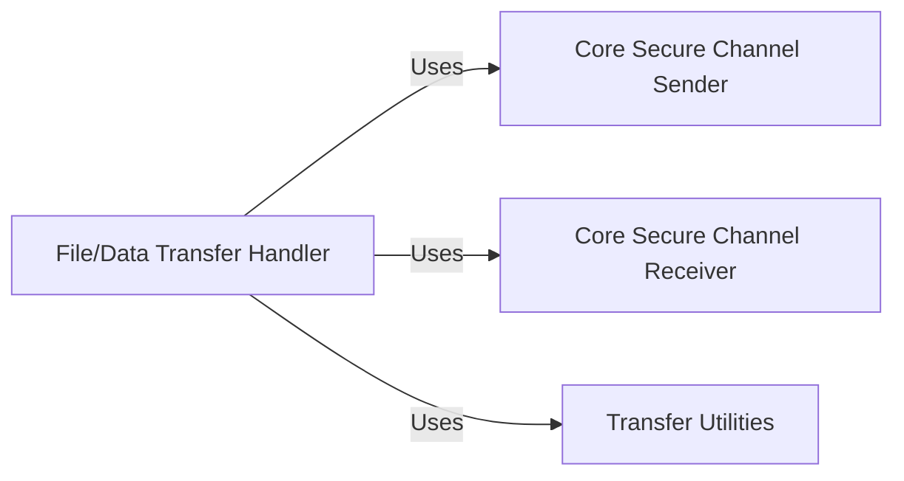

## Details

The magic-wormhole project's core data transfer mechanism is orchestrated by the File/Data Transfer Handler, which prepares various data types for secure transmission and processes them upon reception. This handler delegates the low-level secure communication to the Core Secure Channel Sender and Core Secure Channel Receiver. The Core Secure Channel Sender is responsible for encrypting and transmitting data chunks over the established secure channel, ensuring data integrity and confidentiality. Conversely, the Core Secure Channel Receiver manages the reception, decryption, and initial validation of incoming encrypted messages. Supporting these operations, the Transfer Utilities component provides essential helper functions for data manipulation and stream management. This architecture ensures a clear separation of concerns, with high-level data transfer orchestration decoupled from the intricacies of secure channel communication.

### File/Data Transfer Handler [[Expand]](./File_Data_Transfer_Handler.md)
Orchestrates the application-level transfer of various data types (files, directories, text messages) by preparing them for secure transmission and managing their processing upon reception. It acts as the bridge between the CLI orchestrators and the low-level secure channel communication components.

**Related Classes/Methods**:

- <a href="https://github.com/magic-wormhole/magic-wormhole/blob/master/src/wormhole/_send.py" target="_blank" rel="noopener noreferrer">`wormhole._send`</a>
- <a href="https://github.com/magic-wormhole/magic-wormhole/blob/master/src/wormhole/_receive.py" target="_blank" rel="noopener noreferrer">`wormhole._receive`</a>

### Core Secure Channel Sender
Handles the low-level encryption, framing, and secure transmission of protocol messages and data chunks over the established secure channel. It is responsible for ensuring data integrity and confidentiality during transit.

**Related Classes/Methods**:

- <a href="https://github.com/magic-wormhole/magic-wormhole/blob/master/src/wormhole/_send.py" target="_blank" rel="noopener noreferrer">`wormhole._send:drain`</a>
- <a href="https://github.com/magic-wormhole/magic-wormhole/blob/master/src/wormhole/_send.py" target="_blank" rel="noopener noreferrer">`wormhole._send:deliver`</a>
- <a href="https://github.com/magic-wormhole/magic-wormhole/blob/master/src/wormhole/_send.py" target="_blank" rel="noopener noreferrer">`wormhole._send:_encrypt_and_send`</a>

### Core Secure Channel Receiver
Manages the reception, decryption, and initial processing of incoming encrypted protocol messages and data chunks from the secure channel. It distinguishes between valid and invalid messages and passes processed data to higher layers.

**Related Classes/Methods**:

- <a href="https://github.com/magic-wormhole/magic-wormhole/blob/master/src/wormhole/_receive.py" target="_blank" rel="noopener noreferrer">`wormhole._receive:got_message`</a>
- <a href="https://github.com/magic-wormhole/magic-wormhole/blob/master/src/wormhole/_receive.py" target="_blank" rel="noopener noreferrer">`wormhole._receive:got_message_good`</a>
- <a href="https://github.com/magic-wormhole/magic-wormhole/blob/master/src/wormhole/_receive.py" target="_blank" rel="noopener noreferrer">`wormhole._receive:got_message_bad`</a>

### Transfer Utilities
Provides common utility functions that support file and data transfer operations, such as handling file paths, calculating hashes, or managing data streams.

**Related Classes/Methods**:

- <a href="https://github.com/magic-wormhole/magic-wormhole/blob/master/src/wormhole/xfer_util.py" target="_blank" rel="noopener noreferrer">`wormhole.xfer_util`</a>

### [FAQ](https://github.com/CodeBoarding/GeneratedOnBoardings/tree/main?tab=readme-ov-file#faq)