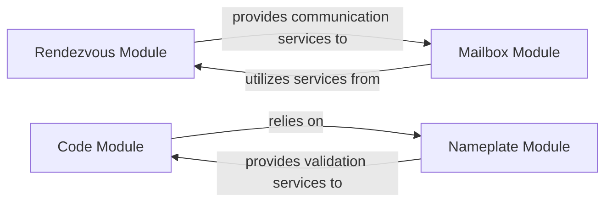

## Details

This subsystem is responsible for the initial, indirect communication between peers via a central rendezvous server. It facilitates the exchange of short, authenticated messages, including wormhole codes and PAKE (Password Authenticated Key Exchange) messages, to bootstrap the secure connection.

### Rendezvous Module
Acts as the primary client for the rendezvous server. It establishes and maintains the WebSocket connection, sends various commands (e.g., `claim`, `open`, `add`, `release`, `close`, `list`, `allocate`), and processes server responses. It orchestrates the initial signaling phase by managing the low-level communication with the server.

**Related Classes/Methods**:

- <a href="https://github.com/magic-wormhole/magic-wormhole/blob/master/src/wormhole/_rendezvous.py" target="_blank" rel="noopener noreferrer">`wormhole._rendezvous`</a>

### Mailbox Module
Manages the specific message exchange for a given wormhole code (or "mailbox") on the rendezvous server. It handles the reception and processing of messages, distinguishing between local and remote peer messages, which typically include PAKE (Password Authenticated Key Exchange) messages.

**Related Classes/Methods**:

- <a href="https://github.com/magic-wormhole/magic-wormhole/blob/master/src/wormhole/_mailbox.py" target="_blank" rel="noopener noreferrer">`wormhole._mailbox`</a>

### Code Module
Focuses on the structure, generation, and validation of wormhole codes. These codes are the human-readable secrets exchanged out-of-band for peer discovery and are crucial for bootstrapping the connection.

**Related Classes/Methods**:

- <a href="https://github.com/magic-wormhole/magic-wormhole/blob/master/src/wormhole/_code.py" target="_blank" rel="noopener noreferrer">`wormhole._code`</a>

### Nameplate Module
Manages the "nameplate" aspect of the rendezvous process. A nameplate is a unique identifier on the rendezvous server that allows two parties to find each other. It ensures the validity and proper structure of nameplate identifiers.

**Related Classes/Methods**:

- <a href="https://github.com/magic-wormhole/magic-wormhole/blob/master/src/wormhole/_nameplate.py" target="_blank" rel="noopener noreferrer">`wormhole._nameplate`</a>

### [FAQ](https://github.com/CodeBoarding/GeneratedOnBoardings/tree/main?tab=readme-ov-file#faq)